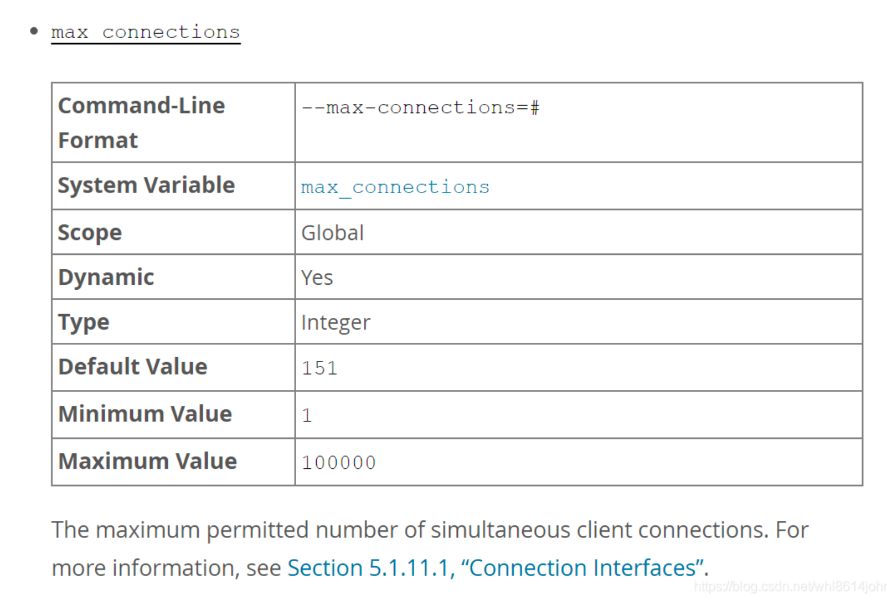
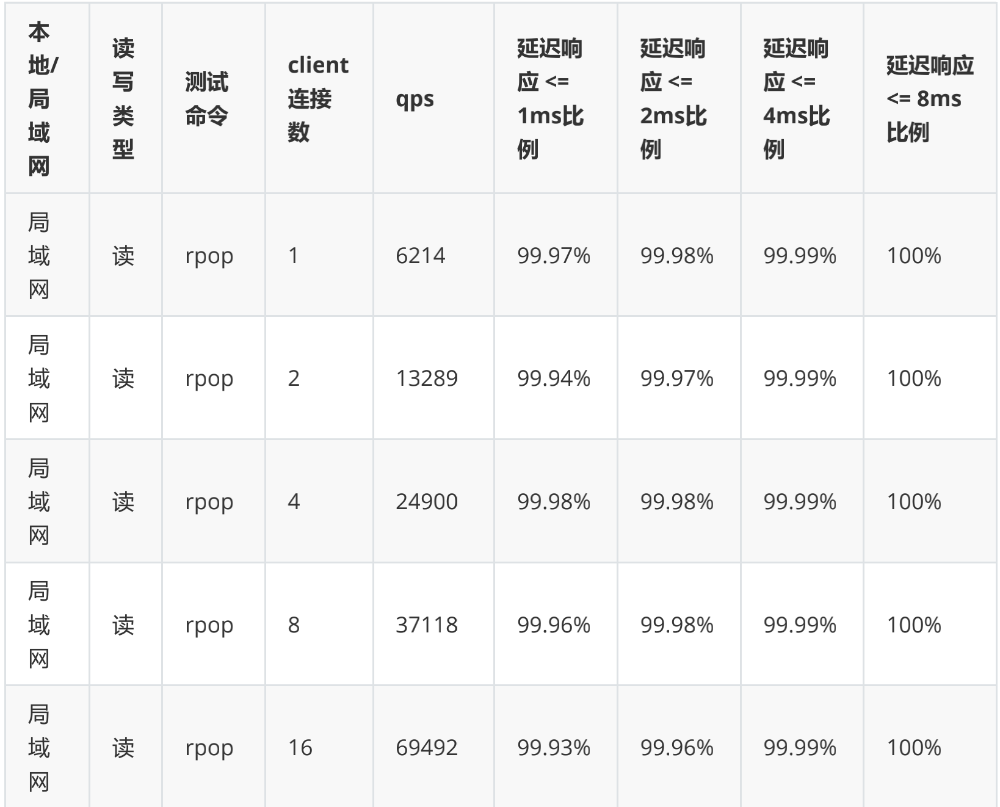
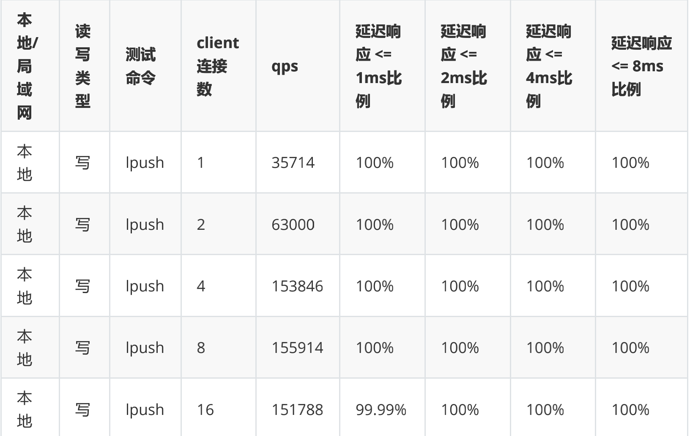
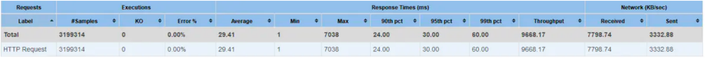
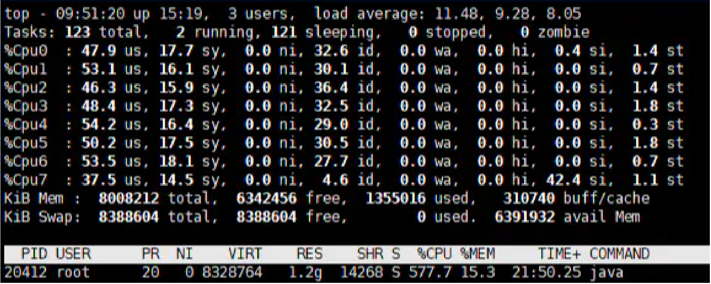
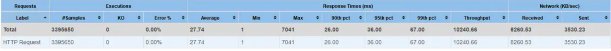
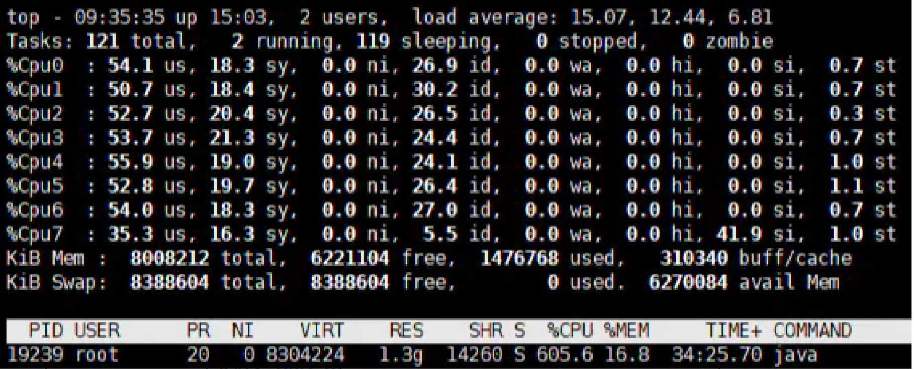
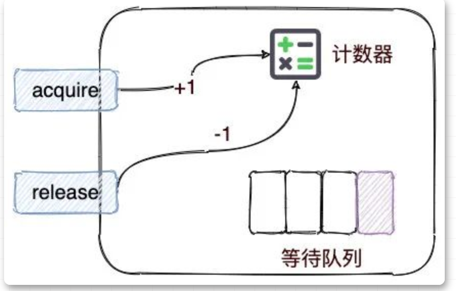
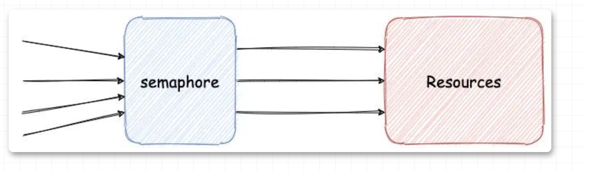

# 流量架构总结

## 1.什么是流量架构？
流量架构包含的主要内容：
1. 根据系统未来用户规模，做系统流量（吞吐量）评估。
2. 按照流量预估值和系统各层的性能基线值，做各层的组件的部署架构规划，确保系统的高性能、高可用。
总结：最终的流量架构，就是系统在不同用户量、不同场景下（平时、战时）的分层规划、组件规划。

## 2.流量架构的类型？
• 旧系统
根据现有监控数据，服务能力，流量指标，对照旧架构，进行偏移指标计算，折算成冗余系数，完成流量架构的工作。
    ▪ 根据系统用户量，不同场景（高峰、平峰、低峰）下流量的预估，包含对未来的两年的流量预估。
    ▪ 做出系统在不同用户量、不同场景下的各层组件的部署架构。
• 新系统
新系统一般还没上线，可以通过压测，评估项目性能是否能支持当前的用户，这个时候性能预期指标更为重要。可以通过"二八定律"
    ▪ 根据二八定律，做出系统在不同用户量、不同场景下的流量（吞吐量）预估，包含未来一两年。
    ▪ 做出系统在不同用户量、不同场景下的各层组件的部署架构。

## 3.流量预估的方法？
• 二八定律（所谓二八定律，是指任何事物，最重要的组成部分占少数，越20%，其余80%虽然占多数，却是次要的。）
    根据二八定律，可以预估不同用户量、场景下的流量，以及未来两年的流量。
    
• 通过用户量来推算PV(Page View 访问量 即页面点击量或浏览量，衡量网站中用户访问网页的数量。)
公式：(总用户数 * 20%) * 每天大致的点击次数(淘宝经验30-50次) = pv 数
问：用户数是1000万 pv数是多少？
答：1000万 * 20% * 30 = 6000万

• PV推算QPS
公式：(总PV数 * 80%)/(每天秒数 * 20%) = 峰值时间每秒请求数（QPS）
问：每天6000万PV，多少QPS？
答：（6000万 * 80%）/ (86400 * 0.2) = 4800万 / 17280(QPS) = 2700

• 乘上冗余系数
评估出来指标后，为了更加保险一些，最好再乘以一个冗余系数（偏离系数），提高预期指标，防止人为评估造成逾期指标偏低的情况。
这个冗余系数一般为2-5之间（行业经验），上面计算出来的tps指标为2700，如果再乘以一个冗余系数4，那么最终tps指标就定位10800。
2700（QPS）* 4 = 10800（QPS）
总结，二八定律的算法为 80%的请求/20%的时间*冗余系数
冗余系数的迭代，同时将来项目上线后，可以通过对项目接口的峰值监控，来对比之前评估的算法结果，调整冗余系数，最终随着不断的数据积累，形成一套本项目的性能模型。

实际与理论的差距
那么将来项目上线后，接口的访问量真的和计算一模一样吗？
肯定不会，因为性能测试从来就不是一门非常精确的技术。
二八定律也并不适应于百分之百的业务场景，对于没有任何数据的背景参考下，二八定律相对拍脑袋来说，比较靠谱。

## 4.各组件可支持的并发能力数值（参考值）
根据二八定律，1亿用户，大概有10万左右QPS。
1.Nginx：高性能的负载均衡和反向代理中间件。
2.LVS：Linux Virtual Server，使用集群技术，实现Linux 操作系统层面的高性能、高可用、负载均衡服务器。
3.Keepalived：用来检验服务状态存活性的软件，常用来做高可用。
4.F5：一个高性能、高可用、负载均衡的硬件设备。
5.DNS轮询：通过在DNS-Server上对一个域名设置多个IP解析，来扩充Web-Server性能以及实施负载均衡的技术。

### 4.1 Tomcat QPS并发参考
tomcat默认配置的最大请求数是150，也就是说同时支持150个并发。具体能承载多少并发，要看硬件的配置，CPU越多性能就越高，分给JVM的内存越多，性能越高，但是会增加GC回收的频率。
当某个应用有250个以上并发时，应考虑应用服务器的集群。
**一般来说，Tomcat中的IO线程一般控制在400以内，每个请求300ms，一个线程3qps，一个tomcat达到1000tps还是可以的。**
tomcat参考的并发能力为1000qps

### 4.2 Nginx的并发能力
Nginx的并发能力，官方给出的数值是5w并发量。
高并发原因：
1.Ngnix只做请求和响应的转发而没有做业务逻辑处理，大部分的时间花在其他I/O计算的上。
2.Nginx的I/O，采用单线程、异步非阻塞模式（Tomcat是连接一个线程同步阻塞模式），避免打开I/O通道进行数据传输，
极大缩减了任务调度和I/O处理时间。

## 5.MySQL并发能力
MySQL查询能力
• 主键查询：千万级别数据 = 1~10ms，4核8线程为 1000qps*8 = 8000qps
• 唯一索引查询：千万级别数据 = 10~100ms，4核8线程为 100qps*8 = 800qps
• 非唯一索引查询：千万级别数据= 100~1000ms，4核8线程为 10qps*8 =80qps
• 无索引：百万条数据 = 1000ms +
综合来说，mysql并发能力，大概是1500qps左右。

MySQL数据库事务能力
• 更新删除(与查询相同)
• 插入操作，依赖于优化，比查询操作效率低。

MySQL的连接数限制
MySQL默认配置的最大连接数是151，可以设置连接数最大值10w，一般来Linux中设置为500~1000


## 6.Redis并发能力
Redis单机为5wQPS左右
由于生产环境业务服务器总延迟需要控制在100ms以内，为了尽量减少日志输出环节的耗时，考虑将日志吞吐到redis中缓存，由其他程序异步从redis中取数据。
在生产环境改造日志系统之前，对单机redis读写性能做了测试。
测试单实例redis读写list数据结构性能。


测试环境和测试工具
CPU：8核
内存：8G
Redis版本：3.2.6
测试工具：redis官方基准测试工具redis-benchmark

##7.Gateway并发能力
一次8核8G压测结果：
并发数：300
Netty工作线程数（reactor.netty.ioWorkerCount）：8默认
样本数据：返回1.5k大小
服务端响应时间：10ms左右
测试时长：5分钟
JVM内存：2G

Jmeter测试报告

CPU负载


将Netty的工作线程数调为12
Jmeter测试报告

CPU负载


#亿级流量架构规划
##


##8.什么是服务的限流限频？
Guava doc 对限频（RateLimiter）的理解是在一个指定的速率上分发许可（permit），每当请求来的时候，线程会阻塞，知道何时获取的permit，
使用完这些permit之后不需要进行释放的操作。

##9.限频key的设计？
任何限频组件都会涉及到堆限流限频资源即key的选择，key虽简单，但重要。
限频按功能分为服务限频和业务限频。
• 服务限频
    ▪ 相同接口/相同path（request path）操作类资源，防止恶意访问导致系统流量占用，需要进行限频率操作。
      服务限频只能保证整体后端的服务可用，不能防止用户恶意刷屏，比如某接口频率100次每分钟，A访问了99次，其他用户只能访问了一次。
      可用基于uuid业务限频避免该类问题。但业务限频不能进行服务限频保证后端服务。
      简单理解，根据这个服务也就是接口或者path，一定时间内能承受的最大值为多少来进行限频。
• 业务限频
    ▪ 动态的uid、ip、cookie值、甚至地区。
      简单理解，根据这个用户来进行限频，一般是ip来区分，判断这个ip请求量是否超过了一定时间的最大次数来限频。
      
##10.常用限频技术？
信号量、计算器、固定窗口、滑动窗口、漏桶算法、令牌桶算法、分布式限流。
• 信号量Semaphore：并发领域的重要编程模型，并发编程语言大多支持信号量这个机制。
    ▪ 限流方式：
        ★ 并发数限流：限制同一时刻的最大并发请求数
        ★ QPS限流：限制一段时间的请求数
    ▪ 实现方式：

从图中看到，Semaphore中有一个计算器，使用时，需提前初始化。
计算器初始化之后，就可以调用acquire方法，获取信号量，这时计数器减1，如果此时计数器小于0，当前线程阻塞，并加入等待队列，否则当前线程继续执行。
执行结束之后，调用release方法，释放信号量，计数器会加1。如果此时计数器的值小于或等于0，会唤醒等待队列中的一个线程，然后将其移出队列。
并发流量通过Semaphore进行限流，只有拿到信号量才能继续执行，保证后端资源访问总在安全范围。
   ▪ 代码实现：限流器例子
    
    ▪ 代码实现：
```java
public class ConcurrencyLimit {    
        private Semaphore semaphore;   
        private ConcurrencyLimit() {    }    
    public static ConcurrencyLimit create(int permits) {        
           ConcurrencyLimit concurrencyLimit = new ConcurrencyLimit();        
           concurrencyLimit.semaphore = new Semaphore(permits);        
           return concurrencyLimit;    
    }    
    public void acquire() throws InterruptedException {        
        this.semaphore.acquire();    
    }    
    public void release() {        
        this.semaphore.release();    
    }    
    public boolean tryAcquire() {        
        return this.semaphore.tryAcquire();    
    }
}
```
测试例子
```java_holder_method_tree
ConcurrencyLimit limit = ConcurrencyLimit.create(5);
ExecutorService executorService = Executors.newCachedThreadPool(        
        new ThreadFactoryBuilder().setNameFormat("limit-%d").build());
        for (int i = 0; i < 10; i++) {    
                executorService.execute(() -> {        
                try {            limit.acquire();            
                    System.out.println(Thread.currentThread().getName() + " START");            
                    // 模拟内部耗时            
                    TimeUnit.MILLISECONDS.sleep(new Random().nextInt(500));        
                } catch (InterruptedException e) {  
                  e.printStackTrace(); 
                } finally {            
                    System.out.println(Thread.currentThread().getName() + " END");            
                    limit.release();        
                           }    
                });
        }
```
注意：Semaphore中的acquire()和release()一定要成对出现，否则导致程序假死。
▪ 具体问题 Semaphore信号量限流的问题。由于Semaphore中，acquire()从计算器中未获取到信号量，此时线程进入等待队列，导致线程被阻塞。
          Semaphore使用非公平竞争信号量。当只有部分线程竞争到信号量时，才能执行，其他线程进入阻塞。部分接口请求耗时正常，其他接口请求耗时直线上升。
          对于服务来说，追求低延迟，高吞吐。服务达到限流之后，不应该阻塞，应该拒绝请求，响应错误提示信息，快速结束请求。
          此时就可以使用，Semaphore中提供的tryAcquire()拿不到信号量时返回false，比较符合这种场景。
          总结：信号量限流acquire()导致线程阻塞，使用tryAcquire()直接返回结果，减少接口平均耗时。
修改后
```
@Override
public boolean preHandle(
    HttpServletRequest request, HttpServletResponse response, Object handler) throws Exception {    
        if (!concurrencyLimit.tryAcquire()) {        
            response.getWriter().println("ERROR");
            return false;    
        }    
            return true;
    }
```
总结：对于Semaphore限流算法，一定不能直接使用acquire()阻塞式限流，使用tryAcquire()非阻塞限流，这样才符合互联网快速响应的要求。

• 固定窗口
• 滑动窗口
• 漏桶算法（Leaky Bucket）
• 令牌桶算法（Token Bucket）
    
 