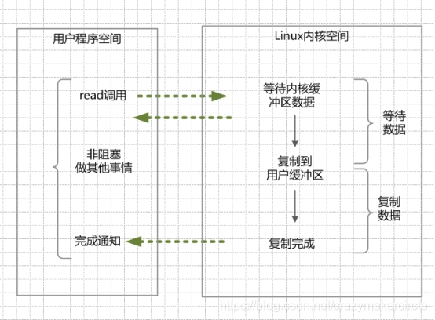

## Servlet总结

在Java Web程序中，**Servlet**主要负责接收用户请求 `HttpServletRequest`,在`doGet()`,`doPost()`中做相应的处理，并将回应`HttpServletResponse`反馈给用户。**Servlet** 可以设置初始化参数，供Servlet内部使用。一个Servlet类只会有一个实例，在它初始化时调用`init()`方法，销毁时调用`destroy()`方法**。**Servlet需要在web.xml中配置（MyEclipse中创建Servlet会自动配置），**一个Servlet可以设置多个URL访问**。**Servlet不是线程安全**，因此要谨慎使用类变量。

## 阐述Servlet和CGI的区别?

### CGI的不足之处:

1，需要为每个请求启动一个操作CGI程序的系统进程。如果请求频繁，这将会带来很大的开销。

2，需要为每个请求加载和运行一个CGI程序，这将带来很大的开销 

3，需要重复编写处理网络协议的代码以及编码，这些工作都是非常耗时的。

# IO总结 
## BIO、NIO、AIO 有什么区别？
1，BIO：Block IO同步阻塞式IO模型，线程的读取和写入必须阻塞在同一线程内等待其完成。 
• BIO通信模型：通常用一个独立的acceptor线程监听客户端连接，代码中通过while 循环调用 accept()方法等待接收客户端连接的方式监听请求，一旦监听
             到请求，就建立通信套接字，在这个套接字上进行读写操作。此时不能接收其他客户端请求，只能等待当前客户端请求处理完成后才能接收其他客户端请求。
             不过可以通过多线程来支持多个客户端请求。
             BIO多线程：接收到客户端请求，为每个客户端创建一个新线程进行链路处理，处理完后通过输出流返回给客户端，线程销毁。这个模型只支持1对1。当客户端建立连接后
             不做任何事情，就会造成不必要的线程开销。可以通过线程池机制改善，线程池可以让线程的创建和回收的成本降低。使用FixedThreadPool可以有效控制线程的最大数。
             保证系统资源的有效使用。
• BIO模型的问题：但是当并发量增加后，java中，线程的创建和销毁都会涉及到用户态和操作系统态的切换。切换的成本非常高。并发高，会导致线程数急速激增。
导致堆栈溢出，创建线程失败，线程僵死，不能对外提供服务。可使用线程池来进行对线程的管理，实现伪异步I/O模型。
• BIO总结：活动连接小于1000时，可以使用，但面临十万，百万连接时，传统的BIO无能为力，需要一个更高效的I/O处理模型来应对更高的并发量。

2，NIO：New IO 同步非阻塞I/O模型，java1.4后引入NIO框架，对应java.nio包，提供了Channel，Selector，Buffer等抽象。
• NIO通信模型：Non Blocking I/O BIO中的Socket 和ServerSocket NIO中对应的是SocketChannel和ServerSocketChannel两种不同的套接字实现。
支持阻塞和非阻塞两种模式，阻塞模式，可靠性和性能都不好，非阻塞，恰巧相反。且非常好的应对高负债，高并发的（网络）应用。应使用NIO非阻塞模式开发。
Buffer：NIO是oriented Buffer进行流的读取或写入的，并且读写同时能做其他事情。而BIO是oriented stream进行读写的，读写时不能做其他事情。
Channel：NIO从 Channel 读取或写入数据到buffer中。channel只能与buffer交互，实现异步读写。
Selector：NIO有，BIO无，选择器的作用是是，使用单个Thread 处理多个Channel，因此需要少的Thread，线程间频繁切换也消耗操作系统资源，Selector能
提高系统效率。

• 为什么NIO这么好，大家不用原生的NIO开发呢？
    原生NIO代码复杂，并且NIO底层用epoll实现，该实现饱受逅病的空沦陷bug，会导致Selector空轮询，导致CPU飙升100%，java1.7版本依然没得到根本性解决。
    项目大后，自实现NIO，很容易出现各类bug，维护成本较高。
    Netty的出现很大程度改善了NIO的存在的一些难以忍受的问题。

2.1NIO服务端创建流程

2.2NIO的优缺点？
优点：
    用select/epoll的优势在于，它可以同时处理成千上万的连接(connection)。与一条线程维护一条连接(BIO)相比，I/O多路复用技术最大的优势是：
系统不必创建线程，也不必维护这些线程，而大大减小了系统的开销。
缺点：
    本质上，select/epoll系统调用，属于同步IO，也是阻塞IO。都需要在读写事件就绪后，自己负责读写，也就是读写过程是阻塞的。

3，AIO：Asynchronous I/O 也就是NIO 2.0，异步非阻塞IO模型，异步IO是基于事件和回调机制实现的，也就是应用操作之后会直接返回，不会阻塞在那里，
当后台操作完成之后，操作系统会通知相应的线程处理后续操作。市面上资料很少，Netty也基于这个做，后面还是放弃了。使用的NIO。

AIO的基本流程是：用户线程通过系统调用，告知kernel启动某个IO操作，用户线程返回。kernel在整个IO操作（包括数据准备、数据复制）完成后，通知用户程序，用户执行后续的业务操作。
               总结就是，用户线程通过注册事件，告知kernel进行IO操作，kernel进行数据准备、数据复制操作完成后，通知用户程序，用户程序可以执行后续操作。
kernel的数据准备是将数据从网络物理设备（网卡）读取到内核缓冲区；kernel的数据复制是将数据从内核缓冲区拷贝到用户程序空间的缓冲区。               

• 当用户线程向kernel发起read请求，马上就可以去做其他事情，用户线程不阻塞。
• kernel接收请求后开始数据准备，准备好后，会将数据从kernel缓存区读取到用户缓存区(用户内存)。
• 用户线程读取用户缓冲区的数据，完成后续的业务操作。

3.1异步IO模型的特点.
在内核kernel的等待数据和复制数据的两个阶段，用户线程都不block（阻塞）的。用户线程需要接受kernel的IO操作完成的事件，或者注册IO操作完成的回调函数，
到操作系统的内核。所以说异步IO有时候也叫信号驱动IO。

# 容器
## 1.说一下Java容器有哪些？
java分为Connection 和 Map 两大类，其下有很多子类。
• Collection
• List
    ▪ ArrayList 
    ▪ LinkedList
    ▪ Vector
        ★ Stack
• Set
    ▪ HashSet
        ★ LinkedHashSet
    ▪ TreeSet
    ▪ SortedSet
• Map
    ▪ HashMap
        ★ LinkedHashMap          
    ▪ TreeMap
    ▪ ConcurrentHashMap
    ▪ Hashtable
    ▪ SortedMap

## 2.Collection和Collections的区别？
Collection是接口，是所有集合的父类，提供了对集合对象进行基本操作的抽象方法，如size(),iterator(),add(),remove()等
Collections是工具类，构造方法私有，无法实例化。包含很多静态方法，如sort()，reverse(),min(),max(),replaceAll(),List()等
    
## 3.List、Set、Map之间的区别是什么？
2个方面区别比较：元素是否有序，元素是否重复。

## 4.HashMap JDK1.7和JDK1.8中发生了哪些变化（底层）？
• JDK1.7中HashMap底层使用数组+链表，1.8中数组+链表+红黑树。加入红黑树后，HashMap插入和查询的效率得到提升。
• JDK1.7中HashMap的链表数据结构使用的是头插法，JDK1.8中HashMap的链表数据结构使用的是尾插法。
  原因是1.7中，两个线程同时触发扩容，移动节点时会导致一个链表中两个节点互相引用。生成环链表。1.8使用尾插法，可以避免这个问题。
• JDK1.7中HashMap，哈希算法比较复杂，存在各种右移与异或运算。1.8中进行了简化，因为复杂的HashMap的目的是提高散列性，从而提高HashMap整体效率。
  JDK1.8中增加了红黑树，适当简化Hash算法，节省CPU资源。
    
##. 5.线程安全的List是什么？实现原理是什么？
CopyOnWriteArrayList
1.CopyOnWriteArrayList内部也是通过数组来实现的，在向其添加元素时，会复制一个新数组，此时对其的写操作在新数组上进行，读操作在原数组上进行。.
2.写操作会加锁，防止出现并发写入丢失数据。
3.写操作结束后，会把原数组指针指向新数组，使得读操作可读到新数组。
4.CopyOnWriteArrayList适用于读多写少的场景，允许写时读数据，大大提高了并发。缺点是，会比较占内存，因为会创建新数组，读数据不一定是最新的，对读一致性要求高场景不适用。
   

#反射
##1.什么是反射？
反射是在运行状态中，对应任意一个类，都能知道这个类的所有属性和方法；对于任意一个对象，都能调用它的任意方法和属性。这种动态获取的信息
以及动态调用对象方法的功能称为Java语言的反射机制。

##2.什么是Java序列化，什么情况下需要序列化？
Java序列化是把Java对象转换为字节序列的过程，Java反序列化是把字节序列恢复成Java对象的过程。
三种情况需要序列化：
• 分布式RMI（remote method invocation）远程方法调用时，需要对象序列化。
• 对象拷贝时
• 写入文件或数据库中时
• 使用套接字传输对象，文件时。

#对象拷贝
##1.为什么要使用克隆？
clone()方法保存用于创建对象的精确副本的额外处理任务。 (克隆的对象可能包含一些已修改过的属性)
如果我们使用new关键字执行它，它将需要执行大量的处理，这就是为什么我们使用对象克隆。

##2.如何实现对象clone()？
• 创建类实现cloneable接口并重写object类中的clone()方法。
• 实现Serializable接口，通过对象序列化，反序列化实现克隆，可以实现真正克隆。

##3.深拷贝和浅拷贝的区别？
• 浅克隆：当对象被复制时只复制它本身和值类型的成员变量，而引用类型的成员对象并没有复制，
举例：person类中有int age = 1； WoMan woman;浅拷贝只拷贝了 int age=1；并没有复制woman；
• 深拷贝：除了对象本身被复制外，对象包含的所有成员变量也将被复制。

#Java Web
##1.JSP 有哪些内置对象？作用分别是什么？
JSP 有 9 大内置对象：
• request：封装客户端的请求，其中包含来自 get 或 post 请求的参数；
• response：封装服务器对客户端的响应；
• pageContext：通过该对象可以获取其他对象；
• session：封装用户会话的对象；
• application：封装服务器运行环境的对象；
• out：输出服务器响应的输出流对象；
• config：Web 应用的配置对象；
• page：JSP 页面本身（相当于 Java 程序中的 this）；
• exception：封装页面抛出异常的对象。

##2.说一下 JSP 的 4 种作用域？
• page：代表与一个页面相关的对象和属性。
• request：代表与客户端发出的一个请求相关的对象和属性。一个请求可能跨越多个页面，涉及多个 Web 组件；需要在页面显示的临时数据可以置于此作用域。
• session：代表与某个用户与服务器建立的一次会话相关的对象和属性。跟某个用户相关的数据应该放在用户自己的 session 中。
• application：代表与整个 Web 应用程序相关的对象和属性，它实质上是跨越整个 Web 应用程序，包括多个页面、请求和会话的一个全局作用域。

##3.session 和 cookie 有什么区别？
• 存储位置不同：session 存储在服务器端；cookie 存储在浏览器端。
• 安全性不同：cookie 安全性一般，在浏览器存储，可以被伪造和修改。
• 容量和个数限制：cookie 有容量限制，每个站点下的 cookie 也有个数限制。
• 存储的多样性：session 可以存储在 Redis 中、数据库中、应用程序中；而 cookie 只能存储在浏览器中。

##4.session 的工作原理？
session 的工作原理是客户端登录完成之后，服务器会创建对应的 session，session 创建完之后，会把 session 的 id 发送给客户端，客户端再存储到浏览器中。
这样客户端每次访问服务器时，都会带着 sessionid，服务器拿到 sessionid 之后，在内存找到与之对应的 session 这样就可以正常工作了。

##5.如果客户端禁止 cookie 能实现 session 还能用吗？
可以用，session 只是依赖 cookie 存储 sessionid，
如果 cookie 被禁用了，可以使用 url 中添加 sessionid 的方式保证 session 能正常使用。

##6.spring mvc 和 struts 的区别是什么？
• 拦截级别：struts2 是类级别的拦截；spring mvc 是方法级别的拦截。
• 数据独立性：spring mvc 的方法之间基本上独立的，独享 request 和 response 数据，请求数据通过参数获取，处理结果通过 ModelMap 交回给框架，方法之间不共享变量；而 struts2 虽然方法之间也是独立的，但其所有 action 变量是共享的，这不会影响程序运行，却给我们编码和读程序时带来了一定的麻烦。
• 拦截机制：struts2 有以自己的 interceptor 机制，spring mvc 用的是独立的 aop 方式，这样导致struts2 的配置文件量比 spring mvc 大。
• 对 ajax 的支持：spring mvc 集成了ajax，所有 ajax 使用很方便，只需要一个注解 @ResponseBody 就可以实现了；而 struts2 一般需要安装插件或者自己写代码才行。

##7.如何避免 SQL 注入？
• 使用预处理 preparedStatement。
• 使用正则表达式过滤字符串中特殊字符。

##8.什么是 XSS 攻击，如何避免？
跨脚本攻击，通常是攻击者通过在页面中恶意插入（JavaScript，css代码）。当用户浏览页面时，嵌入其中的代码就会被执行，
通常是获取用户cookie，重定向到其他网站，破坏页面结构。

##9.什么事CSRF攻击，如何避免？
CSRF:Cross-Site Request Forgery (中午：跨站请求伪造),可理解为攻击者盗用你身份，以你的名义发送恶意请求.
比如说以你的名义发送邮件、发消息、虚拟货币转账、购买商品等。
预防手段：
• 验证请求来源地址 ss
• 关键操作添加验证码
• 请求地址加上token并验证

#异常、网络和设计模式
##1.常见的异常类有哪些？
• NullPointerException 空指针异常
• ClassNotFoundException 指定类不存在
• NumberFormatException 字符串转换为数字异常
• IndexOutOfBoundsException 数组下标越界异常
• ClassCastException 数据类型转换异常
• FileNotFoundException 文件未找到异常
• NoSuchMethodException 方法不存在异常
• IOException IO 异常
• SocketException Socket 异常

##2.简述 tcp 和 udp的区别？
tcp和 udp OSI模型中运输层协议，tcp提供可靠通讯传输，upd提供不可靠传输。
• 是否建立连接 tpc需要3次握手4次挥手，udp不需要。
• 数据是否丢失 tcp保证数据传输不丢失，udp不保证数据丢失。
• 数据类型 tcp传输字节流 udp传输报文。
• 传输速度 tcp慢 udp快。

##3.tcp 为什么要三次握手，两次不行吗？为什么？
《计算机网络》中提到，三次握手目的"为了防止已经失效的连接请求报文段突然又传到服务端，因而产生错误"，
解释一端(client)A发出的连接报文请求并没丢失，因为某些原因导致在网络上滞留，延迟释放后才到达ServerB。
这本来是一个早已失效的报文，但是B收到此失效的报文之后，会误认为是A再次发出的一个新的连接请求，
于是B端就向A又发出确认报文，表示同意建立连接。如果不采用“三次握手”，那么只要B端发出确认报文就会认为新的连接已经建立了，
但是A端并没有发出建立连接的请求，因此不会去向B端发送数据，B端没有收到数据就会一直等待，这样B端就会白白浪费掉很多资源。
如果采用“三次握手”的话就不会出现这种情况，B端收到一个过时失效的报文段之后，向A端发出确认，此时A并没有要求建立连接，所以就不会向B端发送确认，这个时候B端也能够知道连接没有建立。

##4.tcp 粘包是怎么产生的？
tcp 粘包可能发生在发送端或者接收端，分别来看两端各种产生粘包的原因：
• 发送端粘包：发送端需要等缓冲区满才发送出去，造成粘包；
• 接收方粘包：接收方不及时接收缓冲区的包，造成多个包接收。

##5.OSI 的七层模型都有哪些？
• 物理层：利用传输介质为数据链路层提供物理连接，实现比特流的透明传输。
• 数据链路层：负责建立和管理节点间的链路。
• 网络层：通过路由选择算法，为报文或分组通过通信子网选择最适当的路径。
• 传输层：向用户提供可靠的端到端的差错和流量控制，保证报文的正确传输。
• 会话层：向两个实体的表示层提供建立和使用连接的方法。
• 表示层：处理用户信息的表示问题，如编码、数据格式转换和加密解密等。
• 应用层：直接向用户提供服务，完成用户希望在网络上完成的各种工作。

##6.get 和 post 请求有哪些区别？
• get 请求会被浏览器主动缓存，而 post 不会。
• get 传递参数有大小限制，而 post 没有。
• post 参数传输更安全，get 的参数会明文限制在 url 上，post 不会。

##7.如何实现跨域？
实现跨域有以下几种方案：
• 服务器端运行跨域 设置 CORS 等于 *；
• 在单个接口使用注解 @CrossOrigin 运行跨域；
• 使用 jsonp 跨域；

##8.说一下 JSONP 实现原理？
jsonp：JSON with Padding，它是利用script标签的 src 连接可以访问不同源的特性，加载远程返回的“JS 函数”来执行的。

## 9. ConcurrentHashMap？
• 因为 HashMap不是线程安全的，可以使用Collections.synchronizedMap()方法来包装我们的HashMap。但是这是通过一个全局的锁来同步不同线程间的并发访问，
因此会带来不可忽视的性能问题。所以有了ConcurrentHashMap，在进行读操作时几乎不用加锁，进行写操作时，通过锁分段技术只对所操作的段加锁而不影响客户端对其他段的访问。

## 9.1ConcurrentHashMap的设计？
concurrentHashMap默认初始容量：16
concurrentHashMap 有个重要的变量 sizeCtl，0时表示数组未初始化，数组未初始化，默认初始容量16，初始化后记录数组扩容阈值(初始容量*0.75)
-1时，表示数组正在初始化，其他线程无法再次初始化，其他负数时，表示正在扩容。

## 9.2ConcurrentHashMap源码解析？
• 初始化：new ConcurrentHashMap(32)（并没有初始化） 1.7中初始容量32 1.8中返回的初始容量是2的幂次方 并且比32要大，那么就是64了。 
        当调用put方法才会初始化，初始化如何保证线程安全？数组有个变量sizeCtl = -1 
        调用put方法初始化时，1.先判断key value 不等于null，为null抛出异常。
                          2.根据key的hashCode获取hash(正数)。hash是作为判断添加节点是链表节点还是树节点。
                          3.判断数组Node<K,V>节点是否为null，
                            为null做数组的初始化。
                            sizeCtl<0时表示正在有线程在做数组初始化，会通过Thread.yield();保证其他线程不能同时初始化数组。
                            sizeCtl>0时表示没有线程做初始化，做数组初始化，通过CAS，当前值和主内存中的值做比对。相同就可以刷新，不相同就自旋。
                            数组初始化后，Node<K,V>节点就不为空，根据hash节点进行角标运算，得出每个桶的位置，
                                ①当桶的位置为null时，直接将元素添加到该位置，（使用到了CAS）
                                ②当桶的位置有元素时，会判断这个位置是否在扩容，如果在扩容就扩容完成后再添加，直接添加会导致添加的值丢失。
                                ③当位置有元素，且没有扩容时，对当前桶位置加synchronized，保证当前位置桶操作是线程安全的。
                                ④判断当前添加的hash值是否大于0判断是链表还是树结构，>0是链表，就先遍历链表元素，再将插入的值插入到链表尾部。
                                ⑤如果是树结构，就进行树结构的添加操作。
                            添加操作完成后，会判断数组中链表元素是否大于8且数组容量小于64，不会去变成红黑树，先扩容（保证转换时的性能开销）。
                            会扩容为原来两倍避免树化操作，当数组元素大于64时，才会树化操作。

##9.3ConcurrentHashMap的扩容机制？
• 1.7版本
    ▪ 基于Segment分段锁实现的
    ▪ 每个Segment相当于一个小型的HashMap
    ▪ 每个Segment内部会进行扩容，和HashMap扩容机制类似
    ▪ 先生成新数组，转移元素到新数组中
    ▪ 扩容判断是每个segment内部单独判断，判断是否超过阈值
• 1.8版本
    ▪ ConcurrentHashMap不再基于Segment实现，
    ▪ 当某个线程put时，ConcurrentHashMap正在扩容，线程跟着一起扩容。支持多个线程同时扩容。
    ▪ 当某个线程put时，ConcurrentHashMap没有扩容，将key-value添加到ConcurrentHashMap中，判断是否超过了阈值，超了即扩容，扩容会生成新数组。
    ▪ 在扩容时，旧数组元素添加到新数组中时，将原数组分组，由不同线程完成元素的转移，每个线程负责一组或多组元素。
    