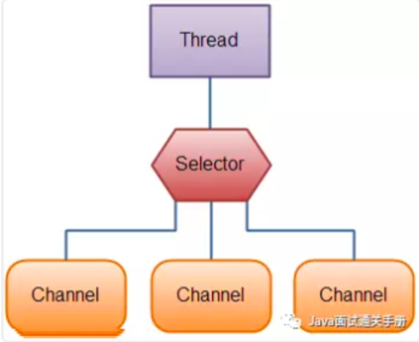
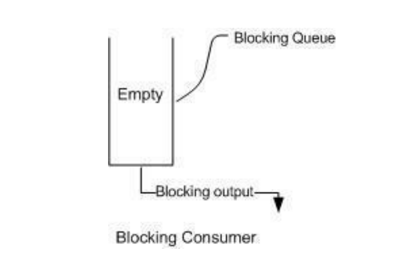
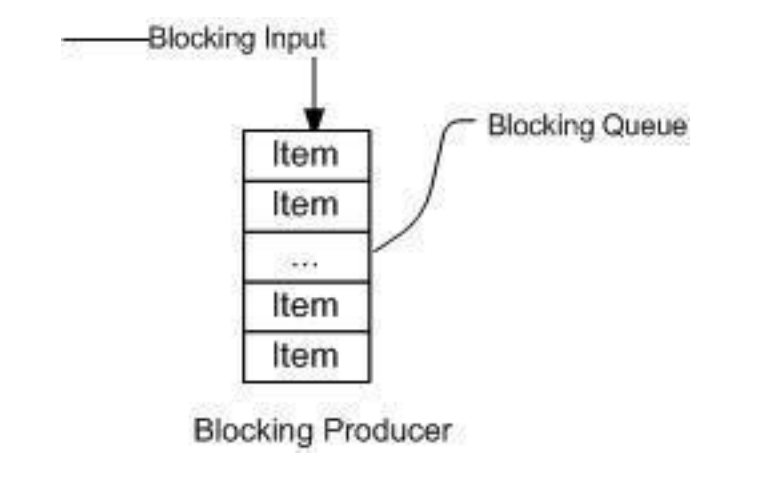

## Servlet总结

在Java Web程序中，**Servlet**主要负责接收用户请求 `HttpServletRequest`,在`doGet()`,`doPost()`中做相应的处理，并将回应`HttpServletResponse`反馈给用户。**Servlet** 可以设置初始化参数，供Servlet内部使用。一个Servlet类只会有一个实例，在它初始化时调用`init()`方法，销毁时调用`destroy()`方法**。**Servlet需要在web.xml中配置（MyEclipse中创建Servlet会自动配置），**一个Servlet可以设置多个URL访问**。**Servlet不是线程安全**，因此要谨慎使用类变量。

## 阐述Servlet和CGI的区别?

### CGI的不足之处:

1，需要为每个请求启动一个操作CGI程序的系统进程。如果请求频繁，这将会带来很大的开销。

2，需要为每个请求加载和运行一个CGI程序，这将带来很大的开销 

3，需要重复编写处理网络协议的代码以及编码，这些工作都是非常耗时的。

# IO总结 
## BIO、NIO、AIO 有什么区别？
1，BIO：Block IO同步阻塞式IO模型，线程的读取和写入必须阻塞在同一线程内等待其完成。 
• BIO通信模型：通常用一个独立的acceptor线程监听客户端连接，代码中通过while 循环调用 accept()方法等待接收客户端连接的方式监听请求，一旦监听
             到请求，就建立通信套接字，在这个套接字上进行读写操作。此时不能接收其他客户端请求，只能等待当前客户端请求处理完成后才能接收其他客户端请求。
             不过可以通过多线程来支持多个客户端请求。
             BIO多线程：接收到客户端请求，为每个客户端创建一个新线程进行链路处理，处理完后通过输出流返回给客户端，线程销毁。这个模型只支持1对1。当客户端建立连接后
             不做任何事情，就会造成不必要的线程开销。可以通过线程池机制改善，线程池可以让线程的创建和回收的成本降低。使用FixedThreadPool可以有效控制线程的最大数。
             保证系统资源的有效使用。
• BIO模型的问题：但是当并发量增加后，java中，线程的创建和销毁都会涉及到用户态和操作系统态的切换。切换的成本非常高。并发高，会导致线程数急速激增。
导致堆栈溢出，创建线程失败，线程僵死，不能对外提供服务。可使用线程池来进行对线程的管理，实现伪异步I/O模型。
• BIO总结：活动连接小于1000时，可以使用，但面临十万，百万连接时，传统的BIO无能为力，需要一个更高效的I/O处理模型来应对更高的并发量。

2，NIO：New IO 同步非阻塞I/O模型，java1.4后引入NIO框架，对应java.nio包，提供了Channel，Selector，Buffer等抽象。
• NIO通信模型：Non Blocking I/O BIO中的Socket 和ServerSocket NIO中对应的是SocketChannel和ServerSocketChannel两种不同的套接字实现。
支持阻塞和非阻塞两种模式，阻塞模式，可靠性和性能都不好，非阻塞，恰巧相反。且非常好的应对高负债，高并发的（网络）应用。应使用NIO非阻塞模式开发。
Buffer：NIO是oriented Buffer进行流的读取或写入的，并且读写同时能做其他事情。而BIO是oriented stream进行读写的，读写时不能做其他事情。
Channel：NIO从 Channel 读取或写入数据到buffer中。channel只能与buffer交互，实现异步读写。
Selector：NIO有，BIO无，选择器的作用是是，使用单个Thread 处理多个Channel，因此需要少的Thread，线程间频繁切换也消耗操作系统资源，Selector能
提高系统效率。

• 为什么NIO这么好，大家不用原生的NIO开发呢？
    原生NIO代码复杂，并且NIO底层用epoll实现，该实现饱受逅病的空沦陷bug，会导致Selector空轮询，导致CPU飙升100%，java1.7版本依然没得到根本性解决。
    项目大后，自实现NIO，很容易出现各类bug，维护成本较高。
    Netty的出现很大程度改善了NIO的存在的一些难以忍受的问题。

3，AIO：Asynchronous I/O 也就是NIO 2.0，异步非阻塞IO模型，异步IO是基于事件和回调机制实现的，也就是应用操作之后会直接返回，不会阻塞在那里，
当后台操作完成之后，操作系统会通知相应的线程处理后续操作。市面上资料很少，Netty也基于这个做，后面还是放弃了。使用的NIO


# 容器
## 1.说一下Java容器有哪些？
java分为Connection 和 Map 两大类，其下有很多子类。
• Collection
• List
    ▪ ArrayList 
    ▪ LinkedList
    ▪ Vector
        ★ Stack
• Set
    ▪ HashSet
        ★ LinkedHashSet
    ▪ TreeSet
    ▪ SortedSet
• Map
    ▪ HashMap
        ★ LinkedHashMap          
    ▪ TreeMap
    ▪ ConcurrentHashMap
    ▪ Hashtable
    ▪ SortedMap

## 2.Collection和Collections的区别？
Collection是接口，是所有集合的父类，提供了对集合对象进行基本操作的抽象方法，如size(),iterator(),add(),remove()等
Collections是工具类，构造方法私有，无法实例化。包含很多静态方法，如sort()，reverse(),min(),max(),replaceAll(),List()等
    
## 3.List、Set、Map之间的区别是什么？
2个方面区别比较：元素是否有序，元素是否重复。


    

# 多线程
## 1.并行和并发的区别？
• 并行：多个处理器或多核处理器同时处理多个任务
• 并发：多个任务同一个CPU核上，按细分的时间片轮流交替执行任务，从逻辑上来看那些任务是同时执行。
例子：7点，我在吃早餐，需要吃10分钟才能吃完，7点2分，我接到了一个电话，需要打5分钟。
并发：我吃了2分钟的饭，放下筷子，接5分钟电话，再吃8分钟的饭，7点15分，完成这两件事，花费15分钟。这是并发。
并行：我吃了2分钟的饭，接到电话，边吃边打电话，7点5分打完电话，7点10分吃完饭。完成这两件事花费10分钟。这就是并行。


##1.1同步和异步的区别？
同步：当你同步执行任务时，需要等待它完成，才能执行下一个任务。当a执行洗衣服，洗澡。同步等洗衣服洗完后，才能去洗澡。A->B
异步：当你异步执行任务时，可以在它完成之前，执行另一个任务。当a使用洗衣机洗衣服，洗澡，把衣服放入洗衣机后，不用等洗衣机洗完，就可以去洗澡了。

##1.2阻塞和非阻塞的区别？
阻塞：调用者发起一个请求，一直等待请求结果返回，当前线程被挂起，无法执行其他任务，只有当条件就绪才能继续执行。
非阻塞：调用者发起一个请求，调用者不用等待结果返回，可以先去干其他事情。

##1.2QPS和TPS？
QPS:Queries Per Second 意思"每秒查询率"

## 2.线程和进程的区别？
一个程序下至少有一个进程， 一个进程下至少有一个线程，一个进程下也可以有多个线程来增加程序的执行速度。

## 3.守护线程时什么？
守护线程是运行在后的一种特殊进程，控制终端并且周期性得执行某种任务或者等待处理某些发生的事件。jvm GC就是守护线程。

#线程池
## 4.创建线程池有哪几种方式？
• newSingleThreadExecutor():特点是工作线程数目被限制为1，操作一个无界的工作队列，所以它保证了所有任务都是被顺序执行,
会有一个任务处于活动状态。并且不允许使用者改动线程池实例，因此可以避免改变线程数目。
• newCachedThreadPool():用来处理大量短时间工作任务的线程池，特点：试图缓存线程并重用，无缓存线程可用时，就会创建新的工作线程;
如果线程的闲置时间超过60s，责备终止并移除缓存;长时间闲置时，这种线程池不会消耗什么资源。内部使用SynchronousQueue为工作队列。
• newFixedThreadPooL():重用指定数目的线程，底层使用无界工作队列，任何时候有nThreads工作线程是活跃的。任务数超过了活动队列数，
将会在工作队列中等待空闲线程出现。如果有工作线程退出，会有新的工作线程被创建，弥补指定数目的nThreads.
• newSingleThreadScheduledExecutor:创建单线程池，返回 ScheduledExecutorService，可以进行定时或周期性的工作调度；
• newScheduledThreadPool:• int corePoolSize)：和newSingleThreadScheduledExecutor()类似，创建的是个 ScheduledExecutorService，
可以进行定时或周期性的工作调度，区别在于单一工作线程还是多个工作线程；
• newWorkStealingPool(int parallelism):这是一个经常被忽略的线程池，• Java 8 才加入这个创建方法，其内部会构建ForkJoinPool，
利用Work-Stealing算法，并行地处理任务，不保证处理顺序；
• ThreadPoolExecutor():• 是最原始的线程池创建，上面1-3创建方式都是对ThreadPoolExecutor的封装。

## 5.线程池都有哪些状态？
• RUNNING：这是最正常的状态，接受新的任务，处理等待队列中的任务。
• SHUTDOWN：不接受新的任务提交，但是会继续处理等待队列中的任务。
• STOP：不接受新的任务提交，不再处理等待队列中的任务，中断正在执行任务的线程。
• TIDYING：所有的任务都销毁了，workCount 为 0，线程池的状态在转换为 TIDYING 状态时，会执行钩子方法 terminated()。
• TERMINATED：terminated()方法结束后，线程池的状态就会变成这个。

## 6.线程池中 submit() 和 execute() 方法有什么区别？
• execute()：只能执行 Runnable 类型的任务。
• submit()：可以执行 Runnable 和 Callable 类型的任务。

## 6.1线程池中，提交任务，线程池队列已满，这时会发生什么？
1.如果使用无界队列，那么不会发生什么。
2.当使用有界队列时，会出现两种情况，提交任务时①队列满，核心线程数未达到上限，会增加线程处理任务。②队列满，核心线程数达到最大值，拒绝策略启动，任务丢失。

## 6.2线程池的组成？
1.线程池管理器：用于创建并管理线程
2.工作线程：线程池中的线程
3.任务接口：每个任务必须实现的接口，用于工作线程调用其运行
4.任务队列：用于存放待处理的任务，提供一种缓冲机制

## 6.3线程池的创造方法？
```
public void ThreadPoolExecutor(int corePoolSize,int maximumPoolSize, long keepAliveTime,
    TimeUnit unit, BlockingQueue<Runnable> workQueue) {
    this(corePoolSize, maximumPoolSize, keepAliveTime, unit, workQueue,
    Executors.defaultThreadFactory(), defaultHandler);
}
```
1. corePoolSize：指定线程池中的线程数量
2. maximumPoolSize：指定线程池中的最大线程数量
3. keepAliveTime：当线程池数量超过corePoolSize时，线程的空闲时间超过了线程的存活时间，那么线程就会被销毁，直到线程池中线程数小于等于corePoolSize
4. unit：keepAliveTime的时间单位
5. workQueue：任务队列，被提交但尚未被执行的任务
6. threadFactory：线程工厂，用于创建线程采用new Thread()方式。
7. handler：线程饱和策略，线程池和队列都满了，就会执行此策略。

##6.4 线程池的工作过程？
1.线程池刚创建时，里面没有一个线程。任务队列是作为参数传进来的，就算队列里面有任务，也不会马上执行。
2.调用execute()方法时添加一个任务时，线程池会做如下判断。
 a) 如果正在运行的线程数小于corePoolSize，马上创建线程运行这个任务；
 b) 如果正在运行的线程数大于等于corePoolSize，将任务放入workQueue；
 c) 如果队列满了，正在运行的线程数大于或等于maximumPoolSize，那么线程池会抛出RejectExecutionException
3.当一个线程完成任务时，它会从队列中取下一个任务来执行。
4.当一个线程空闲时，超过keepAliveTime时，线程池会判断，当前运行的线程数大于CorePoolSize，那么这个线程就会被停掉。
  所有线程池的任务完成后，它最终会收缩到corePoolSize大小。  
  
##6.5 JAVA阻塞队列原理
阻塞队列，关键字是阻塞，线程阻塞有两种情况：
1.当队列中没有数据的情况，消费者端的所有线程都会被自动阻塞（挂起），直到有数据放入队列。

2.当队列中填满数据的情况，生产者端的所有线程都会被自动阻塞（挂起），直到队列中有空的位置，线程被自动唤醒。


## 6.5.1阻塞队列的主要方法

• 抛出异常：抛出一个异常；
• 特殊值：返回一个特殊值（null 或 false,视情况而定）
• 阻塞：在成功操作之前，一直阻塞线程
• 超时：放弃前只在最大的时间内阻塞

##6.5.2Java中的阻塞队列
1. ArrayBlockingQueue ：由数组结构组成的有界阻塞队列。
2. LinkedBlockingQueue ：由链表结构组成的有界阻塞队列。
3. PriorityBlockingQueue ：支持优先级排序的无界阻塞队列。
4. DelayQueue：使用优先级队列实现的无界阻塞队列。
5. SynchronousQueue：不存储元素的阻塞队列。
6. LinkedTransferQueue：由链表结构组成的无界阻塞队列。
7. LinkedBlockingDeque：由链表结构组成的双向阻塞队列。


## 7.在 Java 程序中怎么保证多线程的运行安全？
• 方法一：使用安全类，比如 Java. util. concurrent 下的类。
• 方法二：使用自动锁 synchronized。
• 方法三：使用手动锁 Lock。

## 7.1 ConcurrentHashMap？
• 因为 HashMap不是线程安全的，可以使用Collections.synchronizedMap()方法来包装我们的HashMap。但是这是通过一个全局的锁来同步不同线程间的并发访问，
因此会带来不可忽视的性能问题。所以有了ConcurrentHashMap，在进行读操作时几乎不用加锁，进行写操作时，通过锁分段技术只对所操作的段加锁而不影响客户端对其他段的访问。

## 7.2ConcurrentHashMap的设计？
concurrentHashMap默认初始容量：16
concurrentHashMap 有个重要的变量 sizeCtl，0时表示数组未初始化，数组未初始化，默认初始容量16，初始化后记录数组扩容阈值(初始容量*0.75)
-1时，表示数组正在初始化，其他线程无法再次初始化，其他负数时，表示正在扩容。

## 7.3ConcurrentHashMap源码解析？
• 初始化：new ConcurrentHashMap(32)（并没有初始化） 1.7中初始容量32 1.8中返回的初始容量是2的幂次方 并且比32要大，那么就是64了。 
        当调用put方法才会初始化，初始化如何保证线程安全？数组有个变量sizeCtl = -1 
        调用put方法初始化时，1.先判断key value 不等于null，为null抛出异常。
                          2.根据key的hashCode获取hash(正数)。hash是作为判断添加节点是链表节点还是树节点。
                          3.判断数组Node<K,V>节点是否为null，
                            为null做数组的初始化。
                            sizeCtl<0时表示正在有线程在做数组初始化，会通过Thread.yield();保证其他线程不能同时初始化数组。
                            sizeCtl>0时表示没有线程做初始化，做数组初始化，通过CAS，当前值和主内存中的值做比对。相同就可以刷新，不相同就自旋。
                            数组初始化后，Node<K,V>节点就不为空，根据hash节点进行角标运算，得出每个桶的位置，
                                ①当桶的位置为null时，直接将元素添加到该位置，（使用到了CAS）
                                ②当桶的位置有元素时，会判断这个位置是否在扩容，如果在扩容就扩容完成后再添加，直接添加会导致添加的值丢失。
                                ③当位置有元素，且没有扩容时，对当前桶位置加synchronized，保证当前位置桶操作是线程安全的。
                                ④判断当前添加的hash值是否大于0判断是链表还是树结构，>0是链表，就先遍历链表元素，再将插入的值插入到链表尾部。
                                ⑤如果是树结构，就进行树结构的添加操作。
                            添加操作完成后，会判断数组中链表元素是否大于8且数组容量小于64，不会去变成红黑树，先扩容（保证转换时的性能开销）。
                            会扩容为原来两倍避免树化操作，当数组元素大于64时，才会树化操作。

## 8.多线程中 synchronized 锁升级的原理是什么？
• 就是说在锁对象时，锁对象头中有一个threadId字段，线程第一次访问sync锁时，threadId为空，jvm让其持有偏量锁，将TheadId设置为当前线程id，
当线程再次访问锁时，会判断线程id是否与threadId一致，一致则可以使用此对象，不一致时，sync升级偏量锁为轻量锁，通过自旋环一定次数来获取锁。
执行一定次数后，如果还没获取到对象。那么锁就会从轻量级升级为重量级锁。也就是互斥锁，这个过程就是sync的锁升级。

## 8.1偏量锁是什么意思？
偏量锁 Biased Locking 是java1.6时引入
顾名思义，它会偏向第一个访问锁的线程，在运行过程中，sync只有一个线程访问，不存在多个线程争抢锁的情况，那么就会给线程加一个偏量锁。
在执行过程中，其他线程抢占锁，持有偏量锁的线程会挂起，JVM会将该线程上的锁变成轻量级锁。

## 8.2轻量锁时什么意思？
只允许两个线程进行获取锁，第二个线程会进行自旋操作，如果有第三个线程同时抢占锁，会升级成重量级锁。

## 9.什么是死锁？
当线程A持有独占锁a，并尝试去获取独占锁b时，线程B持有独占锁b，并尝试去获取独占锁a时，
AB两线程由于互相持有对方需要的锁,而发送阻塞现象，我们称为死锁。

##9.1造成死锁的原因是什么？
1.一个资源每次只能被一个线程使用，如果被多个线程使用，可能造成死锁。
2.一个线程在等待阻塞某个资源时，不释放资源
3.若干线程形成头尾相接的循环等待关系

## 10.怎么防止死锁？
• 尽量使用 tryLock(long timeout,TimeUnit unit)的方法(ReentrantLock、ReentrantWriteReadLocK
)，设置锁超时时间，通过超时退出。防止死锁。
• 尽量使用java.util.current包下的并发类代替自己手写锁。
• 尽量降低锁的使用粒度，尽量不用几个功能用同一把锁。
• 尽量减少同步代码块。

## 11.ThreadLocal是什么，有哪些使用场景？
ThreadLocal为每个使用该变量的线程提供变量副本，所以每一个线程都可以独立的改变自己的副本，而不会影响其他线程对应的副本。
Thread的使用场景是数据库连接和session管理。

## 12.synchronized 底层实现原理？
synchronized 是由一对 monitorenter/monitorexit 指令实现的，monitor 对象是同步的基本实现单元。
在 Java 6 之前，monitor 的实现完全是依靠操作系统内部的互斥锁，因为需要进行用户态到内核态的切换，
所以同步操作是一个无差别的重量级操作，性能也很低。但在 Java 6 的时候，Java 虚拟机 对此进行了大刀阔斧地改进，提供了三种不同的 monitor 实现，
也就是常说的三种不同的锁：偏向锁（Biased Locking）、轻量级锁和重量级锁，大大改进了其性能。

## 13.synchronized 和 volatile 的区别是什么？
• 修饰对象不同，sync是类，方法，代码块的修饰符。 volatile是变量的修饰符。
• 原子性不同，sync和volatile都可保证对变量的修改的可见性，volatile不能保证原子性，sync可以保证原子性。
• 线程阻塞，sync会造成线程阻塞，volatile不会造成线程阻塞。

## 14.synchronized 和 Lock 有什么区别？
• 修饰对象不同，sync能给类，方法，代码块的加锁，lock只能给代码块加锁。
• 是否需要释放锁，sync(jvm层面锁)不需要手动获取和释放锁，发生异常会自动释放锁，不会造成死锁。lock需要手动加锁释放锁，使用不当没有unlock()释放锁，就会造成死锁。
• 是否知道获取锁，lock通过tryLock返回true或false 知道是否获取到锁，sync无法知道是否获取到锁。

## 15.synchronized 和 ReentrantLock 区别是什么？
• 锁实现，synchronized 是jvm层面锁，reentrantLock是java层面锁。
• 灵活性，ReentrantLock较灵活，但必须手动获取、释放锁的操作。sync不用，出异常自动释放锁。
• 修饰对象，ReentrantLock修饰代码块，sync修饰对象，方法，代码块。
• 性能，sync早期实现效率比较低，对比ReentrantLock性能较差，java6之后，sync提供了偏量锁，轻量锁，互斥锁的概念。相差不大。
• 是否指定非公平锁，reentrantLock可指定公平或非公平锁，sync只能是非公平锁，所谓公平锁就是先等待的线程先获取锁。
• 唤醒类型，reentrantLock通过Condition类实现分组唤醒线程，sync是随机或全部唤醒线程。
• 中断等待锁的机制，reentrantLock通过lock.lockInterruptibly()实现。

## 16.atomic原理？
atomic主要通过CAS(Compare And Swap)和volatile和native方法来保证原子操作的，从而避免sync高开销，执行效率大大提升。


## 17.volatile为什么是是线程不安全的？
因为volatile只能保证有序性和可见性，无法保证原子性。有序性，可见性，原子性三者都满足才能保证线程安全。
例子：当线程执行for循环 100次 t = t + 1操作， t = 0； 线程1从内存中读取了t = 0，cpu切换到了线程2，线程2也读取t=0，t+1并写会主内存中，
切回线程1，线程1已经读取了t=0 不会再去内存中读取数据了，t+1 再写回 t 那么久出现了非原子操作了。
volatile用于一写多读的场景，保证读取数据的可见性。不能保证多写的原子性，例如for循环加1重新赋值操作。

#反射
##1.什么是反射？
反射是在运行状态中，对应任意一个类，都能知道这个类的所有属性和方法；对于任意一个对象，都能调用它的任意方法和属性。这种动态获取的信息
以及动态调用对象方法的功能称为Java语言的反射机制。

##2.什么是Java序列化，什么情况下需要序列化？
Java序列化是把Java对象转换为字节序列的过程，Java反序列化是把字节序列恢复成Java对象的过程。
三种情况需要序列化：
• 分布式RMI（remote method invocation）远程方法调用时，需要对象序列化。
• 对象拷贝时
• 写入文件或数据库中时
• 使用套接字传输对象，文件时。

#对象拷贝
##1.为什么要使用克隆？
clone()方法保存用于创建对象的精确副本的额外处理任务。 (克隆的对象可能包含一些已修改过的属性)
如果我们使用new关键字执行它，它将需要执行大量的处理，这就是为什么我们使用对象克隆。

##2.如何实现对象clone()？
• 创建类实现cloneable接口并重写object类中的clone()方法。
• 实现Serializable接口，通过对象序列化，反序列化实现克隆，可以实现真正克隆。

##3.深拷贝和浅拷贝的区别？
• 浅克隆：当对象被复制时只复制它本身和值类型的成员变量，而引用类型的成员对象并没有复制，
举例：person类中有int age = 1； WoMan woman;浅拷贝只拷贝了 int age=1；并没有复制woman；
• 深拷贝：除了对象本身被复制外，对象包含的所有成员变量也将被复制。

#Java Web
##1.JSP 有哪些内置对象？作用分别是什么？
JSP 有 9 大内置对象：
• request：封装客户端的请求，其中包含来自 get 或 post 请求的参数；
• response：封装服务器对客户端的响应；
• pageContext：通过该对象可以获取其他对象；
• session：封装用户会话的对象；
• application：封装服务器运行环境的对象；
• out：输出服务器响应的输出流对象；
• config：Web 应用的配置对象；
• page：JSP 页面本身（相当于 Java 程序中的 this）；
• exception：封装页面抛出异常的对象。

##2.说一下 JSP 的 4 种作用域？
• page：代表与一个页面相关的对象和属性。
• request：代表与客户端发出的一个请求相关的对象和属性。一个请求可能跨越多个页面，涉及多个 Web 组件；需要在页面显示的临时数据可以置于此作用域。
• session：代表与某个用户与服务器建立的一次会话相关的对象和属性。跟某个用户相关的数据应该放在用户自己的 session 中。
• application：代表与整个 Web 应用程序相关的对象和属性，它实质上是跨越整个 Web 应用程序，包括多个页面、请求和会话的一个全局作用域。

##3.session 和 cookie 有什么区别？
• 存储位置不同：session 存储在服务器端；cookie 存储在浏览器端。
• 安全性不同：cookie 安全性一般，在浏览器存储，可以被伪造和修改。
• 容量和个数限制：cookie 有容量限制，每个站点下的 cookie 也有个数限制。
• 存储的多样性：session 可以存储在 Redis 中、数据库中、应用程序中；而 cookie 只能存储在浏览器中。

##4.session 的工作原理？
session 的工作原理是客户端登录完成之后，服务器会创建对应的 session，session 创建完之后，会把 session 的 id 发送给客户端，客户端再存储到浏览器中。
这样客户端每次访问服务器时，都会带着 sessionid，服务器拿到 sessionid 之后，在内存找到与之对应的 session 这样就可以正常工作了。

##5.如果客户端禁止 cookie 能实现 session 还能用吗？
可以用，session 只是依赖 cookie 存储 sessionid，
如果 cookie 被禁用了，可以使用 url 中添加 sessionid 的方式保证 session 能正常使用。

##6.spring mvc 和 struts 的区别是什么？
• 拦截级别：struts2 是类级别的拦截；spring mvc 是方法级别的拦截。
• 数据独立性：spring mvc 的方法之间基本上独立的，独享 request 和 response 数据，请求数据通过参数获取，处理结果通过 ModelMap 交回给框架，方法之间不共享变量；而 struts2 虽然方法之间也是独立的，但其所有 action 变量是共享的，这不会影响程序运行，却给我们编码和读程序时带来了一定的麻烦。
• 拦截机制：struts2 有以自己的 interceptor 机制，spring mvc 用的是独立的 aop 方式，这样导致struts2 的配置文件量比 spring mvc 大。
• 对 ajax 的支持：spring mvc 集成了ajax，所有 ajax 使用很方便，只需要一个注解 @ResponseBody 就可以实现了；而 struts2 一般需要安装插件或者自己写代码才行。

##7.如何避免 SQL 注入？
• 使用预处理 preparedStatement。
• 使用正则表达式过滤字符串中特殊字符。

##8.什么是 XSS 攻击，如何避免？
跨脚本攻击，通常是攻击者通过在页面中恶意插入（JavaScript，css代码）。当用户浏览页面时，嵌入其中的代码就会被执行，
通常是获取用户cookie，重定向到其他网站，破坏页面结构。

##9.什么事CSRF攻击，如何避免？
CSRF:Cross-Site Request Forgery (中午：跨站请求伪造),可理解为攻击者盗用你身份，以你的名义发送恶意请求.
比如说以你的名义发送邮件、发消息、虚拟货币转账、购买商品等。
预防手段：
• 验证请求来源地址 ss
• 关键操作添加验证码
• 请求地址加上token并验证

#异常、网络和设计模式
##1.常见的异常类有哪些？
• NullPointerException 空指针异常
• ClassNotFoundException 指定类不存在
• NumberFormatException 字符串转换为数字异常
• IndexOutOfBoundsException 数组下标越界异常
• ClassCastException 数据类型转换异常
• FileNotFoundException 文件未找到异常
• NoSuchMethodException 方法不存在异常
• IOException IO 异常
• SocketException Socket 异常

##2.简述 tcp 和 udp的区别？
tcp和 udp OSI模型中运输层协议，tcp提供可靠通讯传输，upd提供不可靠传输。
• 是否建立连接 tpc需要3次握手4次挥手，udp不需要。
• 数据是否丢失 tcp保证数据传输不丢失，udp不保证数据丢失。
• 数据类型 tcp传输字节流 udp传输报文。
• 传输速度 tcp慢 udp快。

##3.tcp 为什么要三次握手，两次不行吗？为什么？
《计算机网络》中提到，三次握手目的"为了防止已经失效的连接请求报文段突然又传到服务端，因而产生错误"，
解释一端(client)A发出的连接报文请求并没丢失，因为某些原因导致在网络上滞留，延迟释放后才到达ServerB。
这本来是一个早已失效的报文，但是B收到此失效的报文之后，会误认为是A再次发出的一个新的连接请求，
于是B端就向A又发出确认报文，表示同意建立连接。如果不采用“三次握手”，那么只要B端发出确认报文就会认为新的连接已经建立了，
但是A端并没有发出建立连接的请求，因此不会去向B端发送数据，B端没有收到数据就会一直等待，这样B端就会白白浪费掉很多资源。
如果采用“三次握手”的话就不会出现这种情况，B端收到一个过时失效的报文段之后，向A端发出确认，此时A并没有要求建立连接，所以就不会向B端发送确认，这个时候B端也能够知道连接没有建立。

##4.tcp 粘包是怎么产生的？
tcp 粘包可能发生在发送端或者接收端，分别来看两端各种产生粘包的原因：
• 发送端粘包：发送端需要等缓冲区满才发送出去，造成粘包；
• 接收方粘包：接收方不及时接收缓冲区的包，造成多个包接收。


##5.OSI 的七层模型都有哪些？
• 物理层：利用传输介质为数据链路层提供物理连接，实现比特流的透明传输。
• 数据链路层：负责建立和管理节点间的链路。
• 网络层：通过路由选择算法，为报文或分组通过通信子网选择最适当的路径。
• 传输层：向用户提供可靠的端到端的差错和流量控制，保证报文的正确传输。
• 会话层：向两个实体的表示层提供建立和使用连接的方法。
• 表示层：处理用户信息的表示问题，如编码、数据格式转换和加密解密等。
• 应用层：直接向用户提供服务，完成用户希望在网络上完成的各种工作。

##6.get 和 post 请求有哪些区别？
• get 请求会被浏览器主动缓存，而 post 不会。
• get 传递参数有大小限制，而 post 没有。
• post 参数传输更安全，get 的参数会明文限制在 url 上，post 不会。

##7.如何实现跨域？
实现跨域有以下几种方案：
• 服务器端运行跨域 设置 CORS 等于 *；
• 在单个接口使用注解 @CrossOrigin 运行跨域；
• 使用 jsonp 跨域；

##8.说一下 JSONP 实现原理？
jsonp：JSON with Padding，它是利用script标签的 src 连接可以访问不同源的特性，加载远程返回的“JS 函数”来执行的。


