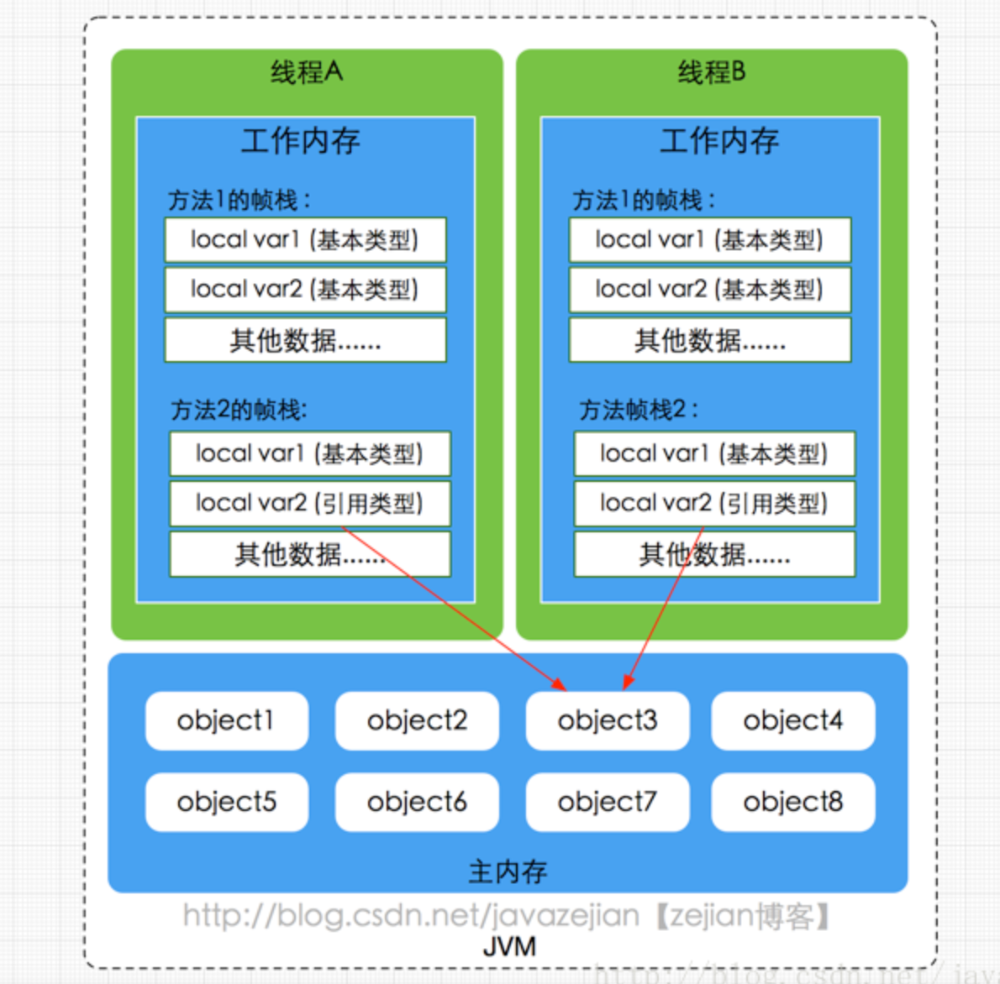
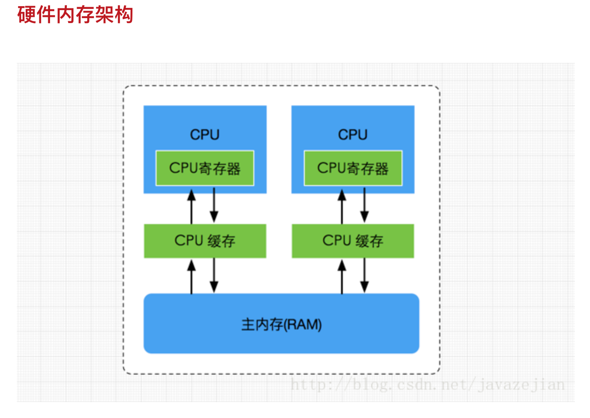

## JVM总结

###1.JVM是什么？

• 内存泄漏（memory leak）
 存储共享数据，需显示的进行内存分配和内存释放。忘记释放时，对应的内存不能再次使用。内存一直被占用却不再使用，这种情况就称为内存泄漏。
 简单点：所有堆空间都被无法回收的垃圾对象占满，虚拟机无法再分配新的空间。
 
### 1.1 （了解）JVM的常用参数

JVM的参数非常之多，这里只列举比较重要的几个，通过各种各样的搜索引擎也可以得知这些信息。

| 参数名称 | 含义 | 默认值 | 说明 |
|------|------------|------------|------|
| -Xms  | 初始堆大小          | 物理内存的1/64(<1GB)         |默认(MinHeapFreeRatio参数可以调整)空余堆内存小于40%时，JVM就会增大堆直到-Xmx的最大限制.
| -Xmx  | 最大堆大小        | 物理内存的1/4(<1GB)        | 默认(MaxHeapFreeRatio参数可以调整)空余堆内存大于70%时，JVM会减少堆直到 -Xms的最小限制
| -Xmn  | 年轻代大小(1.4or lator)       |        |注意：此处的大小是（eden+ 2 survivor space).与jmap -heap中显示的New gen是不同的。整个堆大小=年轻代大小 + 老年代大小 + 持久代（永久代）大小.增大年轻代后,将会减小年老代大小.此值对系统性能影响较大,Sun官方推荐配置为整个堆的3/8
| -XX:NewSize  | 设置年轻代大小(for 1.3/1.4)          |          |
| -XX:MaxNewSize  | 年轻代最大值(for 1.3/1.4)        |         |
| -XX:PermSize  | 设置持久代(perm gen)初始值     | 物理内存的1/64       |
| -XX:MaxPermSize  | 设置持久代最大值          | 物理内存的1/4         |
| -Xss  | 每个线程的堆栈大小        |         | JDK5.0以后每个线程堆栈大小为1M,以前每个线程堆栈大小为256K.根据应用的线程所需内存大小进行 调整.在相同物理内存下,减小这个值能生成更多的线程.但是操作系统对一个进程内的线程数还是有限制的,不能无限生成,经验值在3000~5000左右一般小的应用， 如果栈不是很深， 应该是128k够用的 大的应用建议使用256k。这个选项对性能影响比较大，需要严格的测试。（校长）和threadstacksize选项解释很类似,官方文档似乎没有解释,在论坛中有这样一句话:-Xss is translated in a VM flag named ThreadStackSize”一般设置这个值就可以了
| -XX:NewRatio  | 年轻代(包括Eden和两个Survivor区)与年老代的比值(除去持久代)       |        |-XX:NewRatio=4表示年轻代与年老代所占比值为1:4,年轻代占整个堆栈的1/5Xms=Xmx并且设置了Xmn的情况下，该参数不需要进行设置。
| -XX:SurvivorRatio  | Eden区与Survivor区的大小比值          |          |设置为8,则两个Survivor区与一个Eden区的比值为2:8,一个Survivor区占整个年轻代的1/10
| -XX:+DisableExplicitGC  | 关闭System.gc()        |         |这个参数需要严格的测试
| -XX:PretenureSizeThreshold  | 对象超过多大是直接在旧生代分配       | 0      |单位字节 新生代采用Parallel ScavengeGC时无效另一种直接在旧生代分配的情况是大的数组对象,且数组中无外部引用对象.

### 1.3 双亲委派模型介绍
每一个类都有一个对应它的类加载器。系统中的 ClassLoader 在协同工作的时候会默认使用 **双亲委派模型** 。
即在类加载的时候，系统会首先判断当前类是否被加载过。已经被加载的类会直接返回，否则才会尝试加载。
加载的时候，首先会把该请求委派给父类加载器的 `loadClass()` 处理，因此所有的请求最终都应该传送到顶层的启动类加载器 `BootstrapClassLoader` 中。
当父类加载器无法处理时，才由自己来处理。当父类加载器为 null 时，会使用启动类加载器 `BootstrapClassLoader` 作为父类加载器。

##2.JMM是什么？
Java虚拟机中定义了Java内存模型，JMM（Java Memory Model），只是一个概念，用于屏蔽掉各种硬件和操作系统的内存访问差异，
以实现让Java程序在各种平台下都能达到一致的并发效果，JMM规范Java虚拟机与计算机内存如何协同工作。
规定一个线程如何何时可以看到其他变量修改过的值，以及在必须时如何同步的访问共享变量。
• JMM规范定义了程序中变量(包括实例变量、静态字段、数组对象)的访问方式。
• JMM运行程序的实体是线程，线程运行后，JVM创建工作内存(栈)，用于存储线程私有的数据。
• JMM规定所有变量存储在主内存中，主内存为共享区域，所有线程可以访问主内存的变量。但对变量的操作（读取/赋值）必须在工作内存中。
• 当要修改主内存中一个变量值时，不可直接在主内存中操作，需要从主内存中拷贝一份变量副本到工作内存。操作完再写回主内存。
  工作内存线程私有，主内存线程共享。线程通讯必须通过主内存完成。
总结：JMM更多的是一组规则，通过这组规则控制变量在共享内存区域（主内存）和私有内存区域（工作内存）中的访问方式，
JMM是围绕原子性、有序性、可见性展开的。

• 主内存：
 主要存储的是Java的实例对象，所有线程创建的实例对象都存储在主内存中，不管实例对象是成员变量还是方法中的本地变量，
 当然也包括了共享的类信息、常量、静态变量。由于是共享数据区域，多条线程对同一变量的访问可能发现线程安全问题。
 
• 工作内存：
主要存储当前方法的所有本地变量信息（从主内存中拷贝的变量副本），每个线程只能访问自己的工作内存，
即线程中的本地变量对其他线程是不可见的，就算是两个线程同时执行同一段代码，他们也会各自在自己的工作内存中创建当前线程的本地变量。
包括字节码行号指示器，native方法的信息。由于工作内存是每个线程私有数据，线程间无法访问工作内存，因此存储在工作内存中的数据不存在线程安全问题。

• 主内存与工作内存的数据存储类型以及操作方式
根据JVM规范，实例对象的成员方法中包含的本地变量是基本数据类型(int,byte,short,long,float,double,char,boolean)，
是存储在工作内存中的栈帧结构中。若本地变量是应用类型(Object)，也是存储在工作内存的栈帧中，对象的实例存储在主内存（共享区域，堆）中。
对于实例对象的成员变量(Integer，Double等)还是引用类型，都会被存储到堆区。至于static修饰的变量和类信息存储在主内存中。
由于主内存共享，两个线程同时调用主内存中对象的同一方法，两个线程会将要操作的数据拷贝一份到自己的工作内存中，执行操作完成后才刷新到主内存中。

• 硬件内存架构与内存模型

•所谓的线程安全问题，用JMM内存模型来描述的话，首先有两个线程A,B，主内存中有个变量x=1， 现在A线程从主内存中读取x的副本，并修改x=2；再写回主内存
 B线程读取变量中的x的副本，那么此时x的值时2还是1，并不清楚。有两种情况，一种就是在线程A读取x后还未写入，那么线程B读取x值就是1，
 一种就是线程A读取x后写入主内存，线程B再进行读取x的值就是2。这就是线程安全问题。
 JMM为了解决这样的问题，定义了一组规则。规定一个线程对共享变量的写入何时对其他线程可见。所以就有了可见性、有序性、原子性。
 
 • 原子性
原子性是指一个操作是不可中断的，即使在多线程环境下，一个操作一旦开始就不会被其他线程影响。比如静态变量int x，两个线程同时为它赋值，线程A赋值为1，
线程B赋值为2，不管线程如何运行，x的值要么是1要么是2。线程A线程B间的操作是没有干扰的，这就是原子性操作，不可被中断的特点。对应64位机器系统来说，
基本数据类型(int,byte,short,long,float,double,char,boolean)的读写是原子操作

• 指令重排
计算机在执行程序时，为了提高性能，编译器和处理器常常会对指令做重排操作，一般分为以下三种。
 ▪ 编译器优化的重排（编译期重排）
    编译器在不改变单线程程序语义的前提下，可以重新安排语句的执行顺序。
 ▪ 指令并行重排（处理器重排）
    现代处理器采用了指令级并行技术来将多条指令重叠执行。
    如果不存在数据依赖性(即后一个执行的语句无需依赖前面执行的语句的结果)，处理器可以改变语句对应的机器指令的执行顺序。
 ▪ 内存系统重排（处理器重排）
    由于处理器使用缓存和读写缓存冲区，这使得加载(load)和存储(store)操作看上去可能是在乱序执行，因为三级缓存的存在，导致内存与缓存的数据同步存在时间差。
  在多线程环境中，这些重排优化可能会导致程序出现内存可见性问题，下面分别阐明这两种重排优化可能带来的问题
 注意：指令重排只会保证单线程串行语义的执行一致性，并不会关系多线程间的语义一致性。

• 可见性
可见性指当一个线程修改了某个共享变量的值，其他线程能否马上得知这个修改的值。
串行程序中不存在可见性，在串行程序中，我们任何一个操作修改了某个变量的值，后续的操作都能读到这个变量最新的值。
多线程中，指令重排，编译器优化，多线程修改共享变量都将可能会导致主内存中的共享变量的值与工作线程中的不一致。

• 有序性
有序性是指单线程的执行代码，是顺序执行的。多线程下可能出现乱序的现象。因为程序编译成机器码指令后可能会出现指令重排的现象，重排后的指令与原指令未必一致。
在java本线程中，所有操作都是有序的，但在多线程下，一个线程观察另一个线程，所有操作都是无序的。前半句指单线程内保证串行语句执行的一致性。
后半句指指令重排现象和工作内存与主内存同步延迟现象。

• JMM提供的解决方案
 ▪ JMM保证基本数据类型的读写操作的原子性。对于方法级别和代码级别的原子操作，可以使用synchronized关键字和重入锁(ReentrantLock)保证程序执行的原子性。
 ▪ 而主内存与工作内存同步延迟的可见性问题和有序性问题，可以使用synchronized和volatile关键字来保证原子性、可见性、有序性。
 ▪ JMM内部定义一套happens-before原则来保证多线程环境下来保证两个操作的原子性、有序性和可见性。
 
 • 理解happens-before规则
 内存如下
  ▪ 程序顺序原则，即一个线程内必须保证语义串行性，也就是按代码顺序执行。
  ▪ 锁规则 解锁（unlock）必须发生在同一个锁的加锁（lock）之前，也就是说对于一个锁解锁后，再加锁，那么加锁动作必须在解锁动作之后（同一个锁）。
  ▪
