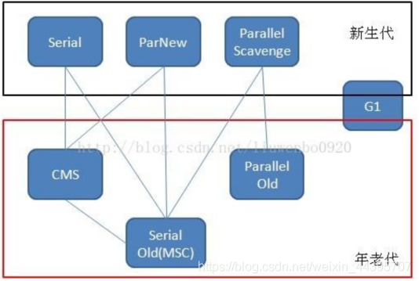

## JVM总结

###1.JVM是什么？

• 内存泄漏（memory leak）
 存储共享数据，需显示的进行内存分配和内存释放。忘记释放时，对应的内存不能再次使用。内存一直被占用却不再使用，这种情况就称为内存泄漏。
 简单点：所有堆空间都被无法回收的垃圾对象占满，虚拟机无法再分配新的空间。
 
### 1.1 （了解）JVM的常用参数

JVM的参数非常之多，这里只列举比较重要的几个，通过各种各样的搜索引擎也可以得知这些信息。

| 参数名称 | 含义 | 默认值 | 说明 |
|------|------------|------------|------|
| -Xms  | 初始堆大小          | 物理内存的1/64(<1GB)         |默认(MinHeapFreeRatio参数可以调整)空余堆内存小于40%时，JVM就会增大堆直到-Xmx的最大限制.
| -Xmx  | 最大堆大小        | 物理内存的1/4(<1GB)        | 默认(MaxHeapFreeRatio参数可以调整)空余堆内存大于70%时，JVM会减少堆直到 -Xms的最小限制
| -Xmn  | 年轻代大小(1.4or lator)       |        |注意：此处的大小是（eden+ 2 survivor space).与jmap -heap中显示的New gen是不同的。整个堆大小=年轻代大小 + 老年代大小 + 持久代（永久代）大小.增大年轻代后,将会减小年老代大小.此值对系统性能影响较大,Sun官方推荐配置为整个堆的3/8
| -XX:NewSize  | 设置年轻代大小(for 1.3/1.4)          |          |
| -XX:MaxNewSize  | 年轻代最大值(for 1.3/1.4)        |         |
| -XX:PermSize  | 设置持久代(perm gen)初始值     | 物理内存的1/64       |
| -XX:MaxPermSize  | 设置持久代最大值          | 物理内存的1/4         |
| -Xss  | 每个线程的堆栈大小        |         | JDK5.0以后每个线程堆栈大小为1M,以前每个线程堆栈大小为256K.根据应用的线程所需内存大小进行 调整.在相同物理内存下,减小这个值能生成更多的线程.但是操作系统对一个进程内的线程数还是有限制的,不能无限生成,经验值在3000~5000左右一般小的应用， 如果栈不是很深， 应该是128k够用的 大的应用建议使用256k。这个选项对性能影响比较大，需要严格的测试。（校长）和threadstacksize选项解释很类似,官方文档似乎没有解释,在论坛中有这样一句话:-Xss is translated in a VM flag named ThreadStackSize”一般设置这个值就可以了
| -XX:NewRatio  | 年轻代(包括Eden和两个Survivor区)与年老代的比值(除去持久代)       |        |-XX:NewRatio=4表示年轻代与年老代所占比值为1:4,年轻代占整个堆栈的1/5Xms=Xmx并且设置了Xmn的情况下，该参数不需要进行设置。
| -XX:SurvivorRatio  | Eden区与Survivor区的大小比值          |          |设置为8,则两个Survivor区与一个Eden区的比值为2:8,一个Survivor区占整个年轻代的1/10
| -XX:+DisableExplicitGC  | 关闭System.gc()        |         |这个参数需要严格的测试
| -XX:PretenureSizeThreshold  | 对象超过多大是直接在旧生代分配       | 0      |单位字节 新生代采用Parallel ScavengeGC时无效另一种直接在旧生代分配的情况是大的数组对象,且数组中无外部引用对象.

###1.2Java类信息在JVM内存区域的存储区别？
• 方法区（Method Area）线程共享 存储类信息
    ▪ 类类型（class、interface、enum、annotation）
    ▪ 类全限定名 (java.lang.zx.HelloWorld) 
    ▪ 类的父类全限定名（java.lang.zx.Father）但不包括java.lang.Object类，其他类型若没有声明父类，默认父类是Object
    ▪ 类型的修饰符（public、abstract、final的某个子类）.
    ▪ 类型的直接接口的有序列表理解为将实现的接口变为一个有序列表
    ▪ 类型的常连池(constant pool)，域(Field)信息，静态方法(static Method)信息，除了常量外的所有静态(static)变量、成员变量。
• 堆(heap)
    ▪ 对象实例(new HelloWorld)
    ▪ 实例变量（非static 修饰的成员变量）和对象关联在一起，所以实例变量也在堆中
    

### 1.3 双亲委派模型介绍
每一个类都有一个对应它的类加载器。系统中的 ClassLoader 在协同工作的时候会默认使用 **双亲委派模型** 。
即在类加载的时候，系统会首先判断当前类是否被加载过。已经被加载的类会直接返回，否则才会尝试加载。
加载的时候，首先会把该请求委派给父类加载器的 `loadClass()` 处理，因此所有的请求最终都应该传送到顶层的启动类加载器 `BootstrapClassLoader` 中。
当父类加载器无法处理时，才由自己来处理。当父类加载器为 null 时，会使用启动类加载器 `BootstrapClassLoader` 作为父类加载器。

### 1.4 Java中有哪些类加载器？
JDK有自带三个类加载器，BootstrapClassLoader，ExtensionClassLoader，ApplicationClassLoader 
此外用户可自定义类加载器，UserClassLoader 
实现方法：
• 继承java.lang.ClassLoader，重写findClass()方法.
• 也可继承UserClassLoader，重写LoadClass()方法，

##2.Java内存模型（JMM）是什么？
Java虚拟机中定义了Java内存模型，JMM（Java Memory Model），只是一个概念，用于屏蔽掉各种硬件和操作系统的内存访问差异，
以实现让Java程序在各种平台下都能达到一致的并发效果，JMM规范Java虚拟机与计算机内存如何协同工作。
规定一个线程如何何时可以看到其他变量修改过的值，以及在必须时如何同步的访问共享变量。
• JMM规范定义了程序中变量(包括实例变量、静态字段、数组对象)的访问方式。
• JMM运行程序的实体是线程，线程运行后，JVM创建工作内存(栈)，用于存储线程私有的数据。
• JMM规定所有变量存储在主内存中，主内存为共享区域，所有线程可以访问主内存的变量。但对变量的操作（读取/赋值）必须在工作内存中。
• 当要修改主内存中一个变量值时，不可直接在主内存中操作，需要从主内存中拷贝一份变量副本到工作内存。操作完再写回主内存。
  工作内存线程私有，主内存线程共享。线程通讯必须通过主内存完成。
总结：JMM更多的是一组规则，通过这组规则控制变量在共享内存区域（主内存）和私有内存区域（工作内存）中的访问方式，
JMM是围绕原子性、有序性、可见性展开的。

• 主内存：
 主要存储的是Java的实例对象，所有线程创建的实例对象都存储在主内存中，不管实例对象是成员变量还是方法中的本地变量，
 当然也包括了共享的类信息、常量、静态变量。由于是共享数据区域，多条线程对同一变量的访问可能发现线程安全问题。
 
• 工作内存：
主要存储当前方法的所有本地变量信息（从主内存中拷贝的变量副本），每个线程只能访问自己的工作内存，
即线程中的本地变量对其他线程是不可见的，就算是两个线程同时执行同一段代码，他们也会各自在自己的工作内存中创建当前线程的本地变量。
包括字节码行号指示器，native方法的信息。由于工作内存是每个线程私有数据，线程间无法访问工作内存，因此存储在工作内存中的数据不存在线程安全问题。

• 主内存与工作内存的数据存储类型以及操作方式
根据JVM规范，实例对象的成员方法中包含的本地变量是基本数据类型(int,byte,short,long,float,double,char,boolean)，
是存储在工作内存中的栈帧结构中。若本地变量是应用类型(Object)，也是存储在工作内存的栈帧中，对象的实例存储在主内存（共享区域，堆）中。
对于实例对象的成员变量(Integer，Double等)还是引用类型，都会被存储到堆区。至于static修饰的变量和类信息存储在主内存中。
由于主内存共享，两个线程同时调用主内存中对象的同一方法，两个线程会将要操作的数据拷贝一份到自己的工作内存中，执行操作完成后才刷新到主内存中。

• 硬件内存架构与内存模型

•所谓的线程安全问题，用JMM内存模型来描述的话，首先有两个线程A,B，主内存中有个变量x=1， 现在A线程从主内存中读取x的副本，并修改x=2；再写回主内存
 B线程读取变量中的x的副本，那么此时x的值时2还是1，并不清楚。有两种情况，一种就是在线程A读取x后还未写入，那么线程B读取x值就是1，
 一种就是线程A读取x后写入主内存，线程B再进行读取x的值就是2。这就是线程安全问题。
 JMM为了解决这样的问题，定义了一组规则。规定一个线程对共享变量的写入何时对其他线程可见。所以就有了可见性、有序性、原子性。
 
 • 原子性
原子性是指一个操作是不可中断的，即使在多线程环境下，一个操作一旦开始就不会被其他线程影响。比如静态变量int x，两个线程同时为它赋值，线程A赋值为1，
线程B赋值为2，不管线程如何运行，x的值要么是1要么是2。线程A线程B间的操作是没有干扰的，这就是原子性操作，不可被中断的特点。对应64位机器系统来说，
基本数据类型(int,byte,short,long,float,double,char,boolean)的读写是原子操作

• 指令重排
计算机在执行程序时，为了提高性能，编译器和处理器常常会对指令做重排操作，一般分为以下三种。
 ▪ 编译器优化的重排（编译期重排）
    编译器在不改变单线程程序语义的前提下，可以重新安排语句的执行顺序。
 ▪ 指令并行重排（处理器重排）
    现代处理器采用了指令级并行技术来将多条指令重叠执行。
    如果不存在数据依赖性(即后一个执行的语句无需依赖前面执行的语句的结果)，处理器可以改变语句对应的机器指令的执行顺序。
 ▪ 内存系统重排（处理器重排）
    由于处理器使用缓存和读写缓存冲区，这使得加载(load)和存储(store)操作看上去可能是在乱序执行，因为三级缓存的存在，导致内存与缓存的数据同步存在时间差。
  在多线程环境中，这些重排优化可能会导致程序出现内存可见性问题，下面分别阐明这两种重排优化可能带来的问题
 注意：指令重排只会保证单线程串行语义的执行一致性，并不会关系多线程间的语义一致性。

• 可见性
可见性指当一个线程修改了某个共享变量的值，其他线程能否马上得知这个修改的值。
串行程序中不存在可见性，在串行程序中，我们任何一个操作修改了某个变量的值，后续的操作都能读到这个变量最新的值。
多线程中，指令重排，编译器优化，多线程修改共享变量都将可能会导致主内存中的共享变量的值与工作线程中的不一致。

• 有序性
有序性是指单线程的执行代码，是顺序执行的。多线程下可能出现乱序的现象。因为程序编译成机器码指令后可能会出现指令重排的现象，重排后的指令与原指令未必一致。
在java本线程中，所有操作都是有序的，但在多线程下，一个线程观察另一个线程，所有操作都是无序的。前半句指单线程内保证串行语句执行的一致性。
后半句指指令重排现象和工作内存与主内存同步延迟现象。

• JMM提供的解决方案
 ▪ JMM保证基本数据类型的读写操作的原子性。对于方法级别和代码级别的原子操作，可以使用synchronized关键字和重入锁(ReentrantLock)保证程序执行的原子性。
 ▪ 而主内存与工作内存同步延迟的可见性问题和有序性问题，可以使用synchronized和volatile关键字来保证原子性、可见性、有序性。
 ▪ JMM内部定义一套happens-before原则来保证多线程环境下来保证两个操作的原子性、有序性和可见性。
 
 • 理解happens-before规则
 内存如下
  ▪ 程序顺序原则，即一个线程内必须保证语义串行性，也就是按代码顺序执行。
  ▪ 锁规则 解锁（unlock）必须发生在同一个锁的加锁（lock）之前，也就是说对于一个锁解锁后，再加锁，那么加锁动作必须在解锁动作之后（同一个锁）。
  

##3.在Java中，对象什么时候可以被垃圾回收?
• 引用计数法，当对象没有被任何引用时，即可被回收。
• 可达性分析法，当对象既没有任何引用，且GCRoot引用链找不到时，即可被回收。

##3.1什么是SWT（stop the world）？
答：GC执行过程中，用户线程暂停执行的一种状态。除了不能与JVM交互的native方法可执行。GC调优的重点是，减少用户线程停顿的时间，尽量增加系统的吞吐量。

##4.JVM 运行时堆内存如何分代?
• 新生代,Eden 8/10,Survivor From 1/10,Survivor To 1/10   占用1/3堆空间，用来存放新生的对象，由于频繁创建对象，新生代会频繁触发MinorGC
进行垃圾回收，
• Eden区 ，Java新对象的出生地，（如果创建的新对象占用的内存很大，就会直接进入老年代。）Eden区，内存不够存放对象，会进行MinorGC，对新生代区进行回收。
• MinorGC采用复制算法，
    ▪ eden、survive from、复制对象到 survivor to 区域 年龄+1，如复制过程中有对象年龄已达到设置年龄阈值，比如5。
    就会直接进入老年代。同时把这些对象的年龄+1,当survivor to区域对象放不下了，也会直接进入老年代。
    ▪ 清空eden区、survivor from的垃圾对象所在的内存空间。
    ▪ 最后 survivor to 与survivor from 指针对换，方便下次回收。
• 老年代 占用 2/3堆空间 主要存放应用程序中生命周期长的对象。 老年代比较稳定，所以Major GC(Full GC)不会频繁进行，当老年代无法找到足够大的连续空间分配
给新创建的对象时，也会触发一次Major GC进行垃圾回收腾出空间。

• 永久代 Permanent Generation指内存永久保存的区域，主要存放class类、 常量、方法描述的信息，class被加载的时候放入永久区域。它和程序存放的实例的区域不同，GC不会在主程序运行时期
对永久代区域进行清理。对永久代进行回收主要是回收废弃常量和无用的类，所以导致永久区域随着class 的增多而胀满，最终抛出OOM异常。

##4.1 Minor GC、Major GC 、 Full GC的区别？
• Minor GC 主要发生在 年轻代，且年轻代eden 不够堆内存存放新对象时发生。主要回收新生代eden 和 from 或to 区的对象
• Major GC 主要发生在老年代，清理老年区，比Minor GC 至少慢10倍以上。
• Full GC 主要发生在老年代，老年代无法创建更多对象时会发送，清理整个堆内存，包括新生代和老年代。

##5.JVM内存为什么要分成新生代，老年代，持久代。新生代中为什么要分为Eden和Survivor。
• 为了使JVM更好的管理堆内存中的对象，更好的进行内存的分配和回收。
    ▪ 共享内存区划分 
              共享内存区 = 持久带 + 堆
              持久带 = 方法区 + 其他
              Java堆 = 老年代 + 新生代
              新生代 = Eden + S0 + S1
    ▪ 一些参数的配置
    默认的，新生代 ( Young ) 与老年代 ( Old ) 的比例的值为 1:2 ，可以通过参数 –XX:NewRatio 配置。
    默认的，Eden : from : to = 8 : 1 : 1 ( 可以通过参数 –XX:SurvivorRatio 来设定)
    Survivor区中的对象被复制次数为15(对应虚拟机参数 -XX:+MaxTenuringThreshold)
    ▪ 为什么要分为Eden和Survivor?为什么要设置两个Survivor区？
     如果没有survivor 区域，eden区每次进行一次MinorGC，存活的对象就会被送到老年代， 老年代很快就会被占满。老年代的区域远大于新生代，触发Major GC
     的时间远比minor GC的时间要长，所以要区分新生代要区分 survivor和eden 
    ▪ survivor 区的意义就是，减少存活的对象被直接送入老年代，间接减少Full GC发生的次数，survivor 区待满16次被回收的经验的对象，才会进入老年代。
    ▪ 设置两个survivor区的最大好处是解决碎片化，保证了在复制算法回收的过程中，from区和eden区的存活对象占用的是连续的内存空间，避免碎片化的发生。
   
## 5.1JVM中的永久代中会发生垃圾回收吗
垃圾回收不会发生在永久代，永久代满了或者超过临界值，会触发Full GC。Java8 已经彻底移除永久代，取而代之的是native内存区，也叫元数据区。

##6.JAVA8 与元数据
在java 8中，永久代已被元数据区取代，他们的区别是元空间不存在虚拟机内中，而是存在本地内存，也可以理解是虚拟机外的内存。因此受限于本地内存大小。
元空间存放类的元数据。堆存放字符串池和静态变量。那么这样加载多少个类的元数据多不由MaxPermSize来控制，而是由系统实际可用内存控制。

## 7.垃圾收集算法有哪些类型？
标记清除、复制、标记整理、分代收集。
• 标记-清除：“标记-清除”（Mark-Sweep）算法(老年代)，如它的名字一样，算法分为“标记”和“清除”两个阶段：
        1.首先标记出所有需要回收的对象，2.在标记完成后统一回收掉所有被标记的对象。 
        缺点：标记、清除过程效率低，产生大量不连续的内存碎片，提高了垃圾回收的频率。
        优点：实现简单，不需要对象移动。
• 复制（Copying）用于新生代，堆内存空间分为两个相等的空间，每次使用其中一块，当一块堆内存使用完，会将还存活的对象复制到另一块堆内中，将剩余对象的内存空间进行回收。
        缺点：可用内存大小缩小为原来的一半，对象存活率高时会频繁进行复制。
        优点：能够按顺序分配内存，实现简单，运行高效，不会产生内存碎片。
        新生代minor GC采用复制算法，因为对象存活率低，复制已存活对象时，效率高。
• 标记-整理（Mark Compact）用于老年代，标记可回收的对象，将其压缩至内存的一端，使他们紧凑排列在一起，对边界以外的内存进行回收，回收后已用和未用内存各占一边。
        优点：解决了标记-清除算法的内存碎片问题。
        缺点：仍需要进行局部对象移动，一定程序上降低了效率。
        
        
##8.GC的垃圾回收器有哪些？
Java 堆内存被划分为新生代和年老代两部分，新生代主要使用复制和标记-清除垃圾回收算法；年老代主要使用标记-整理垃圾回收算法，
因此 java 虚拟中针对新生代和年老代分别提供了多种不同的垃圾收集器， JDK1.6 中 Sun HotSpot 虚拟机的垃圾收集器如下：

• Serial收集器（复制算法）：新生代单线程收集器，标记清除和清理都是单线程，简单高效。
• ParNew收集器（复制算法）：新生代并行收集器，Serial收集器的多线程版本，多核CPU下性能比Serial更好。
• Parallel Scavenge（复制算法）:新生代并行收集器，追求高吞吐量，高效利用CPU。吞吐量=用户线程占用时间/(用户线程执行时间+GC停顿时间)程序总占用时间，
高吞吐量可以高效利用CPU时间，尽快完成程序的运算任务，适合后台应用等对交互要求不高的场景。例如虚拟机总共运行100分钟，垃圾回收占1分钟，那么吞吐量就是99%
• Serial Old（标记-整理）:老年代单线程收集器，Serial的老年代版本.
• Parallel Old (标记-整理)：老年代并行收集器，吞吐量优先，Parallel Scavenge的老年代版本。
• CMS Concurrent Mark Sweep（标记-清除算法）：老年代并行收集器，以获取最短的停顿时间为目标的收集器，具有高并发，低停顿的特点，追求最短GC回收停顿时间。
    CMS分为：初始标记，并发标记，重新标记，并发清除。 初始标记和重新标记会停顿所有的工作线程，收集结束会产生大量空间碎片。
• G1（Garbage First）收集器（标记-整理)：G1在java 1.7被推出，1.9作为默认垃圾回收器。G1是基于标记整理算法实现的，也就是不会产生大量的内存碎片。
  G1不同于之前回收器的最大特点是：G1回收的范围是整个Java堆(包括新生代和老年代)，而之前的回收器回收范围仅限于新生代和老年代。
   G1：分为初始标记，并发标记，最终标记，筛选标记。不会产生内存碎片，可以精准的控制停顿时间。
• ZGC
   
##8.1 CMS和G1的区别？
• CMS收集器是老年代的收集器，可以配合serial 和Par New 一起试用。
• CMS的收集范围是老年代，G1的收集范围是新生代和老年代。
• CMS是以最小停顿时间为目标的垃圾收集器，G1是可精准控制停顿时间的垃圾收集器。
• CMS使用的是标记清除算法，G1使用的是标记整理算法。

##8.3G1垃圾回收器？
G1基于Region布局，不再以固定大小及固定数量的分代区域划分，而是把连续的Java堆划分为多个大小相等的独立区域（Region），每一个Region都可以根据需要，
扮演新生代的Eden空间，Survivor空间，或老年代空间。收集器能够对扮演不同角色的Region采用不同的策略去处理，这样无论是新创建的对象还是已经存活了一段时间、
熬过多次收集的旧对象都能获得很好的收集效果。
Region中有一类特殊Humongous区域，专门存储大对象。G1认为只要大小超过了一个Region容量一半的对象即可判定为大对象。
Region大小设置：-XX：G1HeapRegionSize 范围1MB~32MB，且为2的N次幂
对于超过了Region容量的超大对象，将会被存放在N个连续的Humongous Region之中。
G1的运行步骤：
    • 初始标记(Initial Marking)，Minor GC进行时同步完成的。没有额外的停顿
    • 并发标记(Concurrent Marking)，从GC Root开始对堆中对象进行可达性分析，递归扫描整个堆里的对象图，找出要回收的对象。停顿较长。
    • 最终标记(Final Marking)，用户线程做另一个短暂的暂停，用于处理并发阶段结束后遗留下来的少量的SATB记录。
    • 筛选回收(Live Data Counting and Evacuation)，负责更新Region的统计数据，对各个Region的回收价值和成本进行排序。
      根据用户期望停顿时间来制定回收计划，可以自由选择任意多个Region构成回收集，然后把决定回收的那一部分Region存活对象复制到空Region中。
      再清理掉整个旧Region空间。这里涉及存活对象的移动必须暂停用户线程。由多条收集器线程并行完成。
G1的停顿时间设置，默认停顿两百毫秒，一般在几十至一百甚至两百毫秒正常。如果我们把停顿时间设置的非常低，譬如设置为二十毫秒，很可能出现的结果是由于
停顿目标时间太短，导致每次选出来的回收集只占堆内存
G1使用的算法，整体来看是基于标记整理的，局部来看是基于标记复制实现的。

##9.什么时候会触发FullGC？
1.System.gc()
2.老年代空间不足，创建大对象，大数组时。执行FullGC后，空间仍然不足，则抛出java.lang.OutOfMemoryError:java heap space
为了避免上述两种情况导致的内存溢出，调优时，尽量做到让对象在minorGC时就被回收。

3.Permanent Generation空间满 主要存放class 类信息，当系统中要加载的类，反射的类，要调用的方法比较多时，permanent generation 可能会被占满。
默认采用CMS GC情况下会执行Full GC ，如果Full GC仍然回收不了时，JVM会抛出，java.lang.OutOfMemoryError: PermGen Space
避免 Perm Space error  可以增大Permanent Generation 空间或者使用CMS GC

4.CMS GC时出现promotion failed和concurrent mode failure 应对措施为：增大survivorspace、老生代空间或调低触发并发GC的比率,
但在JDK 5.0+、6.0+的版本中有可能会由于JDK的bug29导致CMS在remark完毕后很久才触发sweeping动作。对于这种状况，可通过设置-XX:CMSMaxAbortablePrecleanTime=5（单位为ms）来避免。

5.统计得到的Minor GC晋升到旧生代的平均大小大于旧生代的剩余空间
这是一个较为复杂的触发情况，Hotspot为了避免由于新生代对象晋升到旧生代导致旧生代空间不足的现象，在进行Minor GC时，做了一个判断，
如果之前统计所得到的Minor GC晋升到旧生代的平均大小大于旧生代的剩余空间，那么就直接触发Full GC。
例如程序第一次触发MinorGC后，有6MB的对象晋升到旧生代，那么当下一次Minor GC发生时，首先检查旧生代的剩余空间是否大于6MB，如果小于6MB，则执行Full GC。
当新生代采用PSGC时，方式稍有不同，PS GC是在Minor GC后也会检查，例如上面的例子中第一次Minor GC后，PS GC会检查此时旧生代的剩余空间是否大于6MB，
如小于，则触发对旧生代的回收。除了以上4种状况外，对于使用RMI来进行RPC或管理的Sun JDK应用而言，默认情况下会一小时执行一次Full GC。
可通过在启动时通过- java-Dsun.rmi.dgc.client.gcInterval=3600000来设置Full GC执行的间隔时间或通过-XX:+ DisableExplicitGC来禁止RMI调用System.gc

##9.1 类被加载到虚拟机中，各参数的存放？

##10.简述java的类加载机制？
虚拟机把类的描述文件从Class文件加载到内存。并对数据进行校验、解析和初始化，最终形成可被虚拟机直接使用的java类型。

##11.简述java加载class文件的原理？
Java的类加载是动态的，JVM启动后不会将全部类加载，而是先加载保证程序运行的基础类，其他类对象需要时再进行加载。节省内存开销。
jvm加载类是通过classloader 实现的，由于java的跨平台性，经过编辑的源文件是一个或多个class文件，当java程序需要某个类是，需要确保这个类，已经
经过了加载，连接(验证、准备、解析)，初始化。类的加载是指把.class 文件读取到内存中，通常是创建一个字节数组读取.class文件，并在内存中生成class文件对象。
加载后，验证、准备（为静态变量分配内存并设置默认的初始值）和解析（将符号引用替换为直接引用）三个步骤。最后对类初始化，先初始化父类，父类成员变量，子类构造，父类构造....
• 加载：加载主要是将.class文件（也可以是zip包）通过二进制字节流读入到JVM中。
• 连接：验证 这一阶段的目的是为了确保Class文件的字节流中包含的信息符合当前虚拟机的要求，并且不会危害到自身的安全。
• 连接：准备 正式为类变量（其实是静态变量）分配初始内存并设置初始值（并不是代码的初始赋值）的阶段，这些变量所使用的内存都将在方法区中进行分配
• 连接：解析 将虚拟机中常量池内的符号引用替换为直接引用的过程，
• 初始化 到了初始化阶段，才真正开始执行类中定义的java程序代码。它主要是负责：初始化阶段是执行类构造器< clinit >()方法的过程， 
        < clinit >()是编译器自动收集类中所有的类变量的赋值动作、静态代码块产生的。
• 使用 当有继承关系时，先初始化父类再初始化子类，所以创建一个子类时其实内存中存在两个对象实例。
• 卸载 即销毁一个对象，一般情况下中有JVM垃圾回收器完成。代码层面的销毁只是将引用置为null。    

##12.简述双亲委派模型？
对于任何一个类，都需要由加载它的类加载器和这个类本身一同确立在 JVM 中的唯一性，每个类加载器，都有一个独立的类名称空间，类加载器就是根据全限定名将
类class文件加载到JVM内存中，再转化成class 对象。双亲委派的意思是指由父类加载器去优先加载，未加载到时，再由子加载器进行加载类对象。

##13.简述4种类加载器？
• 启动类加载器Bootstrap ClassLoader：加载java_HOME/lib/目录中的类库，或者是被 -Xbootclasspath 参数所指定的路径中的并且被虚拟机识别的类库。
• 扩展类加载器extension ClassLoader：加载 /lib/ext目录下的类库或者或java.ext.dirs系统变量指定的路径中的所有类库。
• 应用类加载器application ClassLoader：加载 用户路径classpath上的指定类库，我们可以直接使用这个加载器，没有自定义加载器情况下。

##14.双亲委派模型工作过程是?
如果一个类加载器收到类加载的请求，它首先不会自己去尝试加载这个类，而是把这个请求委派给父类加载器完成。每个类加载器都是如此，
只有当父加载器在自己的搜索范围内找不到指定的类时（即ClassNotFoundException），子加载器才会尝试自己去加载。

##15.new一个对象的过程？
• 检查这个指令的参数是否能在常量池中能否定位到一个类的符号引用，并且检查这个符号引用代表的类是否已被加载、解析和初始化过。
  如果没有，那必须先执行相应的类加载过程。去方法区 找这个对象的

• 为对象分配空间的任务等同于把一块确定大小的内存从Java堆中划分出来，方法有指针碰撞、空闲列表

• 虚拟机需要将分配到的内存空间中的数据类型都初始化为零值（不包括对象头）；
  接下来虚拟机要对对象进行必要的设置，例如这个对象是哪个类的实例、如何才能找到类的元数据信息、对象的哈希码、对象的GC分代年龄等信息，
  这些信息都存放在对象的对象头中。

##16.一个class 有那些占用内存呢？
• 对象头：16字节，markword 8字节，kclass：8字节
• 对象类字段、父类字段：具体的字段按照具体的值来弄
• 对齐填充：整体对象是8的倍数     

##17.静态代码块、普通代码块、构造函数执行顺序
• 静态代码块：这个先执行，因为它是在类加载的过程中就执行。
• 普通代码块：再就是普通代码块执行，对象一建立就运行构造代码块了，而且优先于构造函数执行。
• 构造函数：最后就是构造函数，对象一建立，就会调用与之相应的构造函数。

##18.类的描述信息包括哪些，并且在各个区域的存放是怎样的？
class mate 类描述信息是存在方法区的，
• 类的完整有效名，类的修饰符(public,abstract,final)，类型的直接接口的有序列表和继承的父类。
• 类型的常量池( constant pool)
• 域信息(Field)
• 方法信息(Method)
• 除常量外的所有静态变量(static)
Classloader将类的描述信息（类信息，常量，静态变量）存在方法区后，会创建一个Class对象，存放在堆中。

题外话：
在一个JVM实例的内部，类型信息被存储在一个称为方法区的内存逻辑区中。类型信息是由类加载器在类加载时从类文件中提取出来的。类(静态)变量也存储在方法区中。
JVM实现的设计者决定了类型信息的内部表现形式。如，多字节变量在类文件是以big-endian存储的，但在加载到方法区后，其存放形式由jvm根据不同的平台来具体定义。
VM在运行应用时要大量使用存储在方法区中的类型信息。在类型信息的表示上，设计者除了要尽可能提高应用的运行效率外，还要考虑空间问题。根据不同的需求，JVM的实现者可以在时间和空间上追求一种平衡。
因为方法区是被所有线程共享的，所以必须考虑数据的线程安全。假如两个线程都在试图找lava的类，在java类还没有被加载的情况下，只应该有一个线程去加载，而另一个线程等待。
方法区的大小不必是固定的，jvm可以根据应用的需要动态调整。同样方法区也不必是连续的。方法区可以在堆(甚至是虚拟机自己的堆)中分配。jvm可以允许用户和程序指定方法区的初始大小，最小和最大尺寸。
方法区同样存在垃圾收集，因为通过用户定义的类加载器可以动态扩展java程序，一些类也会成为垃圾。jvm可以回收一个未被引用类所占的空间，以使方法区的空间最小。

##19.常量池
jvm为每个已加载的类型都维护一个常量池。常量池就是这个类型用到的常量的一个有序集合，
• 包括实际的常量(string,integer, 和floating point常量)和对类型，域和方法的符号引用。

题外话
池中的数据项象数组项一样，是通过索引访问的。
因为常量池存储了一个类型所使用到的所有类型，域和方法的符号引用，所以它在java程序的动态链接中起了核心的作用。
jvm必须在方法区中保存类型的所有域的相关信息以及域的声明顺序，
域的相关信息包括：
域名
域类型
域修饰符(public, private, protected,static,final volatile, transient的某个子集)

##20.JVM调优工具？
JDK 自带了很多监控工具，都位于 JDK 的 bin 目录下，其中最常用的是 jconsole 和 jvisualvm 这两款视图监控工具。
• 显示虚拟机进程以及进程的配置、环境信息（jps、jinfo）。
• 监视应用程序的处理器、垃圾收集、堆、方法区以及线程的信息、死锁（jstat、jstack）。
• dump以及分析堆转存储快照（jmap、jhat）

##21.常用的 JVM 调优的参数都有哪些？
• -Xms2g：初始化推大小为 2g；
• -Xmx2g：堆最大内存为 2g；
• -XX:NewRatio=4：设置年轻的和老年代的内存比例为 1:4；
• -XX:SurvivorRatio=8：设置新生代 Eden 和 Survivor 比例为 8:2；
• –XX:+UseParNewGC：指定使用 ParNew + Serial Old 垃圾回收器组合；
• -XX:+UseParallelOldGC：指定使用 ParNew + ParNew Old 垃圾回收器组合；
• -XX:+UseConcMarkSweepGC：指定使用 CMS + Serial Old 垃圾回收器组合；
• -XX:+PrintGC：开启打印 gc 信息；
• -XX:+PrintGCDetails：打印 gc 详细信息。

##22.调优命令有哪些？
Sun JDK监控和故障处理命令有jps jstat jmap jhat jstack jinfo

1.jps，JVM Process Status Tool,显示指定系统内所有的HotSpot虚拟机进程。
2.jstat，JVM statistics Monitoring是用于监视虚拟机运行时状态信息的命令，它可以显示出虚拟机进程中的类装载、内存、垃圾收集、JIT编译等运行数据。
3.jmap，JVM Memory Map命令用于生成heap dump文件
4,jhat，JVM Heap Analysis Tool命令是与jmap搭配使用，用来分析jmap生成的dump，jhat内置了一个微型的HTTP/HTML服务器，生成dump的分析结果后，可以在浏览器中查看
5.jstack，用于生成java虚拟机当前时刻的线程快照。
6.jinfo，JVM Configuration info 这个命令作用是实时查看和调整虚拟机运行参数

##23.怎么打出线程栈信息？
可以说一下jps，top ，jstack这几个命令，再配合一次排查线上问题进行解答。
• 输入jps，获得进程号。
• top -Hp pid 获取本进程中所有线程的CPU耗时性能
• jstack pid命令查看当前java进程的堆栈状态
• 或者 jstack -l > /tmp/output.txt 把堆栈信息打到一个txt文件。
• 可以使用fastthread 堆栈定位，fastthread.io/