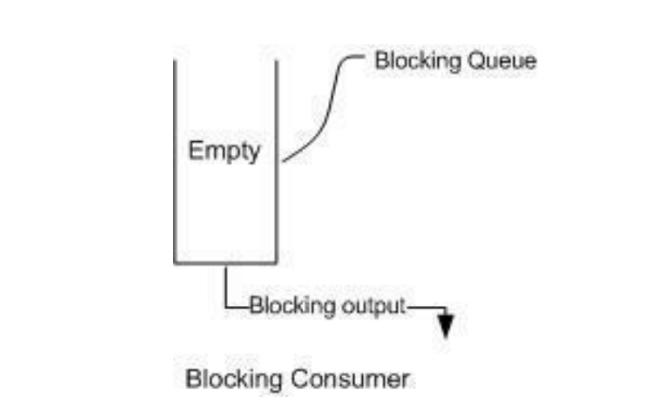
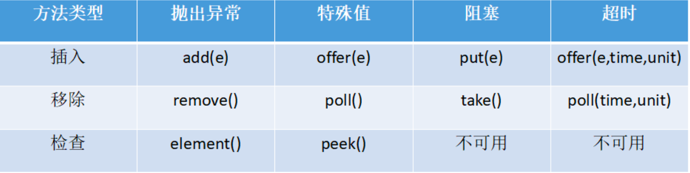

# 多线程总结

##1.什么是线程？
线程是操作系统能够进行运算调度的最小单位，它被包含在进程之中，是进程中的实际运作单位。
程序员可以通过它进行多处理器编程，你可以使用多线程对运算密集型任务提速。
比如，如果一个线程完成一个任务要100毫秒，那么用十个线程完成该任务只需10毫秒。

## 1.1守护线程时什么？
守护线程是运行在后的一种特殊进程，控制终端并且周期性得执行某种任务或者等待处理某些发生的事件。jvm GC就是守护线程。

## 1.3线程的生命周期？
线程有五种状态，分别是创建、就绪、运行、阻塞和死亡状态：
1.新建状态（NEW）：新创建了一个线程对象。
2.就绪状态（Runnable）：线程被创建后，其他线程调用了该对象的start()方法，该线程就进入就绪状态，表示可运行，等待获取CPU的使用权。
3.运行状态（Running）：就绪状态的线程获取了CPU的使用权，执行业务代码。
4.阻塞状态（Blocked）：阻塞状态是线程因为某种原因放弃CPU的使用权，暂时停止运行。直到线程进行就绪状态，才有机会转为运行状态。
5.死亡状态（Dead）：线程执行完或 因异常退出，表示该线程已死亡。

## 1.3.1线程的阻塞状态又分为三种：
• 等待阻塞：运行的线程执行wait方法，该线程会释放占用的所有资源，JVM会把该线程放入"等待池"中。进入这个状态后，线程不能被自动唤醒，必须依靠其他线程
调用notify后notifyAll方法唤醒。 wait是Object中的方法。
• 同步阻塞：运行的线程在获取对象的同步锁时，若该同步锁被其他线程占用，JVM会把该线程放入"锁池"中。
• 其他阻塞：运行的线程调用sleep或join方法时，或者发出I/O请求时，JVM会把该线程设置为阻塞状态，当sleep状态超时、join等待线程终止或超时、I/O处理完成，
            线程重新进入就绪状态，sleep是Thread类中的方法。


##2.线程和进程有什么区别？
一个进程是一个独立(self contained)的运行环境，它可以被看作一个程序或者一个应用。而线程是在进程中执行的一个任务。
线程是进程的子集，一个进程可以有很多线程，每条线程并行执行不同的任务。
不同的进程使用不同的内存空间，而所有的线程共享一片相同的内存空间。
每个线程都拥有单独的栈内存用来存储本地数据。

## 2.1并行和并发的区别？
• 并行：在时间上是重叠的，两个任务在同一时刻互不干扰的同时执行。（多核cpu 同时执行，不同任务。）
• 并发：允许两个任务互相干扰，同一时间，只有一个任务执行，交替执行。（单核cup 交替执行，相同或者不同任务。）
• 串行：在时间点上不可能发生重叠，一个任务执行完，才能执行下一个任务。（单核cpu 串行执行）
例子：7点，我在吃早餐，需要吃10分钟才能吃完，7点2分，我接到了一个电话，需要打5分钟。
并发：我吃了2分钟的饭，放下筷子，接5分钟电话，再吃8分钟的饭，7点15分，完成这两件事，花费15分钟。这是并发。
并行：我吃了2分钟的饭，接到电话，边吃边打电话，7点5分打完电话，7点10分吃完饭。完成这两件事花费10分钟。这就是并行。


##2.2同步和异步的区别？
同步：当你同步执行任务时，需要等待它完成，才能执行下一个任务。当a执行洗衣服，洗澡。同步等洗衣服洗完后，才能去洗澡。A->B
异步：当你异步执行任务时，可以在它完成之前，执行另一个任务。当a使用洗衣机洗衣服，洗澡，把衣服放入洗衣机后，不用等洗衣机洗完，就可以去洗澡了。

##2.3阻塞和非阻塞的区别？
阻塞：调用者发起一个请求，一直等待请求结果返回，当前线程被挂起，无法执行其他任务，只有当条件就绪才能继续执行。
非阻塞：调用者发起一个请求，调用者不用等待结果返回，可以先去干其他事情。

##2.3QPS和TPS？
QPS:Queries Per Second 意思"每秒查询率" QPS = req/sec = 请求/秒  对于单次接口调用的请求， QPS = TPS

##2.4如何计算PV？

##3.如何在Java中实现线程？
（1）.继承Thread类实现多线程，由于java单继承特性，使用较少。
```java
public class MyThread extends Thread {
	public MyThread() {
		
	}
	public void run() {
		for(int i=0;i<10;i++) {
			System.out.println(Thread.currentThread()+":"+i);
		}
	}
	public static void main(String[] args) {
		MyThread mThread1=new MyThread();
		MyThread mThread2=new MyThread();
		MyThread myThread3=new MyThread();
		mThread1.start();
		mThread2.start();
		myThread3.start();
	}
}
```
（2）.实现Runnable()接口定制执行目标（target）类，实现其run()方法
推荐此方式。两个特点：
a.覆写Runnable接口实现多线程可以避免单继承局限
b.实现Runnable()可以更好的体现共享的概念
c.当执行目标类实现Runnable接口，此时执行目标（target）类和Thread是代理模式（子类负责真是业务的操作，thread负责资源调度与线程创建辅助真实业务。
```java
public class MyTarget implements Runnable{
	public static int count=20;
	public void run() {
		while(count>0) {
			try {
				Thread.sleep(200);
			} catch (InterruptedException e) {
				e.printStackTrace();
			}
			System.out.println(Thread.currentThread().getName()+"-当前剩余票数:"+count--);
		}
	}
	public static void main(String[] args) {
		MyThread target=new MyTarget();
		Thread mThread1=new Thread(target,"线程1");
		Thread mThread2=new Thread(target,"线程2");
		Thread mThread3=new Thread(target,"线程3");
		mThread1.start();
		mThread2.start();
		myThread3.start();
	}
}
```
（3）.实现Callable接口创建多线程（JDK1.5）
 a.执行目标核心方法叫call()方法
​ b.有返回值
```java
import java.util.concurrent.Callable;
import java.util.concurrent.ExecutionException;
import java.util.concurrent.FutureTask;

public class MyTarget implements Callable<String> {
	private int count = 20;

	@Override
	public String call() throws Exception {
		for (int i = count; i > 0; i--) {
//			Thread.yield();
			System.out.println(Thread.currentThread().getName()+"当前票数：" + i);
		}
		return "sale out";
	} 

	public static void main(String[] args) throws InterruptedException, ExecutionException {
		Callable<String> callable  =new MyTarget();
		FutureTask <String>futureTask=new FutureTask<>(callable);
		Thread mThread=new Thread(futureTask);
		Thread mThread2=new Thread(futureTask);
		Thread mThread3=new Thread(futureTask);
//		mThread.setName("hhh");
		mThread.start();
		mThread2.start();
		mThread3.start();
		System.out.println(futureTask.get());
		
	}
}
```
（4）.通过线程池创建多线程

##3.1Thread 类中的start() 和 run() 方法有什么区别？
start()被用来启动新创建的线程，使该被创建的线程状态为可运行状态。
直接调用run方法时，只是在原线程中进行调用，要启用新线程要调用start()方法。

##3.2Java中Runnable和Callable有什么不同？
Runnable和Callable代表不同线程中执行的目标target
Runnable JDK1.0 就有，Callable JDK1.5才有
Callable 的call()方法可以返回值和抛出异常，Runnable 的run()方法没有这些功能。

##3.4线程常用的方法有哪些？
1.Thread.sleep(long millis)，一定是当前线程调用此方法，当前线程进入TIMED_WAITING状态，但不释放对象锁，millis后线程自动苏醒进入就绪状态。
作用：给其他线程执行机会的方式。
2.Thread.yield()，一定是当前线程调用此方法，当前线程放弃CPU时间片，但不释放锁资源，由运行状态变为就绪状态，让OS再次选择线程。
作用：让相同优先级的线程轮流执行，但不保证一定会轮流执行。实际中无法保证yield达到让步的目的，因为让步的线程可能会被线程调度再次选中。线程yield不会阻塞
与sleep类似，只是不能由用户指定停多长时间。
3.thread.join()/thread.join(long millis)，当前线程里调用其他线程t的join方法，当前线程进入WAITING/TIMED_WAITING状态，当前线程不会释放
已经持有的对象锁，线程t执行完毕或者millis时间到，当前线程进入到RUNNABLE状态，也有可能进入BLOCKED状态，因为(join是基于wait实现)
4.obj.wait()，当前线程调用对象的wait()方法，当前线程释放对象锁，进入等待队列。依靠notify()/notifyAll()唤醒或者wait(long timeout)timeout时间到了自动唤醒。
5.obj.notify()唤醒在此对象监视器上等待的单个线程，选择是任意性的。notifyAll()唤醒在此对象监视器上等待的所有线程。
6.LockSupport.park()/LockSupport.parkNanos(long nanos),LockSupport.parkUntil(long deadlines), 
  当前线程进入WAITING/TIMED_WAITING状态。对比wait方法,不需要获得锁就可以让线程进入WAITING/TIMED_WAITING状态，需要通过LockSupport.unpark(Thread thread)唤醒。

##4.Java内存模型是什么？
Java内存模型规定和指引Java程序在不同的内存架构、CPU和操作系统间有确定性的行为。JMM对一个线程所做的变动对其他线程可见提供了保证，
他们之间是先发生关系的。这些关系定义了一些规则让程序员并发编程思路更清晰。比如线性发生关系确保了：
• 线程内的代码能按先后顺序执行，被称为程序的次序规则。
• 对于同一个锁，一个锁的解锁操作一定要发生在时间后的另一个解锁操作之前，也叫管程锁定规则。
• 前一个volatile写操作在后一个volatile读操作之前，也叫volatile变量规则。
• 一个线程的任何操作必须在这个线程的start()调用之后，也叫线程启动规则。
• 一个线程的所有操作都在线程终止操作之前，这叫线程终止规则。
• 一个对象的终结操作必须在这个对象构造完成之后，也叫对象终结规则。
• 可传递性。

##5.Java中的volatile变量是什么？
volatile是一个特殊的修饰符，只有成员变量才能使用它。在java并发程序缺少同步类的情况下，多线程对成员变量的操作对于其他线程是透明度。
**volatile可以保证下一个读取操作会在前一个写入操作之后发生**。线程都会从直接内存中读取该变量并且不缓存它。这就保证了线程读取的变量同主内存中是一致的。
• volatile 保证可见性，当一个变量被volatile 修饰时，它会保证被修饰的值被修改后会马上刷新到主内存中，汇编指令会有一个Lock前缀指令控制，
 使其他线程的缓存失效，从而其他线程从主内存中重新读取数据的最新值，这样就保证了可见性。
 
##5.1为什么Volatile不能保证原子性？
举个栗子 
一个变量i被volatile修饰，两个线程想对这个变量修改，都对其进行自增操作也就是i++，i++的过程可以分为三步，首先获取i的值，其次对i的值进行加1，最后将得到的新值写会到缓存中。
线程A首先得到了i的初始值100，但是还没来得及修改，就阻塞了，这时线程B开始了，它也得到了i的值，由于i的值未被修改，即使是被volatile修饰，主存的变量还没变化，那么线程B得到的值也是100，
之后对其进行加1操作，得到101后，将新值写入到缓存中，再刷入主存中。根据可见性的原则，这个主存的值可以被其他线程可见。
问题来了，线程A已经读取到了i的值为100，也就是说读取的这个原子操作已经结束了，所以这个可见性来的有点晚，
线程A阻塞结束后，继续将100这个值加1，得到101，再将值写到缓存，最后刷入主存，所以即便是volatile具有可见性，也不能保证对它修饰的变量具有原子性。

##6.什么是线程安全？Vector是一个线程安全类吗？
应用一个进程中有多个线程同时运行一段代码，如果每次运行结果和单线程运行结果是一样的，而且其他变量的值和预期的也是一样的，就是线程安全的。
例子：Thread 1 Thread 2  同时运行 i+1 操作，按理说两个线程各执行一次，这段代码应该是执行了两次。那么 i最后的结果应为3才是线程安全。
     但是由于，线程1和线程2的操作并没有控制可见性、有序性、原子性。  导致最后执行的结果为2。 这就是线程不安全。
一个线程安全的计数器类，被多个线程使用的情况下也不会出现计算失误。那么集合类就可以分为线程安全的和非线程安全的。
Vector是一个线程安全的类， 里面的方法都有加synchronized。 里面数据结构是一个不指定大小的对象数组。
优点：随机访问方便，节省空间。
缺点：插入删除效率低，只能在数据末尾进行push或者pop，而数组是在头部进行插入操作。当动态数据插入超过默认分配大小，需进行整体重新分配、拷贝和释放。

##7.一个线程运行时发生异常会怎样？
如果异常没有被捕获该线程会停止执行。Thread.UncaughtExceptionHandler是用于处理未捕获异常造成线程突然中断情况的一个内嵌接口。
当一个未捕获的异常造成线程中断时，JVM会使用Thread.getUncaughtExceptionHandler()
来查询线程的未捕获的异常并将线程和异常信息作为参数传递给处理器的未捕获异常的方法进行处理。

##8.什么是FutureTask？
在Java中FutureTask表示一个可以取消的异步运算。它有启动和取消运算、查询运算是否完成和取回运算结果等方法。
只有当运算完成的时候结果才能取回，如果运算尚未完成get方法将会阻塞。
一个FutureTask对象可以对调用了Callable和Runnable的对象进行包装，由于FutureTask也是调用了Runnable接口所以它可以提交给Executor来执行。

##9.Java中interrupted 和 isInterruptedd方法的区别？
interrupted() 和 isInterrupted()的主要区别是前者会将中断状态清除而后者不会。Java多线程的中断机制是用内部标识来实现的，
调用Thread.interrupt()来中断一个线程就会设置中断标识为true。当中断线程调用静态方法Thread.interrupted()来检查中断状态时，
中断状态会被清零。而非静态方法isInterrupted()用来查询其它线程的中断状态且不会改变中断状态标识。
简单的说就是任何抛出InterruptedException异常的方法都会将中断状态清零。无论如何，一个线程的中断状态有有可能被其它线程调用中断来改变。

##10.Java中线程的状态有哪些？
1.初始(new)：实现Runnable接口和继承Thread可以得到一个线程类，new一个实例出来，线程就进入了初始状态。还未调用start()方法
2.就绪(ready)：就绪状态说明有资格运行，调度程序未选择时，永远处于就绪状态，
    ▪ 调用start()方法时，当前线程sleep()方法结束，其他线程join()方法结束，对象拿到对象锁，这些情况都会进入就绪状态。
    ▪ 线程时间片用完了，调用当前线程yield()方法，当前线程进入就绪状态。
    ▪ 锁池线程拿到对象锁后，也会进入就绪状态。
2.运行(running)：就绪状态的线程获取了CPU，执行程序代码。
3.阻塞（blocked）：表示线程阻塞于锁。
    ▪ 阻塞状态是指线程阻塞在进入synchronized/reentrantLock锁关键字修饰的方法或代码块(获取锁)的状态。
4.等待（waiting）：进入该状态的线程需要等其他线程做出一些动作（通知或中断）。调用wait()
    ▪ 处于这种状态的线程不会被CPU分配执行时间，需要被显式的唤醒，否则处于无限等待的状态。
5.超时等待（timed_waiting）:该状态不同于waiting，它可以在指定时间后运行。运行sleep或join()
    ▪ 处于这种状态的线程不会被CPU分配执行时间，不过无需无限期等待其他线程显示地唤醒，达到一定时间后会自动唤醒。
6.终止（Terminated）:表示线程已经执行完毕。
    ▪ 当一个线程执行完毕，或主线程的main()方法执行完成时，我们就认为它终止了。也许这个线程对象是存活的，但它已经不是一个单独执行的线程。
      线程一旦终止，就不可再生。
    ▪ 在一个终止的线程上调用start()方法，会抛出java.lang.IllegalThreadStateException异常。
    
    

#线程池

##1.什么是线程池？为什么要用它？
为什么使用：创建线程需要花费昂贵的资源和时间，如果任务来了才创建线程那么响应时间会变长，而且一个进程创建的线程数量有限。
          多线程主要是解决处理器单元内多个线程执行的问题，可以有效地减少处理器单元的闲置时间，加强处理器单元的吞吐能力。
          处理器单元的吞吐量 = 执行代码时间/执行代码时间+创建销毁线程时间。创建销毁线程时间越短，处理器吞吐量越高。
线程池的组成：1.线程池管理器（ThreadPool），包括创建线程池，销毁线程池，添加新任务；
           2.工作线程（PoolWorker）：线程池中线程，在没有任务时处于等待状态，可以循环的执行任务；
           3.任务接口（Task）：每个任务必须实现的接口，以供工作线程调度任务的执行，它主要规定了任务的入口，任务执行完后的收尾工作，任务的执行状态等；
           4.任务队列（taskQueue）：用于存放没有处理的任务。提供一种缓冲机制。
JDK1.5开始，JavaAPI提供Executor框架让用户可以创建不同类型的线程池，比如单线程池，一次只能处理一个任务。固定数目线程池或者缓存线程池。
    
##2.什么是Executor框架？
Executor框架是一个根据一组执行策略调用，调度，执行和控制的异步任务的框架。可以控制线程数，以防程序因无限创建线程导致内存溢出。

##2.1Executors是什么？
Executors为Executor，ExecutorService，ScheduledExecutorService，ThreadFactory和Callable类提供了一些工具方法。用于方便创建线程池。

##2.2Executor、Executors、ExecutorService的关系图？


##2.32Executors生成2ExecutorService实例的静态方法？


##3.什么是阻塞队列？如何使用阻塞队列来实现生产者-消费者模型？
java.util.concurrent.BlockingQueue就是，它的特性是：当队列是空时，从队列中获取或删除元素的操作将会被阻塞，当队列变满时，继续往队列中添加元素会被阻塞。
阻塞队列不接受空值，当往阻塞队列中添加空值时，会抛出NPE(NullPointException)异常。
阻塞队列的实现是线程安全的，所有查询方法都是原子的并且通过其他形式并发控制。
BlockingQueue是Java Connections框架的一部分，主要用于实现生产者-消费者问题。

##4.常见的线程池的快捷创建方式？
• newSingleThreadExecutor()：单个线程的线程池，即线程池中每次只有一个线程在工作，单线程串行执行任务，不能改变线程数目。
                            线程出现异常退出，会有新线程替代执行。线程执行顺序与任务提交顺序一致。
• newFixedThreadExecutor()：固定线程数量的线程池，每提交一个任务就使用一个线程处理，线程能重用，直到达到线程池的最大数量。
                            后面任务进入等待队列直到前面线程执行任务完成。使用无界队列，线程池数量不够设置线程数会自动弥补。
                            线程出现异常退出，会有新线程替代执行。
• newCacheThreadExecutor()：推荐使用，可缓存的线程池，当线程池超过了处理任务所需的线程，就会回收部分空闲(超过60s无执行)线程，
                            当有任务来时，会自动添加新线程。线程池大小无限制(依赖JVM能创建的最大线程大小)。
• newScheduleThreadExecutor()：大小无限制的线程池，支持定时和周期性的执行任务。
• newWorkStealingPool(int parallelism):这是一个经常被忽略的线程池，• Java 8 才加入这个创建方法，其内部会构建ForkJoinPool，
利用Work-Stealing算法，并行地处理任务，不保证处理顺序；

##4.1为什么不建议使用 Executors静态工厂构建线程池？
阿里巴巴Java开发手册，明确指出不允许使用Executors静态工厂构建线程池。
原因如下：
线程池不允许使用Executors去创建，而是通过ThreadPoolExecutor的方式，这样的方式让写的同学更加明白线程池的运行规则，规避资源耗尽的风险。
Executors返回的线程池对象的弊端如下：
1：FixThreadExecutor和SingleThreadExecutor
允许的工作队列(底层通过LinkedBlockingQueue)长度为Integer.MAX_VALUE（2^31次方，21亿多），可能会堆积大量的请求，从而导致OOM。
2：CachedThreadExecutor和ScheduleThreadExecutor
允许创建线程数为Integer.MAX_VALUE，可能会创建大量的线程，导致OOM。


##4.2创建线程池的正确姿势
避免使用Executors创建线程，主要是避免使用其中的默认实现，我们可以自己调用ThreadPoolExecutor中的构造函数来创建自己的线程池。在创建时，
给Blocking Queue指定容量就可以了。
```text
private static ExecutorService executor = new ThreadPoolExecutor(10,10,60L,TimeUtil.SECONDS,new ArrayBlockingQueue(10));
```
或者使用开源类库，apache和guava

##5.线程池常用参数介绍？
```
public ThreadPoolExecutor(int corePoolSize,
                              int maximumPoolSize,
                              long keepAliveTime,
                              TimeUnit unit,
                              BlockingQueue<Runnable> workQueue,
                              ThreadFactory threadFactory,
                              RejectedExecutionHandler handler) { }
```
• corePoolSize：核心线程数量，会一直存在，除非allowCoreThreadTimeOut设置为true
• maximumPoolSize：线程池允许的最大线程池数量
• keepAliveTime：线程数量超过corePoolSize，空闲线程的最大超时时间
• unit：超时时间的单位
• workQueue：工作队列，保存未执行的Runnable 任务
• threadFactory：创建线程的工厂类
• handler：当线程已满，工作队列也满了的时候，会被调用。被用来实现各种拒绝策略。

##6.线程池的关闭
关闭线程池可以调用shutdownNow和shutdown两个方法来实现
• shutdownNow：对正在执行的任务全部发出interrupt()，停止执行，对还未开始执行的任务全部取消，并且返回还没开始的任务列表。

• shutdown：当我们调用shutdown后，线程池将不再接受新的任务，但也不会去强制终止已经提交或者正在执行中的任务。

##7.初始化线程池时线程数的选择
一般多线程执行的任务类型分为CPU密集型和I/O密集型，根据不同的类型，我们计算线程数的方法也不一样。
• 如果任务是I/O密集型任务，一般线程数需要设置2倍CPU数以上，以此来尽量利用CPU资源。
• 如果任务是CPU密集型，一般线程数量只需要设置CPU数加1即可，更多的线程数也只能增加上下文切换，不能增加CPU利用率。
• 如果任务是混合型，有一个公式，具体请参考：《Java高并发核心编程（卷2）》

##8.线程池都有哪几种工作(阻塞)队列?
1、ArrayBlockingQueue 基于数组实现的有界阻塞队列，按照(FIFO)先进先出原则对元素进行排序。
2、LinkedBlockingQueue 基于链表结构的有界阻塞队列，按照(FIFO)先进先出原则对元素进行排序，吞吐量高于ArrayBlockingQueue，
静态工厂方法Executors.newFixedThreadPool()使用了这个队列。
3、SynchronousQueue 一个不存储元素的阻塞队列，每个插入操作必须等到另一个线程调用移除操作，否则插入操作一直处于阻塞状态，也就是添加一个任务，必须要移除一个任务才行，
                    吞吐量通常要高于LinkedBlockingQueue，静态工厂方法Executors.newCachedThreadPool使用了这个队列。
4、PriorityBlockingQueue 一个具有优先级的无界阻塞队列.
5. LinkedTransferQueue 由链表结构组成的无界阻塞队列。
6. DelayQueue：使用优先级队列实现的无界阻塞队列。
## 9.线程池都有哪些状态？
• RUNNING：这是最正常的状态，接受新的任务，处理等待队列中的任务。
• SHUTDOWN：不接受新的任务提交，但是会继续处理等待队列中的任务。
• STOP：不接受新的任务提交，不再处理等待队列中的任务，中断正在执行任务的线程。
• TIDYING：所有的任务都销毁了，workCount 为 0，线程池的状态在转换为 TIDYING 状态时，会执行钩子方法 terminated()。
• TERMINATED：terminated()方法结束后，线程池的状态就会变成这个。

## 10.线程池中 submit() 和 execute() 方法有什么区别？
• execute()：只能执行 Runnable 类型的任务。
• submit()：可以执行 Runnable 和 Callable 类型的任务。

## 11.1线程池中，提交任务，线程池队列已满，这时会发生什么？
1.如果使用无界队列，那么不会发生什么。
2.当使用有界队列时，会出现两种情况，提交任务时①队列满，核心线程数未达到上限，会增加线程处理任务。②队列满，核心线程数达到最大值，拒绝策略启动，任务丢失。


##12 线程池的工作过程？
1.线程池刚创建时，里面没有一个线程。任务队列是作为参数传进来的，就算队列里面有任务，也不会马上执行。
2.调用execute()方法时添加一个任务时，线程池会做如下判断。
 a) 如果正在运行的线程数小于corePoolSize，马上创建线程运行这个任务；
 b) 如果正在运行的线程数大于等于corePoolSize，将任务放入workQueue；
 c) 如果队列满了，正在运行的线程数大于或等于maximumPoolSize，那么线程池会抛出RejectExecutionException
3.当一个线程完成任务时，它会从队列中取下一个任务来执行。
4.当一个线程空闲时，超过keepAliveTime时，线程池会判断，当前运行的线程数大于CorePoolSize，那么这个线程就会被停掉。
  所有线程池的任务完成后，它最终会收缩到corePoolSize大小。  
 
##13.JAVA阻塞队列原理
阻塞队列，关键字是阻塞，线程阻塞有两种情况：
1.当队列中没有数据的情况，消费者端的所有线程都会被自动阻塞（挂起），直到有数据放入队列。

2.当队列中填满数据的情况，生产者端的所有线程都会被自动阻塞（挂起），直到队列中有空的位置，线程被自动唤醒。


## 14.阻塞队列的主要方法

• 抛出异常：抛出一个异常；
• 特殊值：返回一个特殊值（null 或 false,视情况而定）
• 阻塞：在成功操作之前，一直阻塞线程
• 超时：放弃前只在最大的时间内阻塞

# ThreadLocal总结
## 1.ThreadLocal是什么，有哪些使用场景？
ThreadLocal为每个使用该变量的线程提供变量副本，所以每一个线程都可以独立的改变自己的副本，而不会影响其他线程对应的副本。
Thread的使用场景是数据库连接和session管理。 ThreadLocal底层使用ThreadLocalMap数据结构，即每个线程拥有自己的ThreadLocalMap，
所以每个线程在ThreadLocalMap中进行读写是隔离的。

##2.ThreadLocal有什么问题？
ThreadLocal 底层是采用 ThreadLocalMap 来存储数据的，每个线程持有自己的ThreadLocalMap，所以对变量的读写是隔离的。不会发生线程安全。
但是ThreadLocalMap 存储的key 的值是一个entry[]对象 而entry[]继承了WeakReference对象，也就是说`ThreadLocalMap`的key是一个弱引用。
而value是强引用， `ThreadLocal`在没有外部强引用的情况下，在垃圾回收时，`key`会被清理掉，`value`不会被清理掉。那么`ThreadLocal`就会出现
`key`为null的Entry。假如我们不做任何措施的话，`value`永远无法被GC回收，这时可能会产生内存泄漏。ThreadLocalMap已经考虑了这种情况，
在调用`set`,`get`,`remove`时会清理掉key为null的记录。使用完`ThreadLocal`方法后，最好手动调用`remove()`方法

ThreadLocal会产生内存泄漏的根本原因是，ThreadLocalMap的生命周期和Thread一样长，如果没有手动删除key，会导致内存泄漏，而不是因为弱引用。


#synchronized同步面试题

##1.synchronized简介
synchronized要理解为**加锁**，而不是锁，这个思维有助于你更好的理解线程同步。

##1.1synchronized的使用及各自的锁对象。
1.普通方法 ：锁对象是this，所谓的方法锁（本质上属于对象锁) 
```text
public synchronized void say(){
	 System.out.println("Hello,everyone...");
}
```
2.同步代码块(方法中)：锁对象是synchronized(obj)的对象，也就是所谓的**对象锁**
```text
public void say(boolean isYou){
    synchronized(obj) {
      System.out.println("Hello");
    }
}
```
3.静态方法(static修饰)：锁对象是当前类的Class对象，即(XXX.class)，也就是所谓的**类锁**
```text
public static synchronized void work(){
        System.out.println("Work hard...");
    }
```

##1.2synchronized的关于代码块的疑问
synchronized 能用到类的静态代码块中吗？，答案是不能。因为类级别的代码块，加载顺序是优先于任何方法的，其执行顺序只跟代码块先后顺序有关。没有跟你抢，自然不用同步。

##2.涉及synchronized的面试题。
以常见的面试题-单例模式来讲，DCL(Double Check Lock)双重校验锁的单例
• 实现双重校验锁
```java
public class SingleInstance{
    private  volatile static SingleInstance singleInstance;
    private SingleInstance();
    public static SingleInstance getInstance(){
        if (singleInstance != null) {
            synchronized (SingleInstance.class) {
                if (singleInstance != null) {
                    singleInstance = new SingleInstance();
                }
            }
        }
            return singleInstance;
    }
}
```
##2.1谈一下DCL中synchronized的作用
synchronized主要用来解决多线程同步问题，其可以保证在被其修饰的代码任何时刻只有一个线程执行。主动说出它的用法，
用于修饰普通方法、普通方法中修饰静态代码块，修饰静态方法。

##2.2DCL中volatile的作用
volatile只能保证变量的可见性，并不能保证对volatile修饰的变量的操作的原子性。
    `volatile`主要的作用是：
               1.保持内存的可见性；使所有线程都能看到共享内存的最新状态。
               2.防止指令重排的问题；
    `volatile`的原理通过设置内存屏障实现的。
    
##3.synchronized 面试基本点？
1.若是对象锁，每个对象都持有自己独一无二的锁，对象之间的锁互不影响。若是类锁。所有该类的对象共享这把锁。
2.一个线程获取一把锁，没有获取锁的线程进入阻塞(BLOCKED)/排队等候状态。
2.synchronized是可重入锁，避免很多情况下的死锁发生。
3.synchronized修饰的方法若发生异常，JVM会自动释放锁。
4.锁对象不能为空，否则抛出NPE(NullPointerException)
5.同步本身是不具备继承性的：即父类的synchronized 方法，子类重写该方法,分情况讨论：没有synchonized修饰，则该子类方法不是线程同步的。(PS ：涉及同步继承性的问题要分情况)
6.synchronized本身修饰的范围越小越好。毕竟是同步阻塞。跑不快还占着超车道…

##3.1同时访问synchronized的静态方法和非静态方法，能保证线程安全吗？
不能，两者的锁对象不一样。前者是类锁（xxx.class）后者是对象锁 this。

##3.2同时访问synchronized方法和非同步的方法，能保证线程安全吗？
不能，因为synchronized只会对修饰的方法起作用。

##3.3两个线程同时访问两个对象的非静态同步方法能保证线程安全吗？
不能，因为每个对象拥有一把锁，两个对象相当于有两把锁，锁的对象不一样。(PS:如果是类锁，所有对象共用一把锁)

##3.4若synchronized方法抛出异常，会导致死锁吗？
JVM会自动释放锁，不会导致死锁问题

##3.4.若synchronized的锁对象能为空吗？会出现什么情况？
synchronized锁的对象不能为null，会出现NPE(NullPointException)

##3.5在开发的过程中，你经常使用synchronized方法多还是synchronized代码块？
synchronized同步的范围是越小越好。若该方法耗时很久，其他线程需要等到该持锁线程执行完才能执行。
而synchronized的代码块只有一部分是同步的，其他的照样可以异步执行，提高运行效率。

##3.5对象锁的同步队列?
• 当线程想调用对象A的同步方法时，发现对象A的锁被其他线程占有，此时当前线程进入对象锁的同步队列。简而言之，就是同步队列里存放要竞争锁的线程。
• 当线程wait()等待时间到了/调用notify()或notifyAll()唤醒后，会进入同步队列争抢锁，若抢到锁，则变为RUNNABLE状态，未抢到锁，则变为BLOCKED状态等待获取锁。

## 4.synchronized 底层实现原理？
synchronized 是由一对 monitorenter/monitorexit 指令实现的，monitor 对象是同步的基本实现单元。
在 Java 6 之前，monitor 的实现完全是依靠操作系统内部的互斥锁，因为需要进行用户态到内核态的切换，
所以同步操作是一个无差别的重量级操作，性能也很低。但在 Java 6 的时候，Java 虚拟机 对此进行了大刀阔斧地改进，提供了三种不同的 monitor 实现，
也就是常说的三种不同的锁：偏向锁（Biased Locking）、轻量级锁和重量级锁，大大改进了其性能。

##5.synchronized的作用？
原子性：保证线程互斥的访问同步代码。
可见性：保证共享变量的修改能够及时可见，其实通过JVM内存模型中的"对一个变量unlock操作之前，必须要同步到主内存中；如果一个
变量进行lock操作，则会清空工作内存中此变量的值，在执行引擎使用此变量前，需要从新从主内存中load操作或assign操作初始化变量值"来保证的。
有序性：有效解决重排序的问题，即"一个unlock操作先行发生(happen-before)于后面对同一个锁的lock操作。
从语法上讲，synchronized可以把任何一个非"null"对象作为"锁"，在HotSpot JVM中，锁有个专门的名字：对象监视器（Object Monitor）

##6.synchronized的同步原理？
synchronized同步原理是软件层面依赖于JVM的，java.util.concurrent.lock同步原理是依赖于硬件层面依赖于特殊的CPU指令。
**synchronized同步代码块的原理：**
 synchronized语义底层在JVM层面是通过monitor的一个对象来完成的。通过monitorenter，和monitorexit 来实现加锁和释放锁。monitorexit执行了两次，第二次是发送了异常就会释放锁。
其实wait/notify方法也依赖于monitor对象，这就是为啥只有在同步的块和方法中才能调用wait/notify等方法，否则会抛出
先看一段代码
```java
package com.zx.test.concurrent;
public class SynchronizedDemo {
    public void method() {
        synchronized (this) {
            System.out.println("Method 1 start");
        }
    }
}
```
查看反编译后结果：

1.monitorenter：每个对象都有一个监视器锁(monitor)，当monitor被占用时处于锁定状态，当线程执行monitorenter指令时尝试获取monitor的所有权，过程如下：
    • 如果monitor的进入数为0，则线程进入monitor，然后设置进入数为1，该线程即为monitor的所有者。
    • 如果该线程已经占有monitor，只是重新进入，则进入monitor的进入数加1。
    • 如果有其他线程已经占用了monitor，则该线程进入阻塞状态，直到monitor的进入数为0，再重新尝试获取monitor的所有权。
2.monitorexit：执行monitorexit的线程必须是Objectref所对应的monitor的所有者。执行指令时，monitor的进入数减1，如果减1后进入数为0，
               那线程退出monitor，不再是这个monitor的所有者。其他被这个monitor阻塞的线程可以尝试去获取这个monitor的所有权。
    •monitorexit指令出现了两次，第一次是同步正常退出释放锁，第二次是发生异常退出释放锁。
    
**synchronized同步普通方法的原理：** 普通方法的同步通过是否设置ACC_SYNCHRONIZED指令来实现的。
```java
package com.paddx.test.concurrent;

public class SynchronizedMethod {
    public synchronized void method() {
        System.out.println("Hello World!");
    }
}
```
查看反编译后结果：

从反编译的结果来看，方法的同步并没有通过monitorenter和monitorexit指令来完成（理论上也可以通过两条指令实现），
不过相对于普通方法，常量池中多了ACC_SYNCHRONIZED标识符，JVM就是根据ACC_SYNCHRONIZED此标识符来实现普通方法的同步的：
`当方法调用时，调用指令会检查方法的ACC_SYNCHRONIZED标识符是否被设置，如果设置了，则执行线程先获取monitor，获取成功之后才能执行方法体，方法执行完后再释放monitor。
方法执行期间，任何对象无法再获得同一个monitor对象。`

方法的同步和代码块的同步，在本质上是没有区别的，只是方法的同步是一种隐式的方式来实现，无需通过字节码来完成。两个指令的执行是JVM通过调用操作系统的
互斥原语句mutex来实现的，被阻塞的线程会被挂起、等待重新调度，会导致"用户态和内核态"，两个态之间来回切换，对性能有很大影响。


##7.同步概念
###7.1对象头
在JVM中，对象在内存中的布局为三块区域：对象头、实例数据和对象填充。如下图所示：

1.实例数据：存放类的属性数据信息，包括父类的属性信息。
2.对象填充：由于虚拟机要求，对象的起始地址必须是8字节的整数倍。填充数据不是必须存在的，仅仅是为了字节对齐。
3.对象头：Java对象头一般占有2个机器码（在32位虚拟机中，1机器码等于4字节，也就是32bit，在64位虚拟机中，1机器码是8字节，也就是64bit），但是
         如果对象是数组类型，则需要3个机器码，因为Java虚拟机可以通过对象的元数据信息确定Java对象的大小，
         但是无法从数组的元数据来确定数组的大小，所以用一块来记录数组的长度。
Synchronized用的锁就在Java对象头里，那么什么是Java的对象头呢？
HotSpot 虚拟机对象头主要包括两部分数据：Mark Word(标记字段)，Class Pointer（类型指针）。其中Class Pointer是对象指向它的类元素的指针，
虚拟机通过这个指针来确认这个对象是哪个类的实例。Mark Word用于储存对象自身的运行时数据，它是实现偏向锁和轻量级锁的关键。Java对象头的具体描述如下：


###7.2Java对象头的构成
Mark Word用于存储对象自身的运行时数据，如：哈希码（HashCode）、GC分代年龄、锁状态标志、线程持有的锁、偏向线程 ID、偏向时间戳等。
比如锁膨胀就是借助Mark Word的偏向的线程ID 参考：JAVA锁的膨胀过程和优化(阿里) 阿里也经常问的问题
Mark Word存储结构（无锁）（32位虚拟机）：

Mark Word存储结构（加锁）
对象头信息是与对象自身定义的数据无关的额外存储成本，但是考虑到虚拟机的空间效率，Mark Word被设计成一个非固定的数据结构以便在极小的空间内存存储尽量多的数据，
它会根据对象的状态复用自己的存储空间，也就是说，Mark Word会随着程序的运行发生变化，可能变化为存储以下4种数据：

Mark Word存储结构（加锁）（64位虚拟机）：

**64位Mark Word存储结构**
对象头的最后两位存储了锁的标志位，01是初始状态，未加锁，其对象头里存储的是对象本身的哈希码，随着锁级别的不同，对象头里会存储不同的内容。
偏向锁存储的是当前占用此对象的线程ID；而轻量级则存储指向线程栈中锁记录的指针。从这里我们可以看到，“锁”这个东西，
可能是个锁记录+对象头里的引用指针（判断线程是否拥有锁时将线程的锁记录地址和对象头里的指针地址比较)，
也可能是对象头里的线程ID（判断线程是否拥有锁时将线程的ID和对象头里存储的线程ID比较）。


##8.synchronized锁状态优化？
synchronized锁状态：无锁、偏向锁、轻量锁、重量级锁，锁升级是不可逆，且只能由低到高升级，不会出现降级。

##9.自旋锁？
线程的阻塞和唤醒需要CPU从用户态切换到系统态。频繁的阻塞和唤醒会大大消耗CPU资源。为了减少锁阻塞和唤醒CPU所消耗的时间。引入自旋锁。
**所谓的自旋锁，是一个线程尝试获取某个锁时，该锁已经被其他线程占用，就一直循环检查锁是否被释放，而不是进入线程挂起或睡眠状态。**
自旋超过默认配置10次后，线程就会变为挂起状态。自旋锁是jdk1.4.2引入，默认关闭，通过-XX:+UseSpinning开开启，
jdk1.6默认开启。同时自旋的默认次数为10次，可以通过参数-XX:PreBlockSpin来调整。

##9.1适应性自旋锁？
因为我们没办法实施控制自旋的次数。JDK 1.6引入了更加聪明的自旋锁，即自适应自旋锁。就是说自旋的次数不是固定的，而是由前一次在同一个锁上
的自旋时间以及锁的拥有者的状态来决定的。当这一次线程自旋获取锁成功了，JVM会认为下次自旋也会成功，那么对自旋次数进行增加。
当线程这次自旋失败了，JVM就会认为其他线程下次自旋也会失败，就相应减少自旋时间，自适应自旋锁的目的主要是动态增加减少自旋次数，节约处理器资源。

##10.锁消除？
锁消除是属于JVM内部的一种锁优化机制，举例子：有个局部变量，给它加了一个锁，通过验证发现，在运行时期下锁会被优化掉。

##11.锁膨胀？
当一个操作需要多个连续的加锁和解锁操作时，JVM会将这些锁合并成一个范围更大的锁。
比如vector add操作，会将add操作的连续的加锁和解锁操作移动至for循环体外。

##12.偏向锁？
作用：jdk1.6引入，由于大多数情况下不存在锁竞争，且锁都是由同一线程获取。为了让获取锁的代价更低，引入偏向锁。一般线程不会主动释放偏向锁，通过其他线程竞争才会释放偏向锁。
参数设置：-XX:-UseBiasedLocking来设置禁止偏向锁
偏向锁的获取流程（概述）：
     • 当一个线程访问synchronized修饰的代码块时，会在对象头中和栈帧中的锁记录里记录偏向锁的线程ID，表示该线程可以加锁和解锁时，
     不需要通过CAS操作来竞争锁。只需要检查是否为偏向锁、锁标识位和线程ID是否一致。
偏向锁的执行流程（详细）：
     • 1.检测MarkWord的偏向锁状态是否为1，1则代表为偏向锁。锁标识位0,1
     • 2.若为可偏向状态，判断当前线程ID是否已存在，并且是否与已存在线程ID一样，是直接执行5操作，执行同步代码块。否执行3
     • 3.若当前线程ID与已存在线程ID不一致，当前线程通过CAS操作竞争锁，竞争成功Mark Word将偏向锁的线程ID替换成当前线程ID，执行4
     • 4.通过CAS竞争锁失败，当失败次数超过默认设置的10次，获取偏向锁的线程会被挂起，并将当前线程的锁记录地址的指针放入对象头Mark Word，
         为了锁升级之后，知道是哪个线程继续执行代码块代码。偏向锁会升级成轻量级锁(锁标志位0,0)，被挂起的线程会继续执行同步代码块。此时挂起的线程并没有释放否锁。
     • 5.执行同步代码块。

##13.轻量级锁？
目的：没有多线程的竞争情况下尽量减少重量级锁的使用带来的线程阻塞和唤醒的导致CPU时间损耗。并不能代替重量级锁。
轻量级锁获取过程：
    1.在线程获执行同步代码块之前，先要获取锁，判断对象头Mark Word中的是否为偏向锁值为0，锁标志位为01。那么代表这个锁是无锁状态，
      虚拟机在当前线程的栈帧中建立一个名为锁记录的空间(Lock Record)，用来存储对象目前的Mark Word 的拷贝，官方称之为Displaced Mark Word
      线程堆栈与对象头的状态如下所示：
      
      轻量级锁操作之前线程堆栈与对象的状态
    2.拷贝对象头中的Mark Word 到堆栈的栈帧中的Lock Record中。
    3.拷贝成功后虚拟机将使用CAS操作尝试将对象Mark Word中的Lock Word更新为当前线程的Lock Record指针，并将锁记录指针Lock Record
      中的owner指针指向Object Mark Word 如果更新成功则执行4，更新失败执行5。
    4.如果操作更新成功，那么当前线程就拥有了该对象的锁，并且Mark Word的锁标志位设置为"00"，即表示对此对象处于轻量级锁定状态，
      此时线程堆栈与对象头的状态如下所示:
      
      轻量级锁CAS操作之后线程堆栈与对象的状态
    5.如果更新操作失败了，虚拟机首先会检查Mark Word中的 Lock Word是否指向当前线程的栈帧，如果是就说明当前线程就已经拥有了这个对象的锁。
      那么可以直接进入同步代码块执行。否则说明多个线程竞争锁，进入自旋执行（3），若自旋结束仍未获取到锁，轻量锁就要膨胀成重量级锁，
      锁标志的状态值为"10"，对象头的Mark Word 就指向重量级锁（互斥量）的指针。当前线程以及后面等待锁的线程也要进入阻塞状态。
轻量级锁的释放过程：
    1.通过CAS操作尝试把线程中复制的Displaced Mark Word 对象替换成当前Mark Word对象。
    2.如果替换成功，整个同步过程就完成了，恢复到无锁状态(01)；
    4.如果替换失败，那么就有其他线程尝试获取该锁（此时锁已膨胀为互斥锁），其他线程释放锁的同时，唤醒被挂起的线程，继续竞争锁。
轻量级锁性能提升的依据：
    • 对于绝大部分锁，锁的生命周期内，不会存在竞争。当存在竞争时，轻量级锁比重量级锁更慢。     


##13.1为什么升级轻量级锁时要把对象头中的MarkWord复制到线程的堆栈的锁记录当中呢？
因为在申请对象锁的时，需要以该值作为CAS的比较条件，同时在升级到重量级锁的时候，通过这个比较能判断是否持有锁的过程中被其他锁申请过，如果被其他锁申请过，
那么要唤醒被挂起的线程。

##13.2线程CAS不成功的原因是什么？哪些情况下会不成功？
CAS本身是不带锁机制的，通过比较而来的。线程A和线程B都在对象头里的Mark Word锁状态为无锁(01)状态下进入，线程A线更新对象头锁记录指针为自己的，
线程B再通过CAS去更新，发现对象头里的HashCode已经不是操作前的HashCode，所以线程B执行CAS更新失败，也就是说两个线程同时执行CAS申请锁，只有一个线程能更新成功。
然后线程B进行自旋，等待对象头里的锁标识位为无锁或对象头里的HashCode等于当前线程的(代表线程A已经执行完毕撤销锁才会重置对象头)，此时线程B的CAS终于成功了。
于是线程B获取锁及执行同步代码块的权限。如果线程A执行时间较长，线程B多次CAS都未成功，锁膨胀为重量级锁，线程B被挂起阻塞等待重新调度。

##14.重量级锁？
synchronized是通过线程内部一个叫做监视器锁（Monitor）来实现的，但是Monitor本质是依赖与底层的操作系统的Mutex Lock来实现的。
操作系统实现线程之间的切换需要从用户态到核心态。这个成本是非常之高的，状态之间转换的时间相对比较长。这就是为什么synchronized效率低的原因。
因此依赖于操作系统中的Mutex Lock所实现的锁我们称之为重量级锁。

##15.偏向锁、轻量级锁、重量级锁之间的转换流程？


##16.锁的优劣？
各种锁并不是互相代替的，而是在不同场景下的不同选择，绝不是说重量级锁就是不合适的。锁升级，且不可逆。系统开销逐渐加大。
• 单线程情况下，偏向锁毫无疑问代价最小，并且它就能解决问题，连CAS都不用，仅仅是在内存中比较下对象头线程ID是否一致，锁标志位是否为无锁，锁状态是否为偏向锁，
  HashCode值是否相等。
• 多线程情况下，出现锁竞争，偏向锁就会升级成轻量级锁。
• 如果其他线程通过尝试一定次数CAS未成功，锁就会升级成重量级锁。

## 17.volatile为什么是是线程不安全的？
因为volatile只能保证有序性和可见性，无法保证原子性。有序性，可见性，原子性三者都满足才能保证线程安全。
例子：当线程执行for循环 100次 t = t + 1操作， t = 0； 线程1从内存中读取了t = 0，cpu切换到了线程2，线程2也读取t=0，t+1并写会主内存中，
切回线程1，线程1已经读取了t=0 不会再去内存中读取数据了，t+1 再写回 t 那么久出现了非原子操作了。
volatile用于一写多读的场景，保证读取数据的可见性。不能保证多写的原子性，例如for循环加1重新赋值操作。

##18.Java中notify 和 notifyAll有什么区别？
这又是一个刁钻的问题，因为多线程可以等待单监控锁，Java API 的设计人员提供了一些方法当等待条件改变的时候通知它们，但是这些方法没有完全实现。
notify()方法不能唤醒某个具体的线程，所以只有一个线程在等待的时候它才有用武之地。而notifyAll()唤醒所有线程并允许他们争夺锁确保了至少有一个线程能继续运行。

##19.为什么wait, notify 和 notifyAll这些方法不在thread类里面？
一个很明显的原因是JAVA提供的锁是对象级的而不是线程级的，每个对象都有锁，通过线程获得。如果线程需要等待某些锁那么调用对象中的wait()方法就有意义了。
如果wait()方法定义在Thread类中，线程正在等待的是哪个锁就不明显了。简单的说，由于wait，notify和notifyAll都是锁级别的操作，所以把他们定义在Object类中因为锁属于对象。

##20.为什么wait和notify方法要在同步块中调用？
一个线程需要调用对象的wait()方法的时候，这个线程必须拥有该对象的锁，接着它就会释放这个对象锁并进入等待状态直到其他线程调用这个对象上的notify()方法。
同样的，当一个线程需要调用对象的notify()方法时，它会释放这个对象的锁，以便其他在等待的线程就可以得到这个对象锁。由于所有的这些方法都需要线程持有对象的锁，
这样就只能通过同步来实现，所以他们只能在同步方法或者同步块中被调用。如果你不这么做，代码会抛出IllegalMonitorStateException异常。

##21.为什么应该在循环中检查等待条件?
处于等待状态的线程可能会收到错误警报和伪唤醒，如果不在循环中检查等待条件，程序就会在没有满足结束条件的情况下退出。
因此，当一个等待线程醒来时，不能认为它原来的等待状态仍然是有效的，在notify()方法调用之后和等待线程醒来之前这段时间它可能会改变。
这就是在循环中使用wait()方法效果更好的原因。

##22.对象锁的等待队列?
• 调用obj的wait(), notify()方法前，必须获得obj锁，也就是必须写在synchronized(obj) 代码段内。
• 与等待队列相关的步骤和图。


##23.什么是死锁？
当线程A持有独占锁a，并尝试去获取独占锁b时，线程B持有独占锁b，并尝试去获取独占锁a时，
AB两线程由于互相持有对方需要的锁,而发送阻塞现象，我们称为死锁。
总结：两个线程按照 A B 和B A 这样的循环顺序加锁，导致其中一个线程往下执行必须得另一个个线程先执行完释放锁，另一个线程也是如此。造成循环执行死锁。

##23.1造成死锁的原因是什么？
1.一个资源每次只能被一个线程使用，如果被多个线程使用，可能造成死锁。
2.一个线程在等待阻塞某个资源时，不释放资源
3.若干线程形成头尾相接的循环等待关系

##23.2怎么防止死锁？
• 尽量使用 tryLock(long timeout,TimeUnit unit)的方法(ReentrantLock、ReentrantWriteReadLocK
)，设置锁超时时间，通过超时退出。防止死锁。  
• 尽量使用java.util.current包下的并发类代替自己手写锁。
• 尽量降低锁的使用粒度，尽量不用几个功能用同一把锁。
• 尽量减少同步代码块。

• 注意加锁顺序，保证每个线程按照同样顺序加锁。
• 注意加锁时限，可给锁设置一个超时时间。
• 注意死锁检测，保证第一时间发现死锁，这是预防机制。

##23.3怎么检测死锁？
1.jps查看java所有进程，查询死锁进程pid
2.jstack pid 可以看到有显示 found one deadlock 并显示两个线程需要等待对方的monitor监控器释放才能往下执行，监控器的内存地址是同一个。
             顺着这个信息往下看，能看到发生死锁的代码。去优化代码，解决死锁问题。

3.jconsole 选择死锁进程，通过死锁页面能够很轻松的发现产生死锁的代码。


4.jvisualvm 选择死锁进程，再切换线程窗口，也很轻松发现线程堆栈dump信息，和jstack看到的信息一样。


## 24.ReentrantLock中的公平锁和非公平锁的底层实现？
公平锁和非公平锁，底层都是通过AQS队列来实现的，区别在于，线程使用lock()方法加锁时，如果是公平锁，会检查AQS队列中是否有线程在排队，如果有，则当前线程也排队。
如果是非公平锁，则不会检测是否有线程在排队，而是直接竞争锁。

AQS只是体现在加锁阶段实现公平锁和非公平锁用的，当线程执行完或中途释放锁，会唤醒所有等待队列中的线程，使其竞争锁。所有是否是非公平锁只是体现在了线程加锁阶段，
并没有体现在线程被唤醒阶段。
ReentrantLock也是可重入锁。也就是说获取锁的线程在执行期间可多次获取同一个对象锁。

## 25.ReentrantLock中的lock()与tryLock()方法区别？
1.tryLock()表示尝试加锁，可能加到，可能加不到。该方法不会阻塞线程，加锁则返回true，未加锁则范围false。
2.lock()表示阻塞加锁，线程会阻塞直到加到锁，方法也没有返回值。

## 26.ReentrantLock可重入的实现原因？
可重入功能基于AQS的同步状态：state
当一个线程获取锁后，将state值+1，并记录下当前持有锁的线程id，再有线程来获取锁时，判断这个线程与持有锁的线程释放是同一个线程，
如果是，将state值+1，如果不是，阻塞线程。当线程释放锁时，将state值-1，当state值减为0时，表示当前线程彻底释放了锁，将记录当前持有锁的线程
的那个字段设置为null，并唤醒其他线程，使其重新竞争锁。
````java
public class t1{
// acquires的值是1
final boolean nonfairTryAcquire(int acquires) {
    // 获取当前线程
    final Thread current = Thread.currentThread();
    // 获取state的值
    int c = getState();
    // 如果state的值等于0，表示当前没有线程持有锁
    // 尝试将state的值改为1，如果修改成功，则成功获取锁，并设置当前线程为持有锁的线程，返回true
    if (c == 0) {
        if (compareAndSetState(0, acquires)) {
            setExclusiveOwnerThread(current);
            return true;
        }
    }
    // state的值不等于0，表示已经有其他线程持有锁
    // 判断当前线程是否等于持有锁的线程，如果等于，将state的值+1，并设置到state上，获取锁成功，返回true
    // 如果不是当前线程，获取锁失败，返回false
    else if (current == getExclusiveOwnerThread()) {
        int nextc = c + acquires;
        if (nextc < 0) // overflow
            throw new Error("Maximum lock count exceeded");
        setState(nextc);
        return true;
    }
    return false;
    }
}
````
##26.1.非公平锁的实现原理？
ReentrantLock有两个构造函数：
````
// 无参构造，默认使用非公平锁（NonfairSync）
public ReentrantLock() {
    sync = new NonfairSync();
}

// 通过fair参数指定使用公平锁（FairSync）还是非公平锁（NonfairSync）
public ReentrantLock(boolean fair) {
    sync = fair ? new FairSync() : new NonfairSync();
}
````

## 26.2.tryLock原理？
让当前线程尝试获取一次锁，成功获取返回true，获取失败返回false。
其实就是调用了nonfairTryAcquire来获取锁，
````
public boolean tryLock() {
    return sync.nonfairTryAcquire(1);
}
````
就是获取失败也不会将自己添加到同步队列中等待，直接返回false，让业务代码自己处理。

## 26.3.可中断的获取锁。
中断，也就是通过Thread调用interrupt方法将某个线程中断，中断一个阻塞状态的线程，会抛出一个InterruptedException异常。
当一个线程长时间获取不到锁，我们可以使其中断，可避免死锁的产生。
代码实现：
````
public void lockInterruptibly() throws InterruptedException {
    sync.acquireInterruptibly(1);
}
````
会调用AQS的acquireInterruptibly方法
此时会优先通过tryAcquire尝试获取锁，如果获取失败，会将自己加入到队列中等待，并可随时响应中断。


## 27.AQS是什么？
AQS是AbstractQueuedSynchronizer缩写，抽象队列同步器，简称AQS，可用于构建阻塞锁或其他相关同步器的基础框架，
是Java并发包是基础工具类。通过AQS这个框架可以对同步状态原子性、线程的阻塞和解除阻塞、队列进行统一管理。
AQS是抽象类，并不能直接实例化，当需要使用AQS的时候需要继承AQS抽象类并且重写指定的方法，这些重写方法包括线程获取资源和释放资源的方式
（ReentrantLock 通过分别重写线程获取和释放资源的方式实现公平锁和非公平锁），同时子类还需要负责共享变量state的维护，当state值为0时，
表示锁未占用，等于1时，代表被一个线程占用，大于1时，代表被一个线程多次获取。这个就是可重入锁。而队列的维护（获取资源失败入列、线程唤醒、线程的状态等）
不需要我们考虑，AQS已经帮我们实现好了。AQS这种设计模式采用的是模板方法模式。
总结：AQS通过CAS操作维护共享变量state。重写资源获取和释放的方式。
     AQS作为J.U.C的工具类，面向的是锁的内部实现者，而锁是面向锁的使用者。

### 27.1AQS的成员变量？
```java
// 头结点，你直接把它当做 当前持有锁的线程 可能是最好理解的
private transient volatile Node head;

// 阻塞的尾节点，每个新的节点进来，都插入到最后，也就形成了一个链表
private transient volatile Node tail;

// 这个是最重要的，不过也是最简单的，代表当前锁的状态，0代表没有被占用，大于0代表有线程持有当前锁
// 之所以说大于0，而不是等于1，是因为锁可以重入嘛，每次重入都加上1
private volatile int state;

// 代表当前持有独占锁的线程，举个最重要的使用例子，因为锁可以重入
// reentrantLock.lock()可以嵌套调用多次，所以每次用这个来判断当前线程是否已经拥有了锁
// if (currentThread == getExclusiveOwnerThread()) {state++}
private transient Thread exclusiveOwnerThread; //继承自AbstractOwnableSynchronizer
```

### 27.2.AQS的内部结构？
AQS通过双向链表和单向链表组成，