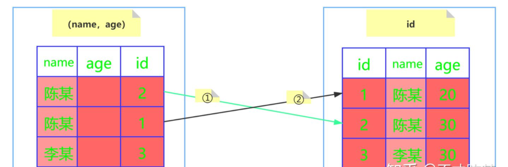
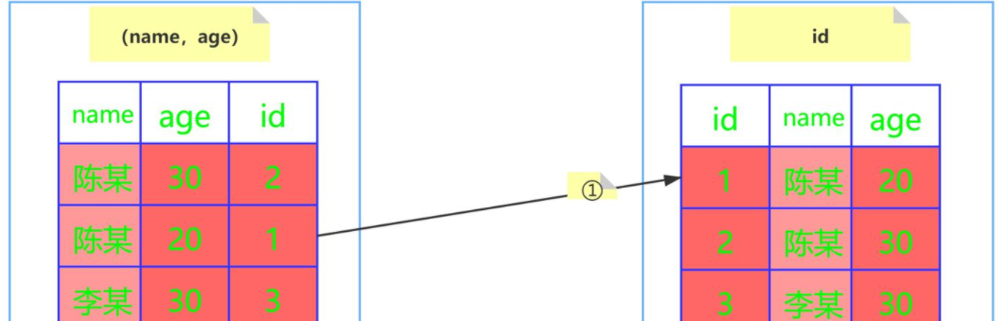

## MySQL总结

### 1.什么是MySQL？
MySQL是一个关系型的数据库，用于

###1.1MySQL的架构？

MySQL可以分为Server层和存储引擎两大部分？
Server层：连接器、查询缓存、分析器、优化器、执行器等,涵盖MySQL的大多数核心服务功能，
        以及所有的内置函数(如日期、时间、数学和加密函数等)，
        所有跨存储引擎的功能都在这一层实现，如存储过程、触发器、视图等。
存储引擎层：负责数据的存储和提取，架构模式是插件式，支持InnoDB、MyISAM、Memory等多个存储引擎。
5.5.5版本使用默认使用InnoIB

###1.1.1InnoDB、MyISAM比较？
1.InnoDB支持事务、MyISAM不支持事务
2.InnoDB支持行级锁，而MyISAM支持表级锁 
3.InnoDB支持MVCC，MyISAM不支持
4.InnoDB支持外键，MyISAM不支持
5.MyISAM支持全文索引，InnoDB不支持全文索引。

###1.1.2 create table如何指定存储引擎？
可以再create table语句中使用engine=memory，指定内存引擎创建表。不同引擎的表存取方式不同，支持的功能也不同。

###1.2MySQL的Server层结构介绍？
• 连接器：我们要使用MySQL需要建立连接，连接器负责跟客户端建立连接、获取权限、维持和管理连接。
建立连接需要输入连接命令，连接命令中的mysql是客户端工具，通过TCP握手建立连接。并获取权限。判断是可读还是可写。
连接完成后，如果超过8小时未操作数据库，连接会自动断开。由参数wait_timeout控制的。
    ▪ 长连接：连接建立成功后，客户端一直有请求，且一直使用同一个连接。
    ▪ 短链接：每次执行完几次很少查询，就断开连接，下次查询再重新建立一个。
建立连接的过程复杂且消耗系统资源，我们要尽量减少建立连接操作，尽量使用长连接。可使用连接池来维护连接。
    
    
```mysql based
mysql -h$ip -P$port -u$user -p
```

### 1.2一条SQL是如何执行的？
1、

### 2.索引的基本原理？
索引是一种特殊的数据结构。
索引用于快速查找那些具有特定值的记录.如果没有索引就会变量整张表。
索引的原理就是把无序的数据变成有序的数据查询。
1.把创建了索引的列的内容进行排序
2.对排序结果生成倒排表
3.在倒排表内容上拼上数据地址链
3.在查询的时候，先拿到倒排表内容，再取出数据地址链，从而拿到具体的数据。

### 2.1索引覆盖是什么？
当sql语句的所查询字段(select列)和查询条件(where子句)全都包含在一个索引中(联合索引)，可以直接使用索引查询，而不需要回表。
这就是覆盖索引，可以通过使用覆盖索引，可以减少搜索树的次数。
例子：
sql语句如下，其中id自增，name为索引：
```sql
mysql> create table t_user (
id bigint(20) not null auto_increment ,
name varchar(255) not null,
password varchar(255) ,
primary key (id),
engine=innodb
default character set=utf8 collate=utf8_general_ci
```
有这么两句sql
sql1：select id from t_user where name ='张三'
sql2：select password from t_user where name ='张三'
语句1：因为name索引树上的叶子节点上保存着name和id的值，所以通过name索引树查找到id后，可以直接提供查询结果，不需要回表。也就是说在这个查询里面，
索引name已经覆盖了我们的查询需求，我们称之为"覆盖索引"。
语句2：name索引树上找到name='张三'对应的主键id，通过回表在主键索引树上找到满足条件的数据。
得出结论，当所查询的字段(select 列)和查询条件字段(where子句)全部包含在一个索引中(联合索引)，可以直接使用索引查询而不用回表，这就是覆盖索引。

### 2.2最左匹配原则
最左匹配原则，MySQL会从左向右匹配。
当我们使用(name,password)两个字段组成的联合索引，
sql where name ='张三' and password ='123456' 和sql where password ='123456' and name ='张三' 索引都会生效
因为mysql优化器判断这条sql语句应该以什么顺序执行效率最高，最后生成执行计划。
sql ①where name like "张%" ;   ②where name like "%张%" ③where name like "%张"
①走索引，②③不走索引。
创建索引时，需要考虑空间代价，使用较少的空间来创建索引。
需要name查询age，或age查询name。
• (name,age) 单独建立age索引
• (age,name) 单独建立name索引
由于name 字段存储值所占用空间大于age字段存储值所占用空间。 so选 (name,age) 单独建立age索引这种方案

### 2.3索引下推
mysql默认开启，关闭索引下推命令
set optimizer_switch='index_condition_pushdown=off';

索引下推是在mysql5.6的版本上推出，用于优化查询。
未开启索引下推，mysql会根据普通索引查询出来的数据直接返回给mysql服务器，由mysql服务器来判断数据是否符合条件，进行过滤操作。
开始索引下推后，mysql将根据普通索引查询出来的数据进行过滤，将过滤的结果数据传给mysql服务器，直接查询结果数据。
索引下推减少了mysql服务器从存储引擎接收数据的次数。

例子：
在开始之前先先准备一张用户表(user)，其中主要几个字段有：id、name、age、address。建立联合索引（name，age）。
• 假设有一个需求，要求匹配姓名第一个为张的所有用户，sql语句如下：
SELECT * from user where  name like '陈%'
• 根据 "最佳左前缀" 的原则，这里使用了联合索引（name，age）进行了查询，性能要比全表扫描肯定要高。
• 问题来了，如果有其他的条件呢？假设又有一个需求，要求匹配姓名第一个字为陈，年龄为20岁的用户，此时的sql语句如下：
SELECT * from user where  name like '陈%' and age=20
Mysql5.6之前的版本（无索引下推）

• 存储引擎会忽略age这个字段，直接通过联合索引name查询到索引id，未判断 age =20，有两条记录，
  通过两条记录的id去主键索引树中查询全行数据，并再次根据age = 20 进行过滤

• 开启索引下推后，会根据 like '陈%'查询出2条记录，再根据age = 20在索引中进行过滤，查询出1条记录，拿到记录id，去主键索引树中进行查询。

总结：索引下推在mysql5.6版本推出，开启后，再第一次查询时会对索引值进行过滤，再进行回表查询。大大减少回表次数。

### 2.4索引的优劣势？
优势
• 加快数据检索，降低数据库IO成本。
• 索引列的排序更快，CPU损耗更低。
劣势
• 建索引需要占用空间。
• 索引提高查询速度同时，降低INSERT、UPDATE、DELETE速度。因为更新数据后，需要更新索引。

### 2.5索引的结构？
MySQL中有4种类型的索引：
• BTREE索引：最常见的类型，INNODB、MyISAM、MEMORY等引擎都支持这个索引，也叫多路搜索树，其中主键索引、唯一索引、联合索引、前缀索引默认使用Btree索引，统称为索引。
• HASH索引：MEMORY支持，其他不支持。
• R-Tree索引：MyISAM中地理空间的数据类型
• Full-Text：MyISAM中的全文索引，INNODB 5.6后也支持

### 3.BTREE结构
Btree又叫多路平衡搜索树，一颗m叉的Btree特性如下：
• 树中每个节点最多包含m个孩子。
• 除根节点和叶子节点外，每个节点至少有[m/2]（向上取整的意思）个子节点
• 若根节点不是叶子节点，至少有两个子节点
• 所有NULL节点到根节点的高度都一样
• 除根节点外，其它节点都包含 n 个key，其中 [m/2] -1 <= n <= m-1

Btree和二叉树相比查询的效率更高，因为对于相同的数据量来说，Btree的层级比二叉树的层级更小，因此搜索速度快。

###4.B+Btree结构
B+Tree为BTree的变种，B+Tree与BTree的区别为：
• n叉B+Tree最多含有n个key，而BTree最多含有n-1个key。
• B+Tree的叶子节点保存所有的key信息，依key大小顺序排列。
• 所有的非叶子节点都可以看做是key的索引部分。

### 5.explain 命令分析


###6.说一下MySQL的事务隔离级别？
Spring事务有五大隔离级别，默认是isolation_default(使用数据库的设置)，其他四个隔离级别和数据库的隔离级别一致：
• ISOLATION_DEFAULT：用底层数据库的设置隔离级别，数据库设置的是什么我就用什么；
• ISOLATION_READ_UNCOMMITTED：未提交读，最低隔离级别、事务未提交前，就可被其他事务读取（会出现幻读、脏读、不可重复读）；
• ISOLATION_READ_COMMITTED：提交读，一个事务提交后才能被其他事务读取到（会造成幻读，不可重复读），SQL server的默认级别。
• ISOLATION_REPEATABLE_READ：可重复读，保证多次读取同一数据时，其值和事务开始时候的内容是一致，禁止读取到别的事务未提交的数据(会造成幻读)，
                             MySQL的默认级别。
• ISOLATION_SERIALIZABLE：序列化，最高最可靠的隔离级别，该隔离级别能防止脏读，不可重复读，幻读。
脏读：表示一个事务可以读取另一个事务中还未提交的数据。比如某个事务尝试插入记录A，此时事务还未提交，另一个事务读取到了记录A。
幻读：同一个事务内多次查询返回的结果集不一样。比如同一个事务A第一次查询时有N条记录，第二次同等条件查询却有N+1条记录，这就好像产生了幻觉。
     发生幻读的原因是另一个事务新增或删除修改了第一个事务结果集里的数据，同一个记录的数据内容被修改了，所有数据行的记录就变多或者变少了。