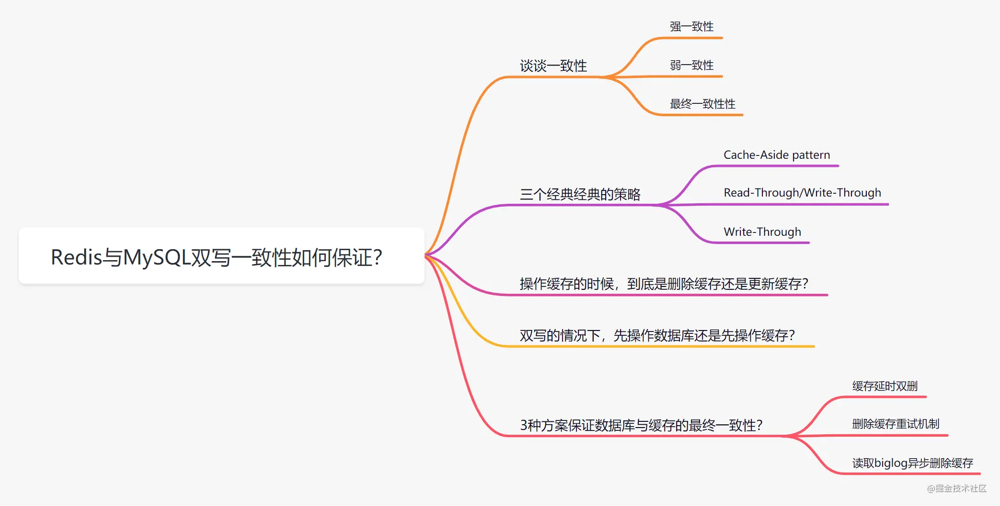

## Redis总结

###0.为什举要使用缓存？
性能：不使用缓存时，当SQL耗时特别久，且固定不便时，系统性能会很差。使用缓存后，直接从缓存中读取，减少对数据库操作，性能提升，迅速响应。
并发：大并发情况下，所有请求直接访问数据库，会造成数据库出现连接异常。使用redis作为缓冲操作。

### 1.什么是Redis？
Redis是一个开源的、C语言编写、遵守BSD协议，高性能分布式（key/value）存储内存数据库，支持持久化。
Redis可用作数据库，缓存，锁，中间件。
Redis支持8种数据类型，常用5种，Strings，Hash，List，Set，zSet。不常用的Bitmaps、Hyperloglogs、地理空间Geospatial。
Redis还支持事务、持久化、Lua脚本、多种集群方案。

###1.1redis有哪些优势？
• 数据持久化，redis能将数据持久化到磁盘中，重启后再次加载数据，保证数据的不丢失。
• 支持key/value类型的数据，还支持，set，zset，hash，list数据
• 支持数据备份，master/slave模式的数据备份

###2.redis是单线程还是多线程的？
redis是单进程单线程的，基于内存操作，不会产生多线程下带来的性能消耗。
CPU不是Redis的瓶颈，Redis的瓶颈是机器内存大小或网络带宽。
这里所说的单线程是指网络请求redis时只用一个线程处理。
redis采用单线程-io多路复用模型进行处理数据的，非阻塞io，这种机制避免了加锁。

###2.1为什么说redis是单线程的？
Redis基于Reactor模型开发了文件事件处理模型，文件事件处理模型是单线程的，所以说Redis是单线程模型

###2.3那么redis是单线程的，怎么监听客户端大量的连接呢？
Redis是通过I/O多路模型来监听客户端大量连接的，或者监听多个（socket），它会将感兴趣的事件及类型（读、写）注册到内存中并监听每个事件是否发生。

###2.4 redis I/O多路模型的好处？
不需要创建多余线程来监听客户端大量连接， 降低资源消耗（和NIO中的Selector组件很像）

###2.1单线程下无法发挥多核cpu性能，怎么解决？
可以在单机上启动多个redis实例来解决。

###3.I/O多路复用模型是什么？
I/O多路复用模式是利用select、poll、epoll可以同时监察多个流的I/O事件的能力。

###4.如何保证Redis和MySQL的数据一致性？
• 前言：客户端对数据中的数据主要有两类操作，读(select)或写(add,update,delete)。针对放入redis缓存中的热点数据，
        命中缓存（cache hit），客户端读取的数据刚好在缓存中且直接返回数据
        缓存未命中（cache miss），缓存未查到数据，查数据库。
        读操作并不会导致缓存与数据库不一致。
• 对于写操作(DML)，缓存与数据库中内容都需要被修改，两者必定存在一个先后顺序，可能会导致缓存与数据库中数据不一致。
这时候需要考虑1.是先更新缓存还是先更新数据库呢？2.更新策略，当缓存数据变化是先update，还是直接delete。

• 缓存不一致场景：
    读redis、和MySQL不会出现缓存不一致问题，但是会出现缓存失效，缓存未命中问题。
    双写场景， 1.先update mysql 再 update redis  2个线程同时操作，会出现 redis 与mysql 的数据不一致(脏数据)。与线程执行顺序有关。
            2.解决方案，改为 先update mysql  再 del redis  就不会出现这个问题。
    单写单读场景，1.线程A，线程B，A写操作（先写mysql，再删redis），B读操作（先读redis，没有数据再读数据库）没啥问题
    单写单读先删缓存再更新数据库，就会出现缓存与数据库不一致。
             解决方案：可以采用延迟双删策略。删缓存，更新库后，再sleep 1秒，再删缓存，就杜绝了缓存是旧数据情况。
    删除缓存失败，会导致脏数据。
             解决方案：删除缓存重试，先修改库，再删缓存，失败后，将key 放入消息队列，消费端获取key，重试删除缓存操作。
             
    总结：1.延迟双删+失败重试（先删缓存，再删库，再sleep，再删缓存，删除失败后再将key放入消息队列，消费端获取是否存在判断是否删除成功，不成功继续删。）
    
### 5.缓存雪崩？
缓存雪崩：原有的缓存失效，新缓存未到期限（我们给缓存设置了相同的过期时间，缓存在同一时间出现大面积过期失效），失效期间，原本查询缓存的请求，全都直接
查询数据库。对数据库CPU和内存造成了巨大压力，严重会导致数据库宕机，系统崩溃。
简言之，缓存时间设置相同，同一时刻缓存失效，大并发请求数据库，系统崩溃。

### 5.1如何预防缓存雪崩？
• 给过期Key加一个随机值时间，使得每个key的过期时间分布开来，不会集中在同一时刻失效。
• 采用redis 令牌桶或滑动窗口算法限制流量，通过加一个标识flag，判断key是否过期，过期则删除缓存。
• 采用分布式锁。

###6.缓存穿透？
缓存穿透：用户查询数据，在数据库中没有，在缓存中也不会有。导致用户查询了缓存和数据库都返回null。进行了两次无用功操作。并发高时，直接绕开缓存对数据库查询
这就是缓存命中率的问题。

###6.1如何预防缓存穿透？
• 采用布隆过滤器，通过redis的bitmap位图操作，将可能查询到的数据哈希到bitmap，一定不存在的数据会被bitmap拦截掉，避免了对数据库的查询压力。
• 如果一个查询的数据为null，将这个null值也存入redis中，并且设置一个短的过期时间，一般不超过5分钟。这种方法简单粗暴。

