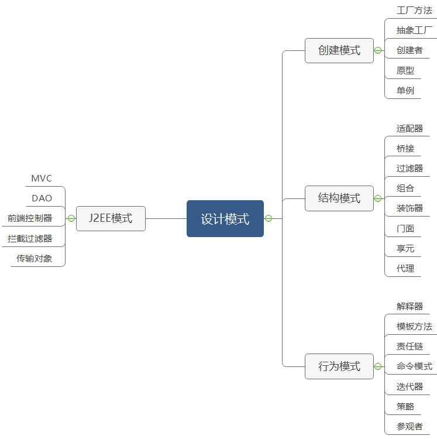
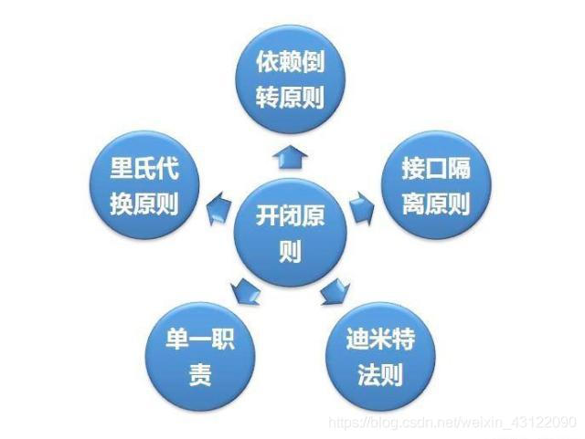

#设计模式

##0.什么是设计模式？
设计模式，是一套被反复使用、多数人知晓的、经过分类编目的、代码设计经验的总结。
使用设计模式是为了可重用代码、让代码更容易被他人理解、保证代码可靠性、程序的重用性。

##0.1为什么要学习设计模式？
• 看懂源代码：如果你不懂设计模式去看Jdk、Spring、SpringMVC、IO等等等等的源码，你会很迷茫，你会寸步难行
• 看看前辈的代码：你去个公司难道都是新项目让你接手？很有可能是接盘的，前辈的开发难道不用设计模式？
• 编写自己的理想中的好代码：我个人反正是这样的，对于我自己开发的项目我会很认真，我对他比对我女朋友还好，把项目当成自己的儿子一样

##0.2设计模式的分类

• 创建型模式，共五种：工厂方法模式、抽象工厂模式、单例模式、建造者模式、原型模式。
• 结构型模式，共七种：适配器模式、装饰器模式、代理模式、外观模式、桥接模式、组合模式、享元模式。
• 行为型模式，共十一种：策略模式、模板方法模式、观察者模式、迭代子模式、责任链模式、命令模式、备忘录模式、状态模式、访问者模式、中介者模式、解释器模式。

##0.3设计模式的六大原则？

• 开放封闭原则（Open Close Principle）
    ▪ 原则思想：尽量通过扩展软件实体来解决需求变化，而不是通过修改已有的代码来完成变化
    ▪ 描述：一个软件产品在生命周期内，都会发生变化，既然变化是一个既定的事实，我们就应该在设计的时候尽量适应这些变化，以提高项目的稳定性和灵活性。
    ▪ 优点：单一原则告诉我们，每个类都有自己负责的职责，里氏替换原则不能破坏继承关系的体系。
• 里氏代换原则（Liskov Substitution Principle）
    ▪ 原则思想：使用的基类可以在任何地方使用继承的子类，完美的替换基类。
    ▪ 大概意思是：子类可以扩展父类的功能，但不能改变父类原有的功能。子类可以实现父类的抽象方法，但不能覆盖父类的非抽象方法，子类中可以增加自己特有的方法。
    ▪ 优点：增加程序的健壮性，即使增加了子类，原有的子类还可以继续运行，互不影响。
• 依赖倒转原则（Dependence Inversion Principle）
    ▪ 依赖倒置原则的核心思想是面向接口编程.
    ▪ 依赖倒转原则要求我们在程序代码中传递参数时或在关联关系中，尽量引用层次高的抽象层类，
    ▪ 这个是开放封闭原则的基础，具体内容是：对接口编程，依赖于抽象而不依赖于具体。
• 接口隔离原则（Interface Segregation Principle）
    ▪ 这个原则的意思是：使用多个隔离的接口，比使用单个接口要好。还是一个降低类之间的耦合度的意思，从这儿我们看出，其实设计模式就是一个软件的设计思想，从大型软件架构出发，为了升级和维护方便。所以上文中多次出现：降低依赖，降低耦合。
    ▪ 例如：支付类的接口和订单类的接口，需要把这俩个类别的接口变成俩个隔离的接口
    ▪ 迪米特法则（最少知道原则）（Demeter Principle）
• 原则思想：一个对象应当对其他对象有尽可能少地了解，简称类间解耦
    ▪ 大概意思就是一个类尽量减少自己对其他对象的依赖，原则是低耦合，高内聚，只有使各个模块之间的耦合尽量的低，才能提高代码的复用率。
    ▪ 优点：低耦合，高内聚。
• 单一职责原则（Principle of single responsibility）
    ▪ 原则思想：一个方法只负责一件事情。
    ▪ 描述：单一职责原则很简单，一个方法 一个类只负责一个职责，各个职责的程序改动，不影响其它程序。 这是常识，几乎所有程序员都会遵循这个原则。
    ▪ 优点：降低类和类的耦合，提高可读性，增加可维护性和可拓展性，降低可变性的风险。

##0.4J2EE中使用了哪些设计模式？
Structural（结构模式）
• Adapter:
    java.util.Arrays#asList()
    javax.swing.JTable(TableModel)
    java.io.InputStreamReader(InputStream)
    java.io.OutputStreamWriter(OutputStream)
    javax.xml.bind.annotation.adapters.XmlAdapter#marshal()
    javax.xml.bind.annotation.adapters.XmlAdapter#unmarshal()
• Bridge:
把抽象和实现解藕，于是接口和实现可在完全独立开来.
    AWT (提供了抽象层映射于实际的操作系统)
    JDBC 

##1.说一下你熟悉的设计模式？
创造型：工厂方法模式（FactoryMethod）、抽象工厂模式（AbstractFactory）、建造者模式（Builder）、原型模式（ProtoType）、单例模式（Singleton）
结构型：适配器模式（Adapter）、桥接模式（Bridge）、组合模式（Composite）、装饰者模式（Decorator）、门面模式（Facade）、享元模式（Flyweight）
    、代理模式（Proxy）
行为型：解释器模式（Interpreter）、模板方法模式（TemplateMethod）、责任链模式（Chain Of Responsibility）、命令模式（Command）
    、迭代器模式（Iterator）、调解者模式（Mediator）、备忘录模式（Memento）、观察者模式（Observer）、状态模式（State）、策略模式（Strategy）
    、访问者模式（Visitor）
通常来说设计模式都是混合使用，不会独立应用。充分穷举法充分理解设计模式的应用场景。
在平时的应用中，不是用设计模式去生搬硬套，在业务中根据具体业务问题需要时借鉴。

##2.简单工厂和抽象工厂有什么区别？
• 简单工厂：用来生产同一等级结构中的任意产品，对于增加新的产品，无能为力。
• 工厂方法：用来生产同一等级结构中的固定产品，支持增加任意产品。
• 抽象工厂：用来生产不同产品族的全部产品，对于增加新的产品，无能为力；支持增加产品族。

##3.单例模式是什么？有什么缺点吗？
单例模式是为了保证创建对象的唯一性而产生的，主要有懒汉式和饿汉式。在多线程中，饿汉式是已经创建好了对象，所以不会出现创建多个对象的问题，
而懒汉式可能出现创建多个对象的问题。不保证对象的唯一性。

##3.1单例模式可以通过什么方式保证对象的唯一性？
通过双重校验锁机制保证对象唯一性，在执行方法前判空，再加锁，锁当前对象。再判空，最后创建对象。
##3.1.1为什么要判空两次，每次判空的目的是什么？
第一次判空是为了提高执行效率，当对象已创建后，就不用进入加锁判空创建对象的逻辑。
第二次判空是为了保证创建多个对象的情况出现，比如当两个线程AB，A第一次进行判空singleton == null 此时线程B获得时间片，由于A还没进入获取锁的逻辑，
B直接判断singleton也是null，执行获取锁的逻辑创建对象（无二次判空）。此时A线程再执行，获取锁创建对象。此时就创建了两个对象， 当有了二次判空，
A此时再获取对象，对象就不为null，就不会创建对象，就保证了对象的唯一性。但是这个还有一个问题。
##3.1.2单例双重校验锁下为什么还要在对象引用前加Volatile关键字呢？
因为JVM有个指令重排操作，比如以下三个指令操作。
指令1：获取singleton内存地址
指令2：初始化singleton对象（赋值之类）
指令3：将这块内存地址指向引用singleton
正常情况是1-2-3这样有序指向，现在JVM指令重排后，比如上个场景中，B对象执行创建创建对象时，顺序是132。刚执行完3时，A线程获取CPU时间片，开始执行。
执行到第二次判空时，获取引用对象此时引用虽然已有了内存地址，但是还未完成赋值。拿到的是一个半成品对象。所以我们要在singleton引用前加上volatile
关键字来防止指令重排。

###4.适配器模式(Adapter)？
适配器模式，是作为两个不兼容接口之间的桥梁。这种设计模式属于结构型模式，它结合了两个独立接口的功能。
例子：读卡器是作为内存卡和笔记本之间的适配器。你将内存卡插入读卡器，再将读卡器插入笔记本。这样就可以使笔记本通过读卡器来读取内存卡了。
作用：将一个类的接口转换为客户希望的另一个接口，适配器使由于接口不兼容的那些类可以一起工作。用来解决软件系统中，对象迁移时，接口不兼容。
何时使用： 1、系统需要使用现有的类，而此类的接口不符合系统的需要。 
         2、想要建立一个可以重复使用的类，用于与一些彼此之间没有太大关联的一些类，包括一些可能在将来引进的类一起工作，这些源类不一定有一致的接口。 
         3、通过接口转换，将一个类插入另一个类系中。
         （比如老虎和飞禽，现在多了一个飞虎，在不增加实体的需求下，增加一个适配器，在里面包容一个虎对象，实现飞的接口。）
如何解决：继承或依赖（推荐）。
优点：让两个没有任何关联的类一起运行。提高了类的复用。增加了类的透明度。灵活性好。
缺点：产生代码凌乱，不好管控。明明调用A接口，里面被替换成B接口实现。
使用场景：有动机的修改一个正常运行系统的接口时，考虑使用适配器模式。

###5.桥接模式(Bridge)？
桥接模式，是用于把抽象化和实例化解耦，使二者可以独立变化。这种类型的设计模式属于结构型模式。通过提供抽象化与实例化之间的桥接结构，来实现二者的解耦。
这种模式涉及到一个作为桥接的接口，使得实体类的功能独立于接口实现类。这两种类型的类可被结构化改变而互不影响。
例子：使用相同的抽象类方法但是不同的桥接实现类，来画出不同颜色的圆。
何时使用：实现系统可能有多个角度分类，每一种角度都可能变化。
使用场景：在一个有可能会变化维度的系统中，用继承的方式会造成类爆炸，扩展起来不灵活。且这个类有两个维度都需要进行扩展时，
        每次在一个新维度上新增一个具体实现都要增加多个子类。为了设计更加灵活的系统，我们可以考虑使用桥接模式。
        当一个系统不希望使用继承或多重继承导致系统类的个数急速增加时，使用桥接模式。
        
定义：将抽象与实现分离，使他们可以独立变化。使用组合关系替代继承关系，从而降低抽象与实现这两个可变维度的耦合性。
结构：
    • 抽象化(Abstraction)角色：定义抽象类，并包含一个对实现化对象的引用。
    • 扩展抽象化(Refined Abstraction)角色：是抽象化角色的子类，实现父类中的业务方法，并通过组合关系调用实现化角色中的业务方法。
    • 实现化（Implementor）角色：定义实现化角色的接口，供扩展抽象化角色调用。
    • 具体实现化（Concrete Implementor）角色：给出实现化角色接口的具体实现。
    

###6.组合模式(Composite)？
定义：将抽象部分与实例部分分离，使他们可以独立变化，也可以称为接口模式。
类似：文件和文件夹。

###7.装饰器模式(Decorator)？
背景：通常情况下，扩展一个类的功能会使用继承的方式来实现，但继承具有静态特征，耦合度高，随着扩展的功能增多，子类很膨胀。
如果使用组合关系来创建一个包装对象（即装饰对象）来包裹真实读写，并在保持真实对象的结构不便的前提下，为其提供额外的功能，
这就是装饰器模式的目的。也就是用装饰器的类代替真实的类来进行功能扩展与编写。
结构：
    • 抽象构件（Component）角色：定义一个抽象接口以规范准备接收附加责任的对象。
    • 具体构件（ConcreteComponent）角色：实现抽象构件，通过装饰角色为其添加一些职责。
    • 抽象装饰（Decorator）角色：继承抽象构件，并包含具体构件的实例，可以通过其子类扩展具体构件的功能。
    • 具体装饰（ConcreteDecorator）角色：实现抽象装饰的相关方法，并给具体构件对象添加附加的责任。
使用场景：
   • 当给现有类添加附加职责，又不能采用生成子类进行扩充时。例如，该类被隐藏或该类是终极类或继承方式产生大量子类。
   • 通过对现有的一组基本功能进行排序产生非常多功能时，继承关系难实现，采用装饰器模式好实现。
   • 动态的添加和撤销功能时。

###8.门面模式(Facade)？

###9.享元模式(Flyweight)？

###10.代理模式(Proxy)？

###10.解释器模式(Interpreter)？

###11.模板方法模式(Template Method)?

###12.责任链模式（Chain Of Responsibility）？

###13.命令模式（Command）？

###14.迭代器模式（Iterator）？

###15.调解者模式（Mediator）？

###16.备忘录模式（Memento）？

###17.观察者模式（Observer）？
定义对象间的一种一对多的依赖关系，当一个对象的状态发生改变时，所有依赖于它的对象
都得到通知并被自动更新。Spring中Observer模式常用的地方是Listener的实现。 
一般由两个角色组成，发布者和订阅者（监听者），当发布者发生变化时，多个监听者就会做出不同的改变。 如：监听器、日志、邮件、短信通知.

###18.状态模式（State）？

###19.策略模式（Strategy）？
背景：生活中长遇见出行，选择坐火车，乘飞机，骑自行车或开私家车。超时促销打折，送商品，送积分等情况。
在软件中，我们可以采用不同的算法来完成功能，比如二分法，冒泡排序，选择排序。

定义：该模式定义了一系列的算法，将每个算法封装起来，使它们可以互相替换，且算法的变化不会影响使用算法的用户。
策略模式属于对象行为模式，对算法进行封装，把算法的责任和实现分割开来，并委派给不同的对象对这些算法进行管理。

结构：
1.抽象策略类：定义了一个公告接口，各种不同的算法以不同的方式实现这个接口，环境角色使用这个接口调用不同的算法。（单个）
2.具体策略类：实现了抽象策略的定义的接口，提供具体的算法实现。（有多个）
3.环境类：持有一个抽象策略类的引用，最终暴露给客户端调用。（单个）

###20.访问者模式（Visitor）？

##4.J2EE中使用了哪些设计模式？
• Structural（结构模式）
    ▪ Adapter（适配器）:
        ★ java.util.Arrays#asList()
        ★ javax.swing.JTable(TableModel)
        ★ java.io.InputStreamReader(InputStream)
        ★ java.io.OutputStreamWriter(OutputStream)
        ★ javax.xml.bind.annotation.adapters.XmlAdapter#marshal()
        ★ javax.xml.bind.annotation.adapters.XmlAdapter#unmarshal()     
    ▪ Bridge （桥接）: 将对象与实现解耦，使接口与实现分离
        ★ AWT (提供了抽象层映射于实际的操作系统)
        ★ JDBC
    ▪ Composite（组合）: 让使用者觉得使用对象还是组合。
        ★ javax.swing.JComponent#add(Component)
        ★ java.awt.Container#add(Component)
        ★ java.util.Map#putAll(Map)
        ★ java.util.List#addAll(Collection)
        ★ java.util.Set#addAll(Collection)
    ▪ Decorator（装饰者）: 为一个对象动态的加上一系列的动作，而不需要因为这些动作的不同而产生大量的继承类。这个模式在JDK中几乎无处不在，所以，下面的列表只是一些典型的。.
        ★ java.io.BufferedInputStream(InputStream)
        ★ java.io.DataInputStream(InputStream)
        ★ java.io.BufferedOutputStream(OutputStream)
        ★ java.util.zip.ZipOutputStream(OutputStream)
        ★ java.util.Collections#checkedList|Map|Set|SortedSet|SortedMap
    ▪ Facade（门面模式）：用一个简单的接口包状一组组件，接口，抽象或是子系统。
        ★ java.lang.Class
        ★ javax.faces.webapp.FacesServlet
    ▪ Flyweight（享元模式）：有效的存储大量小的对象。
        ★ java.lang.Integer#valueOf(int)
        ★  java.lang.Boolean#valueOf(boolean)
        ★  java.lang.Byte#valueOf(byte)
        ★  java.lang.Character#valueOf(char)
    ▪ Proxy（代理模式）：用一个简单的对象代替一个复杂的对象。
        ★ java.lang.reflect.Proxy
        ★ RMI
• Creational（创建模式）
    ▪ AbstractFactory（抽象工厂）：
        ★ java.util.Calendar#getInstance()
        ★ java.util.Arrays#asList()
        ★ java.util.ResourceBundle#getBundle()
        ★ java.sql.DriverManager#getConnection()
        ★ java.sql.Connection#createStatement()
        ★ java.sql.Statement#executeQuery()
        ★ java.text.NumberFormat#getInstance()
        ★ javax.xml.transform.TransformerFactory#newInstance()
    ▪ Builder（创建者）: 用来简化一个复杂对象的创建
        ★ java.lang.StringBuilder#append()
        ★ java.lang.StringBuffer#append()
        ★ java.sql.PreparedStatement
        ★ javax.swing.GroupLayout.Group#addComponent()
    ▪ Factory（工厂）：按要求返回一个类型的实例
        ★ java.lang.Proxy#newProxyInstance()
        ★ java.lang.Object#toString()
        ★ java.lang.Class#newInstance()
        ★ java.lang.reflect.Array#newInstance()
        ★ java.lang.reflect.Constructor#newInstance()
        ★ java.lang.Boolean#valueOf(String)
        ★ java.lang.Class#forName()
    ▪ Prototype（原型）：避免创建多个对象时的对象拷贝操作，隐藏代码复杂性。
        ★ java.lang.Object#clone()
        ★ java.lang.Cloneable
    ▪ Singleton（单例）：只允许创建一个实例
        ★ java.lang.Runtime#getRuntime()
• Behavioral(行为模式)
    ▪ Chain of responsibility（责任链）：把一个对象在一个链接传递直到被处理。在这个链上的所有的对象有相同的接口（抽象类）但却有不同的实现。
        ★ java.util.logging.Logger#log()
        ★ javax.servlet.Filter#doFilter()
    ▪ Command（命令）：把一个或一些命令封装到一个对象中。
        ★ java.lang.Runnable
        ★ javax.swing.Action                                  
    ▪ Interpreter（解释器）：一个语法解释器的模式。
        ★ java.util.Pattern
        ★ java.text.Normalizer
        ★ java.text.Format
    ▪ Iterator（迭代器）: 提供一种按顺序遍历容器中所有元素的一致方法。
        ★ java.util.Iterator
        ★ java.util.Enumeration
    ▪ Mediator（中介者）：使用一个管理类，降低多个对象和类之间的复杂度。
        ★ java.util.Timer
        ★ java.util.concurrent.Executor#execute()
        ★ java.util.concurrent.ExecutorService#submit()
        ★ java.lang.reflect.Method#invoke()
    ▪ Memento（备忘录）：保存一个对象的某个状态，以便在适当的时候恢复对象。
        ★ java.util.Date
        ★ java.io.Serializable                  
    ▪ Null Object Pattern（空对象）：使用一个空对象代替NULL。
        ★ java.util.Collections#emptyList()
        ★ java.util.Collections#emptyMap()
        ★ java.util.Collections#emptySet()
    ▪ Observer（观察者）：允许一个对象向所有的侦听的对象广播自己的消息或事件。          
        ★ java.util.EventListener
        ★ javax.servlet.http.HttpSessionBindingListener
        ★ javax.servlet.http.HttpSessionAttributeListener
        ★ javax.faces.event.PhaseListener
    ▪ State（状态）: 类的行为随状态而改变。
        ★ java.util.Iterator
        ★ javax.faces.lifecycle.LifeCycle#execute()
    ▪ Strategy（策略）: 一个类的行为或算法可以在运行时更改。
        ★ java.util.Comparator#compare()
        ★ javax.servlet.http.HttpServlet
        ★ javax.servlet.Filter#doFilter()
    ▪ Template Method（模板方法）：抽象类公开定义方法模板，子类可以按要求重写。可重写部分
        ★ java.util.Collections#sort()
        ★ java.io.InputStream#skip()
        ★ java.io.InputStream#read()
        ★ java.util.AbstractList#indexOf()
    ▪ Visitor （访问者）：根据不同访问者，改变类的不同执行算法。
        ★ javax.lang.model.element.Element 和javax.lang.model.element.ElementVisitor
        ★ javax.lang.model.type.TypeMirror 和javax.lang.model.type.TypeVisitor
    ▪ MVC模式：将类结构分为 模型-视图-控制器，用于将应用程序解耦，分层开发。职责更清晰。减少冗余。
        ★ Model（模型） - 模型代表一个存取数据的对象或 JAVA POJO。它也可以带有逻辑，在数据变化时更新控制器。
        ★ View（视图） - 视图代表模型包含的数据的可视化。
        ★ Controller（控制器） - 控制器作用于模型和视图上。它控制数据流向模型对象，并在数据变化时更新视图。它使视图与模型分离开。
    ▪ Intercepting Filter Pattern （拦截过滤器） 定义过滤器，对程序请求前后做处理。
        ★ 过滤器（Filter） - 过滤器在请求处理程序执行请求之前或之后，执行某些任务。
        ★ 过滤器链（Filter Chain） - 过滤器链带有多个过滤器，并在 Target 上按照定义的顺序执行这些过滤器。
        ★ Target - Target 对象是请求处理程序。
        ★ 过滤管理器（Filter Manager） - 过滤管理器管理过滤器和过滤器链。
        ★ 客户端（Client） - Client 是向 Target 对象发送请求的对象。