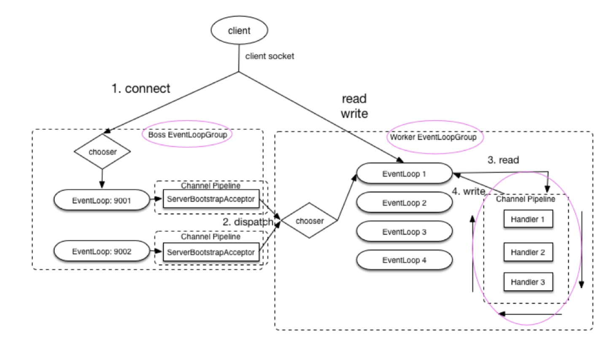

## Netty总结 https://cloud.tencent.com/developer/article/1754078

### 1.什么是Netty？
Netty is an asynchronous event-driven network application framework ，是一个异步基于事件驱动的网络应用框架。
基于 JAVA NIO 提供的 API 实现。它提供了对TCP、UDP 和文件传输的支持，作为一个异步 NIO 框架，Netty 的所有 IO 操作都是异步非阻塞
的，通过 Future-Listener 机制，用户可以方便的主动获取或者通过通知机制获得 IO 操作结果。

### 2.为什么要使用Netty？
• Netty是基于NIO(Non Blocking I/O模型 )同步非阻塞I/O模型，极大简化TCP和UDP套接字服务器等网络编程，并且性能、安全性方便都很优秀。
• 平时经常接触的Dubbo、RocketMQ、ElasticSearch、gRPC、Spark等开源项目都用到了Netty。
• 大部分框架涉及到网络通信的部分，都是使用Netty来做的，Spring Cloud中的Gateway

### 3.说一下对Netty的认识？
• Netty是一个基于NIO模型实现的client、server端的网络通信框架，使用它可以快速的简单的开发网络应用程序。
• 极大简化了TCP和UDP套接字等网络编程，并且性能安全性比较原生NIO要好。
• 支持多种协议，HTTP、FTP、SMTP以及各种二进制基于文本的协议。

### 4.Netty的特点
• 统一API，支持HTTP、FTP、SMTP等多种传输类型、传输协议
• 自带编码器解决TCP粘包黏包问题
• 支持真正的无连接数据套接字支持
• 安全性不错有完整的SSL/TLS以及StartTLS支持
• 社区活跃，使用简单，性能高。
• 开源框架Dubbo、ElasticSearch、RocketMQ、gRPC、Spark底层网络通信部分都使用Netty

### 5.Netty的使用场景
• RPC框架的网络通讯工具：分布式系统中，不同节点需要互相调用，需要RPC框架。
• 实现HTTP服务器：后端基本使用Tomcat，要实现自己的HTTP服务器，至少需要处理POST,GET，PUT等请求
• 实现即时通讯系统IM
• 实现消息推送系统

### 6.Netty的核心组件有哪些？

### 7.Netty为什么快？
Netty依赖了NIO的特性，零拷贝。一般数据拷贝，需要从IO读取到堆内存中，中间经过Socket缓冲区，也就是说一个数据要拷贝两次才能完成拷贝，如果数据量大就会造成浪费。
Netty的零拷贝，是在接收数据时，不是读取到堆内存中，而是直接在堆内存外开辟一块内存，数据直接从I/O读取到那块内存中，再通过ByteBuf直接对数据进行操作，加快传输速度。

