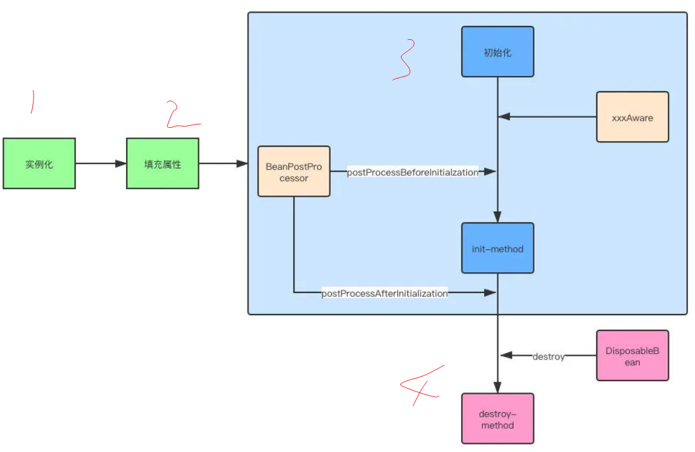
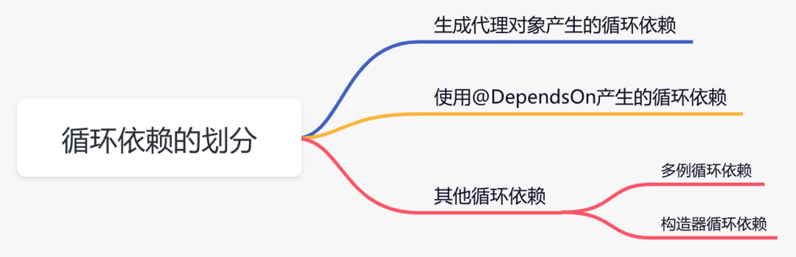
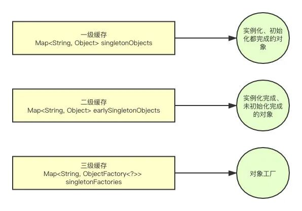
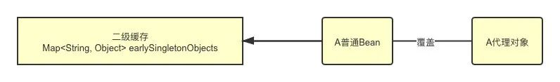

## Spring总结

### 0.什么是Spring？
Spring是java企业级应用的开源开发框架。主要用来开发Java应用，Web应用。主要宗旨用于简化Java企业级开发，通过POJO为基础的编程模型促进良好编程习惯。

### 1.为什么要使用 Spring？Spring的好处在哪里？
• 轻量：Spring是轻量级，基本版本大约2MB左右大小。
• 非侵入：基于Spring框架开发应用中的对象，可以不依赖Spring Api。
• 控制反转：Spring通过IoC控制反转实现了控制反转，交给容器去进行创建对象，不需要关心对象的创建过程。
• 依赖注入：DI Dependency Injection 创建对象中依赖的对象不需要手动的方法去设置，而是通过配置赋值。
• 面向切面编程：AOP Aspect Oriented Program 把核心业务和周边业务区分开，独立开发，通过动态代理进行耦合，实现了真正面向接口编程。
• Web MVC框架：Spring Web框架能够很好的实现业务的解耦
• 事务处理：Spring提供了一个持续的事务管理接口，可以扩展至上至本地事务，下至全局事务(JTA)
• 异常处理：Spring提供方便的API把具体技术相关的异常(JDBC,Hibernate,JDO抛出异常)转化为一致的uncheck非检查异常。

### 2.AOP是什么？
AOP是Aspect Oriented Program 面吐切面编程，首先在面向切面编程思想中，把功能分为核心业务功能和周边业务功能，分别独立开发。
核心业务功能：添加数据，修改数据，登录注册。周边业务功能：性能统计、日志、事务管理。周边业务功能在Spring AOP思想中被定义成切面。
把切面和核心业务功能编制在一起叫做AOP。

### 3.IoC是什么？
IoC是Inversion of Control 控制反转。核心思想是利用工厂模式，设置一个对象的容器，把对象的创建，依赖的管理，生命周期的管理交给容器来完成。
当我们需要一个对象A a时，通过容器Factory.get("A")的方式，从容器中拿A对象，至于在创建过程中还需要什么对象就不用我们操心。
使用接口时，我们只需要把接口的实现类放入到容器中，通过@Service @Controller等注解把类交给Spring容器管理。使用时通过@Autowired或其他注入方式，
从容器中注入接口对应的实现，这样就能实现真正的解耦，真正的面向接口编程。

###3.1IoC的简单代码实现？
Spring IoC说白了就是工厂模式+反射机制。
```java
interface Fruit {
   public abstract void eat();
 }

class Apple implements Fruit {
    public void eat(){
        System.out.println("Apple");
    }
}

class Orange implements Fruit {
    public void eat(){
        System.out.println("Orange");
    }
}

class Factory {
    public static Fruit getInstance(String ClassName) {
        Fruit f=null;
        try {
            f=(Fruit)Class.forName(ClassName).newInstance();
        } catch (Exception e) {
            e.printStackTrace();
        }
        return f;
    }
}

class Client {
    public static void main(String[] a) {
        Fruit f=Factory.getInstance("io.github.dunwu.spring.Apple");
        if(f!=null){
            f.eat();
        }
    }
}
```
###3.3依赖注入的基本原则？
应用组件不应该负责查找资源或者其他依赖的协作对象。配置对象的工作应该由IoC容器负责，“查找资源”的逻辑应该从应用组件的代码中抽取出来，交给IoC容器负责。
容器全权负责组件的装配，它会把符合依赖关系的对象通过属性（JavaBean中的setter）或者是构造器传递给需要的对象。

###3.4依赖注入的不同实现方式？
接口注入（Interface Injection）、Setter方法注入（Setter Injection）、构造器注入（Constructor Injection）
接口注入在于灵活性和易用性比较差，在Spring4开始就已经被遗弃了。
构造器依赖注入：构造器依赖注入通过容器触发一个类的构造器来实现的，该类有一系列参数，每个参数代表一个对其他类的依赖。
Setter方法注入：Setter方法注入是容器通过调用无参构造器或无参static工厂 方法实例化bean之后，调用该bean的setter方法，即实现了基于setter的依赖注入。

###3.5构造器依赖注入和 Setter方法注入的区别？
1.构造函数注入	            2.setter 注入
1.没有部分注入	            2.有部分注入
1.不会覆盖 setter 属性	    2.会覆盖 setter 属性
1.任意修改都会创建一个新实例	    2.任意修改不会创建一个新实例
1.适用于设置很多属性	        2.适用于设置少量属性
两种依赖方式都可以使用，构造器注入和Setter方法注入。最好的解决方案是用构造器参数实现强制依赖，setter方法实现可选依赖。

### 4.Spring 有哪些主要模块？
• Core module
• Bean module
• Context module
• JDBC module
• ORM module
• Expression Language module
• OXM module
• Java Messaging Service(JMS) module
• Transaction module
• Web module
• Web-Servlet module
• Web-Struts module
• Web-Portlet module 

### 4.1Spring核心容器(应用上下文)模块
基于Bean的模块，提供核心功能，BeanFactory是Spring为基础的应用的核心。Spring框架建立在此模块之上，使Spring成为一个容器。

### 4.2BeanFactory实现举例
BeanFactory 是工厂模式的一种实现，提供了控制反转，应用配置和依赖从代码中隔离，最常见的实现是XmlBeanFactory类

### 4.3XmlBeanFactory类  
最常用的就是 org.springframework.beans.factory.xml.XmlBeanFactory，XmlBeanFactory是根据XML中定义的Beans，
该容器从XML文件中读取解析配置文件，并用它去创建一个完全配置的系统或应用。

### 4.4解释JDBC module 和 ORM module
通过JDBC模块和DAO模块保证数据库代码的简洁，避免数据库资源错误关闭导致的问题，它在各种不同的数据库错误信息之上，提供了统一的异常访问层。
利用Spring AOP和Spring 应用中的对象提供事务管理。

###4.5解释ORM module 
Spring通过提供ORM module，可以让我们在JDBC之上使用一个对象/关系映射(ORM)工具，比如集成Hibernate，JPA，Mybatis，SQL Maps

###4.6解析Web module 
Spring Web 是构建在application context模块基础之上的，提供一个适合web应用的上下文。

###4.7ApplicationContext常见的实现是什么？
• FileSystemXmlApplicationContext：容器从XML加载Beans，XML配置文件加载bean类需要配置全路径，并且构造方法不能私有化。
• ClassPathXmlApplicationContext：容器从XML加载Beans，Beans类路径需要配置全路径，不然bean加载时会找不到这个类。
• WebXmlApplicationContext：容器加载一个定义了Web应用的所有Bean。

###4.8 BeanFactory和ApplicationContext有什么区别？
BeanFactory和ApplicationContext都是Spring内的两大核心接口，都可以作为Spring容器。ApplicationContext是BeanFactory的子类。
BeanFactory：Spring最底层接口，包含各种bean定义，读取bean配置文件，bean加载实例化，控制bean的生命周期，维护bean直接的依赖关系。
ApplicationContext：bean的派生类，除了有bean的具有的功能外，还提供了更完整地框架功能：

###5.如何给 Spring 容器提供配置元数据?
1.基于XML配置，注解配置，java配置。

###6.怎么定义类的作用域？
Spring中 通过定义bean时的scope属性来定义bean的作用域，主要有singleton返回一个单例bean，protoType返回多例bean

###6.1Spring支持的几种bean作用域？
• singleton：bean在Spring IoC容器中只有一个实例（线程不安全的，可使用ThreadLocal来保证线程安全）
• protoType：一个bean可以有多个实例
• request：每次Http请求创建一个bean，bean的作用域仅在当前http请求内有效，请求结束，bean实例销毁。
• session：一次http session内有效，相同session请求 返回同一bean实例，不同session返回不同bean实例。相同Http请求 每次返回不同bean实例。
不同实例直接不共享属性，仅在请求内有效，请求结束，实例被销毁。
• global Session：全局HttpSession中，仅返回同一Bean实例，仅在portletContext 下有效

###6.2Spring 框架中的单例 bean 是线程安全的吗?
不是，Spring框架中的单例Bean不是线程安全的。Spring 中的 Bean 默认是单例模式，Spring 框架并没有对单例 Bean 进行多线程的封装处理。
实际上大部分时候 Spring Bean 无状态的（比如 Dao 类），所有某种程度上来说 Bean 也是安全的，但如果 Bean 有状态的话（比如 View Model 对象），
那就要开发者自己去保证线程安全了，最简单的就是改变 Bean 的作用域，把“Singleton”变更为“Prototype”，这样请求 Bean 相当于 new Bean()了，所以就可以保证线程安全了。
• Bean有状态就是有数据存储功能
• Bean无状态就是无数据存储功能

###6.3什么是Spring Beans？
Spring beans 是那些形成Spring应用的主干的java对象。它们被Spring IOC容器初始化，装配，和管理。这些beans通过容器中配置的元数据创建。
比如，以XML文件中 的形式定义。

###6.4如何给Spring 容器提供配置元数据？Spring有几种配置方式？
这里有三种重要的方法给Spring 容器提供配置元数据。
• XML配置文件。
• 基于注解的配置。
• 基于java的配置。

###6.5Spring基于xml注入Bean的几种方式？
1.Set方法注入；
2.构造器注入：①通过index设置参数的位置；②通过type设置参数类型；
3.静态工厂注入；
4.实例工厂；

###6.6Spring中的Bean是线程安全的吗？
不是，Spring中的Bean默认是单例模式，Spring框架并没有对Bean进行多线程的封装处理，大部分情况下Spring的Bean是无状态的，某种意义上来说也是线程安全。
当开发者需要用Bean去保存一些数据时，那就要自己去保证线程安全了。
解决方案：
1.改变bean的作用域，把single改为prototype，这样请求bean相当于new Bean()也就保证了线程安全。
2.使用ThreadLocal，使多个线程只访问自己的bean对象副本，这样也不会引发线程安全。
• 有状态 有数据存储 
• 无状态 无数据存储

###7.解释Spring的生命周期？
• 实例化bean Instantiation 
• 属性赋值 Populate
• 初始化 initialization
• 销毁 Destruction
主要逻辑都在doCreate()方法中，1.createBeanInstance()实例化，2.populateBean()属性赋值，3.initializeBean()初始化 
4.销毁在容器关闭时调用详见ConfigurableApplicationContext#close()


各个阶段的工作:
• 实例化，创建一个Bean对象
• 填充属性，为属性赋值
• 初始化
• 如果实现了xxxAware接口，通过不同类型的Aware接口拿到Spring容器的资源
• 如果实现了BeanPostProcessor接口，则会回调该接口的postProcessBeforeInitialzation和postProcessAfterInitialization方法
• 如果配置了init-method方法，则会执行init-method配置的方法
• 销毁

容器关闭后，如果Bean实现了DisposableBean接口，则会回调该接口的destroy方法
如果配置了destroy-method方法，则会执行destroy-method配置的方法

###8.SpringMVC 有哪些组件？
• 前端控制器DispatcherServlet
• 映射处理器HandlerMapping
• 处理器Controller
• 模型和视图ModelAndView
• 视图解析器ViewResolver

###9.@Autowired 的作用是什么？
对成员变量、方法及构造函数进行标注，完成自动装配工作，通过@Autowired使用消除get/set方法


###10.Spring当中怎么解决循环依赖？
项目中如果出现循环依赖问题，说明是spring默认无法解决的循环依赖，要看项目的打印日志，属于哪种循环依赖。目前包含下面几种情况：

• 生成代理对象产生的循环依赖 的解决方案：
    1.使用@Lazy注解，延迟加载
    2.使用@DependsOn注解，指定加载先后关系
    3.修改文件名称，改变循环依赖类的加载顺序
    
• 使用@DependsOn产生的循环依赖 的解决方案：
这类循环依赖问题要找到@DependsOn注解循环依赖的地方，迫使它不循环依赖就可以解决问题。

• 多例循环依赖 的解决方案：
这类循环依赖问题可以通过把bean改成单例的解决。

• 构造器循环依赖 的解决方案：
这类循环依赖问题可以通过使用@Lazy注解解决


###11.Spring框架中用到了哪些设计模式？
1、工厂模式：BeanFactory就是简单工厂模式的体现，用来创建对象的实例。
2、单例模式：Bean默认为单例模式。
3、代理模式：Spring AOP功能运用了JDK动态代理和CGLIB字节码生成技术。
4、模板方法：用来解决代码重复的问题，比如RestTemplate、JmsTemplate、JpaTemplate
5、观察者模式：定义对象一对多的依赖关系，当一个对象的状态发生改变时，所有依赖于它的对象都会得到通知被动更新，如Spring Listener中的ApplicationListener

###12.详细讲解一下核心容器（spring context应用上下文) 模块？
SpringFactory是Spring框架的核心，Spring框架建立在此模块之上，使得Spring成为一个容器。Bean工厂是工厂模式的一个实现，提供了控制反转的功能，
将应用的配置和依赖从真正的代码中分离出来。最常用的是org.springframework.beans.factory.xml.XmlBeanFactory，它根据XML中的定义加载beans，
该容器从beans中读取配置元数据，并通过一系列解析、校验、初始化、增强等功能去完成bean的实例化。

###13.Spring框架中有哪些不同类型的事件？
Spring提供了5中不同类型的事件：
1.上下文开始事件(ContextStartedEvent)：当容器调用ConfigurableApplicationContext的Start()方法开始/重新开始容器时触发该事件。
2.上下文更新事件（ContextRefreshedEvent）：在调用ConfigurableApplicationContext 接口中的refresh()方法时被触发。
3.上下文停止事件（ContextStoppedEvent）：当容器调用ConfigurableApplicationContext的Stop()方法停止容器时触发该事件。
4.上下文关闭事件（ContextClosedEvent）：当ApplicationContext被关闭时触发该事件。容器被关闭时，其管理的所有单例Bean都被销毁。
5.请求处理事件（RequestHandledEvent）：在Web应用中，当一个http请求（request）结束触发该事件。如果一个bean实现了ApplicationListener接口，
                                    当一个ApplicationEvent 被发布以后，bean会自动被通知。
                                    
                                    
###14.BeanFactory 和 ApplicationContext有什么区别？
BeanFactory和ApplicationContext是Spring的两大核心接口，都可以当做Spring的容器。ApplicationContext是BeanFactory的子类。
• 依赖关系：
    ▪ BeanFactory：是Spring里面最底层的接口，包含了各种Bean的定义，读取bean配置文档，管理bean的加载、实例化，控制bean的生命周期，维护bean之间的依赖关系。
    ▪ ApplicationContext：除了有BeanFactory所有的功能之外，还有
      ★ 继承MessageSource，因此支持国际化。
      ★ 统一的资源文件访问方式。
      ★ 提供在监听器中注册bean的事件。
      ★ 同时加载多个配置文件。
      ★ 载入多个（有继承关系）上下文 ，使得每一个上下文都专注于一个特定的层次，比如应用的web层。

• 加载方式：
    ▪ BeanFactory：延迟加载，使用Bean时，调用get(Bean)方法对Bean进行实例化的。有个小问题，当bean初始化属性未注入时，调用getBean()会抛出异常。
    ▪ ApplicationContext：容器启动时，一次性创建所有Bean，有利于检查所依赖的属性是否注入，Application启动后，预载入所有单例Bean，需要时不用等待直接创建好了。
                          相比BeanFactory，ApplicationContext会占用空间， 容器启动速度会慢。
• 创建方式：BeanFactory以编程方式创建，ApplicationContext还能以声明方式创建。如ContextLoader。

• 注册方式：BeanFactory和ApplicationContext都支持BeanPostProcessor、BeanFactoryPostProcessor的使用，
          两者之间的区别是：BeanFactory需要手动注册，ApplicationContext自动注册。
          
###15.Spring 如何设计容器的，BeanFactory和ApplicationContext的关系详解
Spring 作者 Rod Johnson 设计了两个接口用以表示容器。
BeanFactory
ApplicationContext
BeanFactory 简单粗暴，可以理解为就是个 HashMap，Key 是 BeanName，Value 是 Bean 实例。通常只提供注册（put），获取（get）这两个功能。我们可以称之为 “低级容器”。
ApplicationContext 可以称之为 “高级容器”。因为他比 BeanFactory 多了更多的功能。他继承了多个接口。因此具备了更多的功能。
例如资源的获取，支持多种消息（例如 JSP tag 的支持），对 BeanFactory 多了工具级别的支持等待。所以你看他的名字，已经不是 BeanFactory 之类的工厂了，
而是 “应用上下文”， 代表着整个大容器的所有功能。该接口定义了一个 refresh 方法，此方法是所有阅读 Spring 源码的人的最熟悉的方法，用于刷新整个容器，即重新加载/刷新所有的 bean。
当然，除了这两个大接口，还有其他的辅助接口，这里就不介绍他们了。BeanFactory和ApplicationContext的关系
为了更直观的展示 “低级容器” 和 “高级容器” 的关系，这里通过常用的 ClassPathXmlApplicationContext 类来展示整个容器的层级 UML 关系。

最上面的是 BeanFactory，下面的 3 个绿色的，都是功能扩展接口，这里就不展开讲。
看下面的隶属 ApplicationContext 粉红色的 “高级容器”，依赖着 “低级容器”，这里说的是依赖，不是继承哦。他依赖着 “低级容器” 的 getBean 功能。
而高级容器有更多的功能：支持不同的信息源头，可以访问文件资源，支持应用事件（Observer 模式）。通常用户看到的就是 “高级容器”。 但 BeanFactory 也非常够用啦！
左边灰色区域的是 “低级容器”， 只负载加载 Bean，获取 Bean。容器其他的高级功能是没有的。例如上图画的 refresh 刷新 Bean 工厂所有配置，生命周期事件回调等。
小结

说了这么多，不知道你有没有理解Spring IoC？ 这里小结一下：IoC 在 Spring 里，只需要低级容器就可以实现，2 个步骤：

1.加载配置文件，解析成 BeanDefinition 放在 Map 里。
2.调用 getBean 的时候，从 BeanDefinition 所属的 Map 里，拿出 Class 对象进行实例化，同时，如果有依赖关系，将递归调用 getBean 方法 —— 完成依赖注入。
上面就是 Spring 低级容器（BeanFactory）的 IoC。
至于高级容器 ApplicationContext，他包含了低级容器的功能，当他执行 refresh 模板方法的时候，将刷新整个容器的 Bean。同时其作为高级容器，包含了太多的功能。
一句话，他不仅仅是 IoC。他支持不同信息源头，支持 BeanFactory 工具类，支持层级容器，支持访问文件资源，支持事件发布通知，支持接口回调等等。


###16.ApplicationContext通常的实现是什么？
FileSystemXmlApplicationContext ：此容器从一个XML文件中加载beans的定义，XML Bean 配置文件的全路径名必须提供给它的构造函数。

ClassPathXmlApplicationContext：此容器也从一个XML文件中加载beans的定义，这里，你需要正确设置classpath因为这个容器将在classpath里找bean配置。

WebXmlApplicationContext：此容器加载一个XML文件，此文件定义了一个WEB应用的所有bean。

###17.Spring的事务有哪些？

###18.Spring的三级缓存？
第一级缓存：用来保存实例化、初始化都完成的对象singletonObjects

第二级缓存：用来保存实例化完成，但是未初始化完成的对象 earlySingletonObjects

第三级缓存：用来保存一个对象工厂，提供一个匿名内部类，用于创建二级缓存中的对象 singletonFactories


###18.1为什么要三级缓存？二级不行吗？
不可以，主要是为了生成代理对象。
因为三级缓存中放的是生成具体对象的匿名内部类，他可以生成代理对象，也可以是普通的实例对象。
使用三级缓存主要是为了保证不管什么时候使用的都是一个对象。
假设只有二级缓存的情况，往二级缓存中放的显示一个普通的Bean对象，BeanPostProcessor去生成代理对象之后，覆盖掉二级缓存中的普通Bean对象，那么多线程环境下可能取到的对象就不一致了。


###19.Spring各注解的作用？
• @Component：这将 java 类标记为 bean。它是任何 Spring 管理组件的通用构造型。spring 的组件扫描机制现在可以将其拾取并将其拉入应用程序环境中。

• @Controller：这将一个类标记为 Spring Web MVC 控制器。标有它的 Bean 会自动导入到 IoC 容器中。

• @Service：此注解是组件注解的特化。它不会对 @Component 注解提供任何其他行为。您可以在服务层类中使用 @Service 而不是 @Component，因为它以更好的方式指定了意图。

• @Repository：这个注解是具有类似用途和功能的 @Component 注解的特化。它为 DAO 提供了额外的好处。它将 DAO 导入 IoC 容器，并使未经检查的异常有资格转换为 Spring DataAccessException。

• @Autowired： 默认是按照类型装配注入的，默认情况下它要求依赖对象必须存在（可以设置它required属性为false）。

• @RequestMapping：注解用于将特定 HTTP 请求方法映射到将处理相应请求的控制器中的特定类/方法。
###19.2@Autowired和@Resource之间的区别？
• @Autowired默认是按照类型装配注入的，默认情况下它要求依赖对象必须存在（可以设置它required属性为false）。
• @Resource默认是按照名称来装配注入的，只有当找不到与名称匹配的bean才会按照类型来装配注入。

###19.3Qualifier 注解有什么作用?
当您创建多个相同类型的 bean 并希望仅使用属性装配其中一个 bean 时，您可以使用@Qualifier 注解和 @Autowired 通过指定应该装配哪个确切的 bean 来消除歧义。

###20.Spring支持的事务管理类型，事务实现方式有哪些？
Spring支持两种类型的事务管理：
• 编程式事务管理：这意味你通过编程的方式管理事务，给你带来极大的灵活性，但是难维护。
• 声明式事务管理：这意味着你可以将业务代码和事务管理分离，你只需用注解和XML配置来管理事务。

###21.Spring事务的实现方式和实现原理？
Spring事务的本质其实就是数据库对事务的支持，没有数据库的事务支持，spring是无法提供事务功能的。
真正的数据库层的事务提交和回滚是通过binlog或者redo log实现的。

###22.说一下Spring的事务传播行为？
Spring的传播行为指的是，当多个事务同时存在时，Spring如何处理这些事务的行为。
• population=required：如果当前的方法没有事务，就创建一个事务执行，如果当前存在事务，则加入该事务。
• population=required_new：不管存不存在事务，就创建新事务执行。
• population=nested：如果存在就嵌套事务执行，不存在就创建一个新事务执行。
• population=supports：如果不存在事务就以非事务执行，如果存在就加入该事务。
• population=not_supported：如果不存在事务就非事务方式运行，如果存在就把当前事务挂起。
• population=mandatory：不存在事务就抛出异常，存在就加入该事务。
• population=never：如果不存在就非事务方式运行，存在就抛出异常。


###23.说一下Spring的事务隔离级别？
Spring事务有五大隔离级别，默认是isolation_default(使用数据库的设置)，其他四个隔离级别和数据库的隔离级别一致：
• ISOLATION_DEFAULT：用底层数据库的设置隔离级别，数据库设置的是什么我就用什么；
• ISOLATION_READ_UNCOMMITTED：未提交读，最低隔离级别、事务未提交前，就可被其他事务读取（会出现幻读、脏读、不可重复读）；
• ISOLATION_READ_COMMITTED：提交读，一个事务提交后才能被其他事务读取到（会造成幻读，不可重复读），SQL server的默认级别。
• ISOLATION_REPEATABLE_READ：可重复读，保证多次读取同一数据时，其值和事务开始时候的内容是一致，禁止读取到别的事务未提交的数据(会造成幻读)，
                             MySQL的默认级别。
• ISOLATION_SERIALIZABLE：序列化，最高最可靠的隔离级别，该隔离级别能防止脏读，不可重复读，幻读。
脏读：表示一个事务可以读取另一个事务中还未提交的数据。比如某个事务尝试插入记录A，此时事务还未提交，另一个事务读取到了记录A。
幻读：同一个事务内多次查询返回的结果集不一样。比如同一个事务A第一次查询时有N条记录，第二次同等条件查询却有N+1条记录，这就好像产生了幻觉。
     发生幻读的原因是另一个事务新增或删除修改了第一个事务结果集里的数据，同一个记录的数据内容被修改了，所有数据行的记录就变多或者变少了。
     
###24.Spring框架的事务管理有哪些优点？
• 为不同的事务API 如 JTA，JDBC，Hibernate，JPA 和JDO，提供一个不变的编程模式。
• 为编程式事务管理提供了一套简单的API而不是一些复杂的事务API
• 支持声明式事务管理。
• 和Spring各种数据访问抽象层很好得集成。       

###25.使用哪种事务类型管理比较好？
大多数Spring框架用户选择声明式事务管理，因为它对应用代码的影响最小，因此更符合一个无侵入轻量级容器的思想。声明式事务管理要优于编程式事务管理，
虽然比编程式事务管理（通过代码控制事务）少了一些灵活性。唯一不足的地方就是最细粒度只能做到方法级别，无法像编程式事务那样做到代码块级别。


###26.什么是AOP？
• OOP(Object-Oriented Programming)面向对象编程，允许开发者定义纵向的关系，但并适用于定义横向的关系，导致了大量代码的重复，而不利于各个模块的重用。

• AOP(Aspect-Oriented Programming)，一般称为面向切面编程，作为面向对象的一种补充，用于将那些与业务无关，但却对多个对象产生影响的公共行为和逻辑，
抽取并封装为一个可重用的模块，这个模块被命名为“切面”（Aspect），减少系统中的重复代码，降低了模块间的耦合度，同时提高了系统的可维护性。可用于权限认证、日志、事务处理等。                      

###27.SpringAOP And AspectJ AOP 有什么区别？AOP有哪些实现方式？.
AOP实现的关键在于 代理模式，AOP代理主要分为静态代理和动态代理。静态代理的代表为AspectJ；动态代理则以Spring AOP为代表。
（1）AspectJ是静态代理的增强，所谓静态代理，就是AOP框架会在编译阶段生成AOP代理类，因此也称为编译时增强，
    他会在编译阶段将AspectJ(切面)织入到Java字节码中，运行的时候就是增强之后的AOP对象。
（2）Spring AOP使用的动态代理，所谓的动态代理就是说AOP框架不会去修改字节码，而是每次运行时在内存中临时为方法生成一个AOP对象，
    这个AOP对象包含了目标对象的全部方法，并且在特定的切点做了增强处理，并回调原对象的方法。
    

