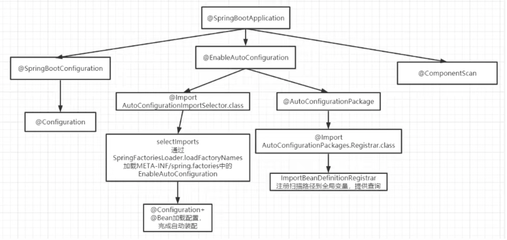

## SpringBoot总结

### 1.什么是SpringBoot？
SpringBoot是建立在Spring框架之上，基于Spring启动，避免样板代码和配置。减少工作量的框架。

###1.1@SpringBootApplication注解解析
• @SpringBootApplication：由java元注解外，三个注解实现。
• @Configuration：标注的类属于Spring.xml中的<beans> 允许在上下文中导入额外的bean或导入其他配置类
• @EnableAutoConfiguration：SpringBoot自动配置机制
• @ComponentScan：扫描@Component @Service @Controller注解的bean，默认扫描启动类所在包下的所有的类，
    可以自定义不扫描某些bean，容器中将排除TypeExcludeFilter和AutoConfigurationExcludeFilter

### 2.SpringBoot的核心配置文件是什么？
• bootstrap (.yml或.properties) 由父ApplicationContext加载，bootstrap优先加载
• application(. yml 或者 . properties)用于SpringBoot项目的自动化配置.

### 3.SpringBoot有哪些优点？
减少大量开发时间并提高生产力，避免编写大量样板代码，注释，和XML配置。SpringBoot应用程序与Spring生态系统
(Spring JDBC，Spring JPA，Spring ORM，Spring Data，Spring security)集成非常容易。
• 使用 Spring 项目引导页面可以在几秒构建一个项目方便对外输出各种形式的服务，如 REST API、WebSocket、Web、Streaming、Tasks
• 非常简洁的安全策略集成
• 支持关系数据库和非关系数据库
• 支持运行期内嵌容器，如 Tomcat、Jetty强大的开发包
• 支持热启动
• 自动管理依赖
• 自带应用监控
• 支持各种 IED，如 IntelliJ IDEA 、NetBeans
• 缺点是集成度过高，不太容易了解底层

###3.1.Spring SPI 是什么?
Spring Boot定义了一套接口规范，规定Spring Boot启动时会扫描外部引用jar包中的META-INF/spring.factory文件，
将文件中的全限定类名加载到Spring IoC容器中，并实行类初始化操作。对于外部的jar包来说，只需要Spring Boot定义的标准，
就可以将自己的功能加载到Spring Boot。

###4.SpringBoot自动配置原理？
SpringBoot是通过复合注解@SpringBootApplicaiton中的@EnableAutoConfiguration 来实现的，
这个注解会扫描各个符合Spring Boot 标准的Stater中的METE-Inf文件夹下的spring.factories文件，
将文件中定义的类全限定名，加载到Spring IoC容器中完成自动装配的原理。我们也可以自定义注解的Stater。
不会去加载所有bean，会根据@ConditionalOnxxx等注解进行条件加载，不符合条件的bean就会被过滤。
@Import + @Configuration + @Spring spi。
自动配置类由各个starter提供，使用@Configuration + @Bean定义配置类，放到META-INF/spring.factories文件下。
使用Spring.spi去扫描META-INF/spring.factories下的配置类。
使用@Import导入配置类。

###4.1SpringBoot每次启动都要去加载spring.factories文件吗？
不会，SpringBoot有个@ConditionalOnxxx 的注解 会根据条件加载bean，不符合条件的bean就会被过滤。

###5.为什么SpringBoot不需要去启动Tomcat容器呢？ SpringBoot嵌入式服务是什么？
SpringBoot帮我们节省了下载Tomcat，将程序打包成jar包，再通过webapp目录下运行。
SpringBoot已内置tomcat，启动时一并启动tomcat，通过Tomcat的spi机制加载spring mvc 等bean 来接收发送请求。

