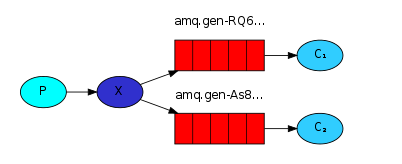
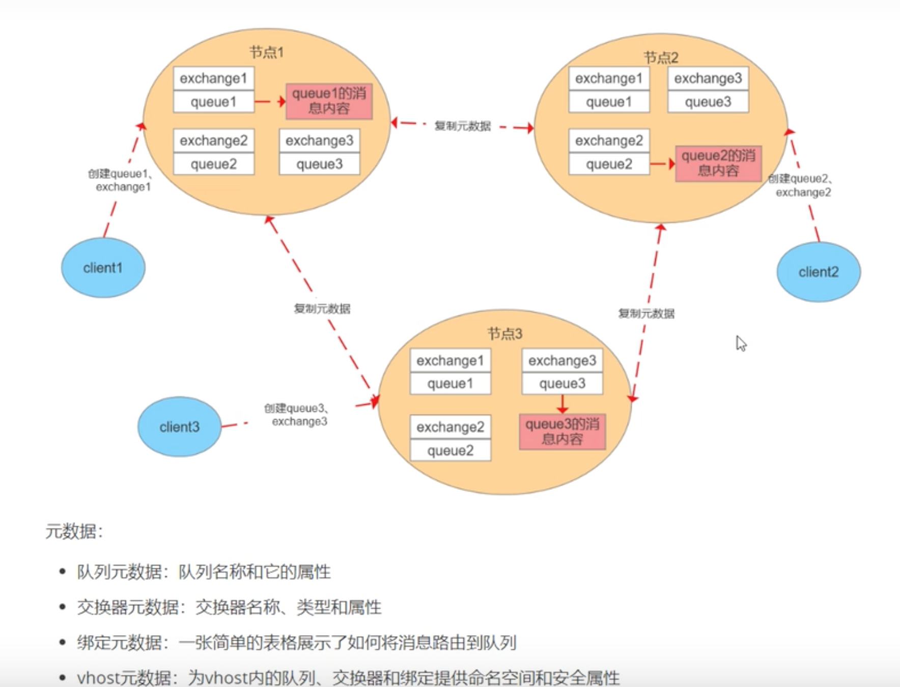

# RabbitMQ总结

## 1.什么是RabbitMQ？
RabbitMQ是一款开源的，Erlang语言编写的，基于AMQP协议的消息中间件。

## 2.RabbitMQ的使用场景？
• 服务异步通信
• 顺序消费
• 定时任务
• 流量削峰

## 3.RabbitMQ的基本概念？
• Broker：消息队列服务实体。
• Exchange：消息交换机，可指定消息按什么规则，路由到什么队列。
• Queue：消息的载体。
• Binding：绑定，将exchange和queue按照路由规则绑定起来。
• Routing Key：路由关键字，exchange根据Routing Key 进行消息投递。
• VHost：虚拟机，就是mini-RabbitMQ Server。内部有独立queue、exchange和binding。 可以做到虚拟机级别的用户控制。
• Producer：消息生产者，可投递消息。
• Consumer：消息消费者，可接收消息。
• Channel：消息通道，用来传输消息
消息路线由，Exchange、Queue、Routing Key 三个决定。

## 3.1RabbitMQ支持的优先队列？
RabbitMQ通过设置x-max-priority，是一个可选队列参数。此参数可设置到0-255之间的正整数，表示队列支持最大优先级。
设置优先级的消息优先发布。

##3.2RabbitMQ支持的死信队列？
RabbitMQ为了保证消息不丢失，使用到了死信队列机制，当消息发生异常时，会将异常消息投入到死信队列当中。
也就是说，当配置了死信队列，消息存活时间超时或者消息超出队列长度，就会被存入到死信队列当中，进行特殊处理。
死信队列是指死信队列交换机，并配置一个单独key，来监听业务消息是否发生异常。

## 4.RabbitMQ的工作模式？
• simple模式（简单收发）
一对一，生产者发生一个，消费者消费一个。

• work模式（一生产者多消费者）
默认多个消费者竞争一个消息，高并发下可能产生一个消息被多个消费者消费，
可以通过设置syncronize 保证一条消息只能被一个消费者使用

• publish/subscribe发布订阅(共享资源) 多个生产者多个消费者
生产者将消息发送给交换机，绑定交换机的队列才会收到消息。

• routing 路由模式
生产者根据routing key 来绑定交换机，消费者也是根据 routing key 来消费消息，实现消费的对应消费。
使用场景错误通知，生产者将error日志发送到消息队列当中，通过routing key 绑定，此时消费者通过不同的routing key 来对不同的错误异常进行处理。

• topic 主题模式

1.星号井号属于通配符。
2.星号表示多个词，井号表示一个词。
3.路由功能添加模糊匹配。
4.消息产生者产生消息，把消息交给交换机。
5.交换机根据key的规则模糊匹配到对应的队列，由队列的监听消费者接收消息消费。

##5.RabbitMQ如何保证消息的顺序性？
拆分多个queue，每一个queue一个consumer处理，然后consumer内部的queue使用FIFO进行排队处理。

##6.消息如何分发？
消息以 round-robin 循环发送的方式发送给消费者，消费者收到消息后，再进行消费。

##7.消息如何路由？
RabbitMQ通过Routing Key 进行绑定消息/绑定交换机
交换机的路由方式有三种：
fanout：如果交换器收到消息，将会广播到所有绑定的队列上
direct：如果路由键完全匹配，消息就被投递到相应的队列
topic：可以使来自不同源头的消息能够到达同一个队列。 使用 topic 交换器时，可以使用通配符

## 8.消息基于什么传输？
由于 TCP 连接的创建和销毁开销较大，且并发数受系统资源限制，会造成性能瓶颈。
RabbitMQ 使用信道的方式来传输数据。信道是建立在真实的 TCP 连接内的虚拟连接，且每条 TCP 连接上的信道数量没有限制。
总结：未通过TCP传输，通过TCP中建立信道传输，信道数据不限。

## 9.如何保证消息不被重复消费？或者说，如何保证消息消费时的幂等性？
• 数据库唯一索引
• 分布式全局ID

## 10.RabbitMQ如何保证消息正常发送，和消息正常接收的机制？
发送方通过开启confirm模式，开启后，在信道发送的消息会有唯一消息ID，
当消息投入到队列当中后，或被写入磁盘后，信道会发送一个消息确认消息（包含唯一消息ID）告知发送者已经成功发送消息。
接收方接收并消费完这个消息后，会发送一个已消费消息给队列或交换机，通知删除磁盘上的消息。如果接收方处理超时了，
队列根据接收方是否连接中断，来确认是否需要重新发送消息。但是会因消费方为消费完消息就宕机，导致发送消息重复，
需要做一个消息去重，如果消费者没有断开连接，且没回复确认消息，那么就判断消费者繁忙，不会继续发送消息。

## 11.如何保证RabbitMQ消息的可靠传输？
生产者丢消息：
• transaction模式 通过开始事务 回滚事务 提交事务来保证消息的可靠 （是同步的，发送消息后需要txCommit 事务才会提交到queue中）
• confirm模式 通过唯一消息ID，消息确认机制来保证消息可靠  (是异步的，发送后，不用管了)
消息队列丢消息：
• 消息持久化 消息持久化+confirm模式一起使用，当持久化磁盘中，再发送Ack通知生产者消息消费成功，生产者重发。
• 实现步骤：
    ▪ 将queue的持久化标识durable设置为true,则代表是一个持久的队列
    ▪ 发送消息的时候将deliveryMode=2
这样设置即使RabbitMQ重启后，消息也不会丢失。
消费者丢失消息：
• 处理前回复队列，会导致处理失败，丢失消息。
• 处理完成后，再通过confirm消息确认，保证消息不丢失。

## 12.RabbitMQ普通集群模式？
有多个节点，每个节点之间的元数据互相同步，消息数据不参与同步。

缺点：某一台集群节点挂掉，该节点中的消息会丢失。

##12.1为什么RabbitMQ只同步元数据？
• 减少存储空间，如果每一个节点保存全量数据，会导致消息堆积。
• 影响性能，消息发布者需要将消息复制到每一个集群节点。

##12.2.RabbitMQ集群节点的类型？
• 磁盘节点：将配置信息和元数据存储在磁盘上
• 内存节点：配置信息和元数据存储在内存中。性能优于磁盘节点。依赖磁盘节点进行持久化。

集群节点设置：至少2个磁盘节点，其他均可内存节点。

##13.RabbitMQ中的交换机类型？
fanout：扇形交换机，不判断routingKey，直接将消息分发到所有绑定的队列。
direct：判断routeKey的规则是否是完全匹配模式，发送指定消息时通过routeKey与exchange交换机绑定
topic：判断routeKey是否是模糊匹配规则。
header：绑定队列与交换机时指定键值对，当交换机分发消息时会解析headers信息，判断是否有设置键值对，如有，会发送到指定队列中。
        交换机性能较差，实际工作中使用场景较少。

##14.RabbitMQ中的死信队列和延时队列？
• 死信队列：
    ▪ 当消息被消费者拒绝消费时，使用chanel.basicNack或channel.basicReject，并且此时requeue属性被设置为false
    ▪ 消息在队列的存活时间超过设置的TTL时间。
    ▪ 消息队列的消息数量已经超过了最大队列长度。
上述三种情况，消息会进入死信队列，由RabbitMQ进行特殊处理，如没配置死信队列，消息会丢失。
配置死信队列需要配置死信队列交换机，可与业务交换机共用。
• 延迟队列
    ▪ TTL：一条有时限的消息
    ▪ 如果设置了TTL属性，并进入TTL属性队列的消息，这个消息在设定时间内没被消费掉，如果配置了死信交换机，那么会进入死信队列。