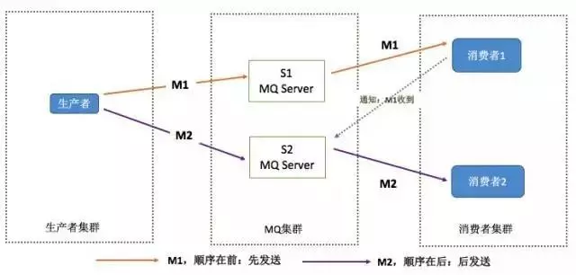

# MQ总结

## 1.为什么使用MQ？MQ的优点？
• 异步处理 - 相比于传统的串行、并行方式，提高了系统吞吐量。
• 应用解耦 - 系统间通过消息通信，不用关心其他系统的处理。
• 流量削峰 - 可以通过消息队列长度控制请求量；可以缓解短时间内的高并发请求。
• 日志处理 - 解决大量日志传输。
• 消息通讯 - 消息队列一般都内置了高效的通信机制，因此也可以用在纯消息通讯。比如点对点消息队列，或聊天室等。

详细答
**解耦**：ABC三个系统 通过接口调用关联，A调用B，B调用C。 现在A不需要调用B， 需要调用C。此时就要改大量代码。
这时就要用到MQ，通过将消息发送到MQ当中。由MQ来保存消息，A中就不用关心我到底调用谁。这样就不用考虑是否调用成功、失败超时等情况。
就比如一个系统或者一个模块，调用了多个系统或者模块，互相之间的调用很复杂，维护起来很麻烦。其实调用是不需要直接同步调用接口的，用MQ异步调用即可。

**异步**：A系统接受一个请求，需要在本地写库，还需要写BCD，本地写库需要3ms，BCD三个系统分别写库要300ms、450ms、250ms。最终请求总延时是
3 + 300ms + 450ms + 250ms = 1003ms，超过1s，用户就感觉搞这个东西，太卡了，很慢。用户通过浏览器发送请求。如使用MQ A系统连续发送3条消息
到MQ队列中，假如耗时5ms，A系统从接收一个请求到返回响应给用户，总时长是3 + 5 = 8s。
 
**削峰**
减少高峰时期对服务器压力。

## 2.消息队列有什么优缺点？
优：解耦、削峰、异步
缺：
• 系统可用性降低
    ▪ 消息队列加入后，若消息队列崩溃将会导致系统崩溃。需要考虑消息队列的可用性。
• 系统复杂度提高
    ▪ 需要考虑消息重复消费、消息丢失等问题。系统复杂性增大。
• 一致性问题
    ▪ A系统处理完直接返回成功，别人以为这个请求成功了；但BCD三系统那里，BD两个系统写库成功了，C系统写库失败了，这个数据就不一致了。

总结：使用消息队列，需要全面考虑，考虑它的优点时，也要考虑它所引入带来的后果，这样才能全面看待问题。但关键时刻，用还得用。

## 3.公司生产环境用的什么消息中间件？
首先说是RabbitMQ，可初步给出一些不同的MQ中间件技术的选型分析
比如：ActiveMQ是老牌的消息中间件，国内很多公司运用非常广泛，功能强大。问题是ActiveMQ没办法支持互联网公司的高并发、高负载和高吞吐量的场景，
国内互联网公司落地较少，传统企业使用较多。
• RabbitMQ的
好处：支持高并发、高吞吐、性能高，有完善的管理界面使用。支持集群、高可用部署架构、消息防丢失、功能完善，社区活跃，bug修复快。
缺点：使用erlang语言开发，导致里面源码难分析，难定制，难改造。
• RocketMQ
好处：阿里开源、经过阿里超高并发，高吞吐考验，性能卓越，同时支持分布式事务场景。RocketMQ是Java语言开发的，适合深入阅读源码，
有需要可以在源码层面解决生产问题。也可二次开发与改造。
• Kafka
好处：超高吞吐量、实时日志采集、实时数据同步、实时数据计算，大数据场景用的比较多。

## 4.Kafka、RabbitMQ、RocketMQ、ActiveMQ、ZeroMQ之间的区别？

各大MQ经过各种对比后，有如下建议：
RabbitMQ稳定、活跃度高，支持使用，中小公司使用
RocketMQ社区不稳定，活跃不高，不高，出了问题需要人排查，大型公司使用。
Kafka 大数据领域，日志采集，都是kafka业内标准，社区活跃度高。

## 5.MQ有哪些问题？怎么解决这些问题？
常见的问题：
1.消息的顺序怎么保证？
2.消息的重复消费怎么解决？

## 5.1 如何保证消息顺序？
消息顺序消费，指消息的发送顺序与消费顺序一致。
例：生产者产生了两条消息：M1，M2，假定M1发送到S1，M2发送到S2，需要保证M1先于M2被消费，怎么做？

解决方案：
（1）保证生产者 - MQServer - 消费者是一对一对一的关系  也就是说我将消息都发送到同一台服务器上的同一个服务中进行处理，按照先后顺序进行发送。

缺陷：
• 并行度会成为消息系统的瓶颈（吞吐量不够）
• 更多的异常处理，比如只要消费端出现问题，就会导致整个处理流程阻塞，需要解决。通过合理的设计或将问题分解来规避
• 不关注乱序的应用大量存在
• 队列无序并不意味着消息无序，从业务层面来保证消息顺序不仅仅依赖于消息系统，可以通过业务解决。
• 比如Rocket就是通过轮询所有的队列，判断消息发送到哪个队列当中，订单号相同的消息就会发送到同一个队列当中。

实际解决思路：
 解决思路：在生产端发送消息的时候，把自己上一条消息ID 记录到放到消息体中。在消费端接收到消息后，首先检查此消息中的 上一条消息ID属性。
 如果不存在上一条消息ID属性，那么就正常消费操作。如果成功消费，则将此次消费的消息ID记录到数据库中。                        
 如果存在上一条消息ID属性，那么就先去数据库查看上一条消息是否已经成功被消费。
 如果成功被消费，那么就执行正常的业务逻辑。消费并记录本次消息ID。
 如果发现上一条消息没有被成功消费，那么可以稍等一下，在程序中执行睡眠X秒的操作。当休眠时间到了以后，
 再去检查一下上一条消息是否已经被成功消费。如果此时上一条消息仍然没有成功消费，那么就抛出异常，将当前的消息推回原队列，并等待下次重新消费。

## 5.2 如何保证消息重复消费？
消息重复消费的根本原因有两：①网络延迟 ②服务业务处理阻塞 
• 网络延迟，我们可以理解为，当网络延迟发送了两条相同的消息到MQ，消费端如何处理两条相同的消息？
    ▪ 解决方案，消费端通过业务来保证消息的幂等性，可将消息ID存入到日志表当中，当有同样消息过来时，就不再处理这条消息。

## 5.3 如何设计MQ的思路？
• MQ的可伸缩性，快速扩容：参考kafka设计理念，broker -> topic -> partition，每个partition放一个机器，就存一部分数据。如果资源不够，
  给topic增加partition，做数据迁移，增加机器，可支持更高吞吐量。
• MQ数据持久化磁盘：通过顺序写入磁盘，减少磁盘随机读写的寻址开销，磁盘顺序读写性能高，也就是快。参考kafka。
• MQ的可用性：多副本 -> leader & follower -> broker 挂了重新选举leader 即可对外服务。
• MQ数据丢失：参考kafka数据零丢失方案。

