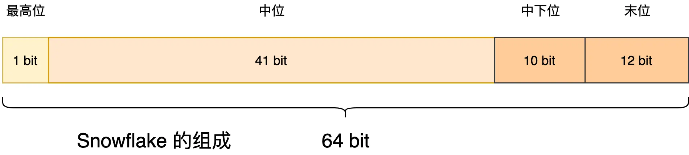
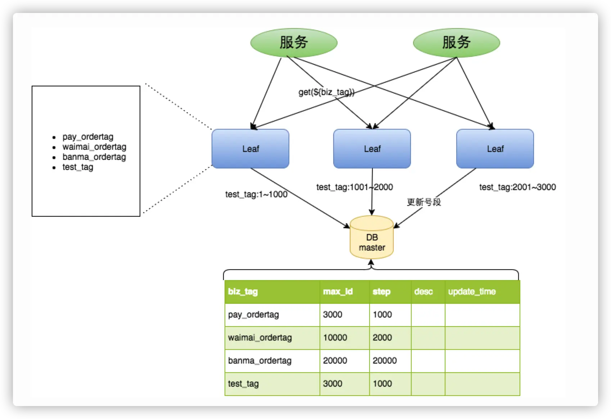
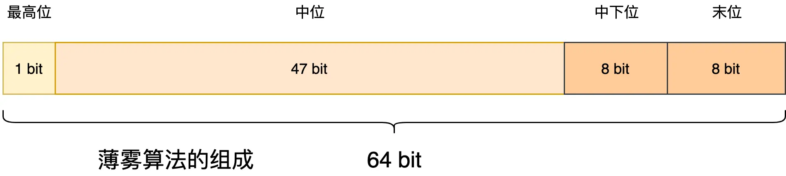
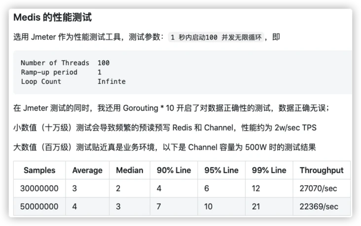

# 分布式幂等性总结

## 1.什么是幂等性？
所谓的幂等性就是一次请求和多次请求同一个资源产生相同的副作用。
通俗点说：对于相同的请求调用这个接口一次或多次，需要给调用方返回一致的结果时，就要考虑将这个接口设计幂等性接口。
用数学表达式表达 f(x) =f(f(x))

## 2.为什么需要幂等性？
在系统高并发的环境下，很有可能因为网络、阻塞等问题导致客户端或调用方不能及时收到服务端的反馈甚至调用超时的问题。
总之就是调用方调用了你的服务，没有收到任何信息，完全是懵逼的状态。比如订单问题。
1.创建订单时，第一次调用服务超时，再次调用是否产生两笔订单。
2.订单创建成功去扣减库存时，第一次扣减库存超时，是否会多扣减一次。
幂等性要求，一次请求和多次请求统一资源产生相同的副作用。
所以，创建订单时，第一次调用服务超时，再次调用是否产生两笔订单。当然不会
所以，订单创建成功去扣减库存时，第一次扣减库存超时，是否会多扣减一次。当然不会


## 3.需要幂等性的场景？
可能会发生重复请求或消费的场景。在分布式、微服务架构中随处可见。
• 网络波动：因网络波动，可能会引起重复请求。
• 分布式消息消费：任务发布后，使用分布式消息服务来进行消费。
• 用户重复操作：用户在使用产品时，可能无意的触发多笔交易，甚至没有响应而有意触发多笔交易。
• 未关闭的充实机制：因开发人员、测试人员、运维人员没有检查出来，而开启的重试机制(如Nginx重试，RPC通讯重试或业务层重试等)


## 4.做到幂等性的几个例子？
服务方提供一个查询操作是否成功的api，第一次超时之后，调用方调用查询接口，如果查到了就走成功的流程，失败了就走失败的流程。
• 用户礼包领取
    ▪ 我们都知道一个用户新注册的时候，系统都会送该用户一份新用户大礼包，当我们点击领取了这个礼包之后，我们就相当于收下了这份礼包，
        以后无论你怎么点击领取，结果还是一样的，系统已经提示你已经领取过该礼包了，不会再让你重复领取一次。
• 抢红包
    ▪ 当我们在抢一份红包时，我们点击了抢，抢到就有，没抢到就没有，之后无论我们重复点击多少次，系统都会提示你已经抢过该红包了。
    
• 账单付款
    ▪ 当我们要结账的时候，支付平台会生成唯一的支付连接，不会再生成另外的支付连接。（不能因这个支付接口被调用了两次，就生成两个一样的订单。）

## 5.幂等性的重要性？
• 防止商品超卖
• 重复转账、扣款或付款
• 重复增加金币、积分或优惠券


## 6.幂等性的解决方案？
• 全局唯一ID：根据业务的操作和内容生成全局的唯一ID，执行操作前先根据全局唯一ID是否存在，判断这个操作是否已执行。
              如果不存在就把全局ID存储到存储系统当中，比如数据库，Redis中。如果存在代表该方法已执行。
 
 6.1全局唯一ID?
• UUID：6F9619FF-8B86-D011-B42D-00C04FC964FF
优点：出现数据拆分、合并存储的时候，能达到全局的唯一性
缺点：UUID使用字符串存储，占用空间较大。无法满足趋势递增、单调递增这两个属性，同时写入时会降低写入性能。

• Redis生成ID：订单号=日期+当日自增长号，自增长通过 INCR 实现。但这样操作无法满足编号不可猜测的需求。

• MongoDB ObjectID：5b6b3171599d6215a8007se0，和UUID一样无法满足递增属性，和MySQL一样需要入库后才能生成。

• Snowflake：Twitter 内部使用的全局ID生成算法Snowflake，
优点：Snowflake不借助于数据库，可以直接由编程语言生成，通过巧妙的位设计满足ID递增属性，且生成的ID并不是依次连续。能够满足上面的全局ID的四个属性。
     它生成的ID是这样的
````sql
563583455628754944
563583466173235200
563583552944996352
````
Snowflake以64bit来存储组成ID的4个部分：
1、最高位占1bit，固定值为0，以保证生成的ID位正数；
2、中间位占41bit，值为毫秒级时间戳；
4、中下位占10bit，工作机器的ID，值上线为1024；
5、末尾占12bit，单位时间内（同一毫秒内）生成的ID序列号，值上线为4096；表达生成的这一毫秒内，第5个或第150个的数值。


* Snowflake存在的问题？
• Snowflake不依赖于数据库，也不依赖于内存存储，随时可生成ID，这是它受欢迎的原因。但因为它在设计时通过时间戳来避免对内存和数据库的依赖，
所以它依赖于服务器的时间。Snowflake的4段结构，实际上影响ID大小的是最高位的值，由于最高位固定为0，遂影响ID大小的是中位的值，也就是时间戳。
试想，服务器的时间发生了错乱或回拨，这就直接影响到生成的ID，有很大概率生成重复的ID且一定会打破递增属性。这是一个致命缺点，想一下支付宝订单和购买订单的编号重复。
这是多么严重的问题。
简而言之：**Snowflake依赖于服务器时间生成，服务器时间错乱，导致生成ID重复，出现非常严重的问题。**
• Snowflake由于它的中下位和末尾bit数限制，**它每秒生成的ID严重受到限制，由于中位是41bit的毫秒时间戳，所以从起始到41bit消耗完，只能坚持70年。**
• 对于程序获取操作系统的时间会耗费很多时间，相比于随机数和常数来说，性能相差太远，这是至于它生成性能的最大因数。

• 百度 UIDGenerator 算法，它通过借用未来时间和双 Buffer 来解决时间回拨与生成性能等问题，
  同时结合 MySQL 进行 ID 分配。这是一种基于 Snowflake 的优化操作，是一个好的选择.
• 美团 Leaf-Segment方案/Leaf-Snowflake 出现两种方案的原因是，Leaf-Segment没有满足安全属性的要求，容易被猜测，无法用在对外开放的场景（订单）。

    ▪ Leaf-Snowflake 通过文件系统缓存降低了对Zookeeper的依赖，同时通过对时间的对比和报警来应对Snowflake的时间回拨问题。
• 微信 Seqsvr 它是一个用ID来标识消息的顺序的场景，用来确保我们收到的消息是有序的。
  在这里不是全局唯一ID，而是单个用户全局唯一ID，只需要保证这个用户发送的消息ID是递增即可。 
     
• 薄雾Mist 性能高出Snowflake 587倍
 最高位是1bit固定值0，中位47bit，中下位和末位都是8bit数值上线是255，即开闭区[0,255]。
**位数是影响ID数值上限的主要因素，Snowflake的中下位和末尾的bit数限制了单位时间内生成的ID的上限，要解决这两个问题就要重新设计ID的组成。**
**Snowflake通过中下位机器序列号和每毫秒生成的ID序列号来保证 分布式ID的安全属性。但我们可以通过多组随机数组合的方式实现，随着数字的递增和随机数的变换，通过ID猜顺序的难度是很高的。**
**通过对Snowflake分析，缩减中下位和末尾的bit数，增加中位的bit数，这样就可以拥有更高的上限和使用年限，
  那上限和年限现在是多久呢？中位数值的上限计算公式为 int64(1<<47 - 1)，计算结果为 140737488355327 。
  百万亿级的数值，假设每天消耗 10 亿 ID，薄雾算法能用 385+ 年，几辈子都用不完。
  中下位都是8bit，对应的值是255，[0,255] 能够产生的随机数的组合是256 * 256种，而且每次都会变化，猜测难度相当高。由于不需要像Snowflake那样需要计算末位的序列号，
  薄雾的算法的代码并不长。github地址: https://github.com/asyncins/mist**
  
• 薄雾算法的性能为什么高呢？
薄雾算法不用获取时间戳，只是通过随机数生成的。
▪ 以 Golang 为例（我用 Golang 做过实验），Golang 随机数有三种生成方式：
    ★ 基于固定数值种子的随机数；
    ★ 将会变换的时间戳作为种子的随机数；
    ★ 大数真随机；
基于固定数值种子的随机数每次生成的值都是一样的，是伪随机，不可用在此处。将时间戳作为种子以生成随机数是目前 Golang 开发者的主流做法，实测性能约为 8800 ns/op。
大数真随机知道的人比较少，实测性能 335ns/op，由此可见性能相差近 30 倍。大数真随机也有一定的损耗，如果想要将性能提升到顶点，
只需要将中下位和末位的随机数换成常数即可，常数实测性能 15ns/op，是时间戳种子随机数的 587 倍。
要注意的是，将常数放到中下位和末位的性能是很高，但是猜测难度也相应下降。
总结：mist算法通过随机数生成ID，使用常数随机数最高，因为不用去获取时间戳，减少了获取系统时间戳的时间。不过猜测难度降低。
▪ 薄雾算法的依赖问题。
薄雾算法的避开了时间依赖，使用内存存储，依赖内存，自增ID只能在内存中存活，遂需要存储将自增ID存储起来，避免因为宕机或程序异常造成重复ID的事故。

▪ 薄雾算法与KV存储结合
Mest与Redis的结合 Medis。                                                         

Medis的性能为2.5w/sec

▪ 薄雾算法的高性能
★ 使用 Channel 作为数据缓存，这个操作使得发号服务性能提升了 7 倍；
★ 采用预存预取的策略保证 Channel 在大多数情况下都有值，从而能够迅速响应客户端发来的请求；
★ 用 Gorouting 去执行耗费时间的预存预取操作，不会影响对客户端请求的响应；
★ 采用 Lrange Ltrim 组合从 Redis 中批量取值，这比循环单次读取或者管道批量读取的效率更高；
★ 写入 Redis 时采用管道批量写入，效率比循环单次写入更高；
★ Seqence 值的计算在预存前进行，这样就不会耽误对客户端请求的响应，虽然薄雾算法的性能是纳秒级别，但并发高的时候也造成一些性能损耗，放在预存时计算显然更香；
★ 得益于 Golang Echo 框架和 Golang 本身的高性能，整套流程下来我很满意，如果要追求极致性能，我推荐大家试试 Rust；

## 7.为什么要全局唯一ID？
MySQL分库分表条件下，MySQL无法做到依次、顺序、交替的生成ID，这时候就要保证数据的顺序，分布式唯一ID就是很好的选择。
在爬虫场景当中，这条数据进入数据库之前会进行数据清洗、校验、矫正、分析等多个流程，这期间有一定概率发生重试或设为异常等操作，
也就是在进入数据之前需要有一个唯一的ID来标识这条数据。

## 8.全局ID应该具备怎么样的属性？
1、全局唯一性：不能出现重复的ID号，既然是唯一标识，这是最基本的要求。
2、趋势递增：在MySQL InnoDB引擎中使用的是聚簇索引，由于多数RDBMS使用B-tree的数据结构来存储索引数据，在主键的选择上我们应该尽量使用有序的主键保证写入性能。
3、单调递增：保证下一个ID一定大于上一个ID，例如数据库版本号、IM增量操作、排序等特殊需求。
4、信息安全：如果ID是连续的，恶意用户的爬取操作就容易做了，直接按照顺序下载指定URL；如果是订单号就更危险了。
           竞争对手可以直接知道一天的单量。所以在一些应用场景下会需要无规则、不规律的全局ID。


    
    
    
    