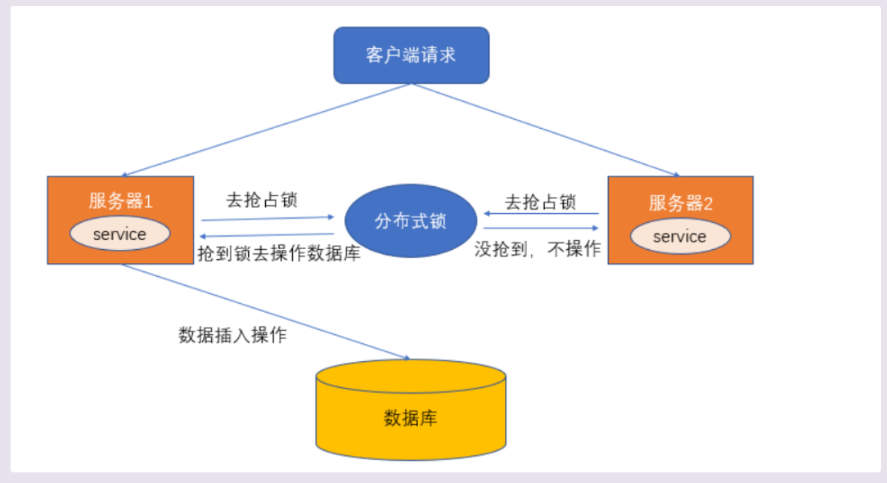

## 分布式总结

### 0.分布式事务是什么？
业务相关的多个操作，要保证他们同时成功或者同时失败。
最终一致性：在整个事务当中，允许一段时间内数据不一致，比如刚下完但，但是看物流还没发货，2分钟过去了，物流也发货了。
强一致性：在整个事务当中，每一个时间节点都要保证数据的一致性，就比如我下完单，需要马上看到物流发货。

### 1.什么是分布式锁？
在分布式模型下，数据只有一份，需要利用锁的技术控制某一时刻修改数据的进程数。是控制分布式系统之间**互斥访问共享资源**的一种方式
比如说，在一个分布式系统中，多台机器上部署了多个服务，当客户端一个用户发起一个数据插入请求时，如果没有分布式锁机制保证，那么多台
机器上的多个服务可能进行并发插入操作，导致数据重复插入，对于某些不允许有多余数据的业务来说，这就会造成问题。而分布式锁就是为了解决这样的问题
保证多个服务之间互斥访问共享资源，如果一个服务抢占了分布式锁，其他服务没获取到锁，就不进行后续操作。
大致流程图
### 2.跨JVM线程安全问题
在单体的应用开发场景中，在多线程的环境下，涉及并发同步的时候，为了保证一个代码块在同一时间内只能由一个线程访问，一般可以通过
synchronized 和ReentrantLock去保证，这是本地锁的方式。
在分布式集群工作的开发场景中，JVM需要一种更高级的锁机制，来处理JVM进程之间的线程安全问题。
解决方案：使用分布式锁。

### 3.分布式锁的作用，特点，实现
*作用：*   
• 分布式模型下，数据只有一份（或有限制），需要利用锁的技术控制某一时刻修改数据的进程数。
• 用一个状态值表示锁，对锁的占用和释放通过状态值来标识。
*条件：*
• 互斥性。任何时刻，只有一个客户端能持有锁。
• 不会发生死锁。即使有一个客户端在持有锁的期间崩溃而没有主动解锁，也能保证后续其他客户端能够加锁。
• 具有容错性，只要大部分redis节点正常运行，客户端就可以加锁和解锁。
• 解铃还须系铃人，加锁和解锁必须是同一个客户端，客户端不能把别人加的锁给解了。
*分布式锁的实现：*
分布锁的实现有很多种，文件锁，数据库，redis等，比较多；常见的分布式锁的多种实现方式：
1.数据的悲观锁；
2.数据库的乐观锁；
3.基于redis的分布式锁；
4.基于Zookeeper的分布式锁。

### 3.1数据库悲观锁
所谓悲观锁，是对数据的修改持悲观态度，认为一定会存在并发问题，因此在数据处理过程中将数据锁定。
悲观锁的实现方式依靠数据库提供的锁机制。数据库的行锁、表锁、排他锁都是悲观锁。
使用场景举例:
```text
秒杀案例中，生成订单和扣减库存的操作，可以通过商品记录的行锁，进行保护。通过 select ... ，在查询商品表库存时将该记录加锁，
待下单减库存完后，再释放锁。
```
```sql
//0.开始事务
begin; 
//1.查询出商品信息
select stockCount from seckill_good where id=1 for update;
//2.根据商品信息生成订单
insert into seckill_order (id,good_id) values (null,1);
//3.修改商品stockCount减一
update seckill_good set stockCount=stockCount-1 where id=1;
//4.提交事务
commit;
```
以上，在对id = 1的记录修改前，先通过for update的方式进行加锁，然后再进行修改。这就是比较典型的悲观锁策略。
如果以上修改库存的代码发生并发，同一时间只有一个线程可以开启事务并获得id=1的锁，其它的事务必须等本次事务提交之后才能执行。
这样我们可以保证当前的数据不会被其它事务修改。但是这样操作效率太低。

###3.2数据库乐观锁
使用乐观锁就不需要借助数据库的锁机制了。
乐观锁的概念中其实已经阐述了他的具体实现细节：主要就是两个步骤：冲突检测和数据更新。
其实现方式有一种比较典型的就是Compare and Swap(CAS)技术。CAS是多个线程尝试修改同一个变量时，只有一个线程能够更新变量的值，
其他的线程更新失败，失败的线程不会被挂起，而是被告知这次竞争中失败，并可以再次尝试。
```text
CAS的实现中， 在表中增加一个version字段，操作前先查询version信息，在提交时检查version字段是否被修改，如果没有被修改就进行提交，否则认为是过期数据。
```
比如前面扣减库存问题，用CAS实现如下：
```text
//1.查询出商品信息
select stock_count,version from seckill_good where id = 1;
//2.根据商品信息生成订单
insert into seckill_order(id,good_id) value(null,1);
//修改商品库存
update seckill_good set stock_count = stock_count -1 , version = version+1 where id = 1 and version = version;
```
当我们更新时，先查询一下库存中当前版本version，提交更新时，判断数据库对应的记录的当前版本与第一次查询出来的version进行比对，
如果相等，则更新，不相等，则认为是过期数据。


###4.Zookeeper分布式锁

###5.Redis分布式锁
Redis分布式锁的两个维度
①Jedis手工造轮子分布式锁
②使用Redission分布式锁

###5.1分布式锁的特点
• 互斥性：同一时刻只有一个线程持有锁。
• 可重入性：同一节点上同一个线程获取锁之后能再次获取锁。
• 锁超时：和JUC包中的锁一样，支持锁超时，防止死锁。
• 高性能和高可用：加锁和解锁需要高效，同时也保证高可用，防止分布式锁失效。
• 具有阻塞和非阻塞性：能够及时从阻塞状态中被唤醒。

###5.2Redis分布式锁实现
主要使用setnx和expire

setnx命令：setnx 是set is not exists 
只有当key不存在的情况下，将key设置为value；若key存在，不做任何操作，结果成功返回1，失败返回0
expire命令：为key设置过期时间，单位为秒，当key过期时，会被自动删除。
setex命令( set if not  exist)：当key 不存在时 才能进行设置，已经存在会覆盖原有值。
1.属于原子操作，与set key value、expire key seconds作用一样。
2.针对redis分布式锁的问题：setnx是成功的，但是expire是失败的，一旦出现释放锁失败，或者没有手工释放锁，那么这个锁就永远被占用，其他线程永远抢不到锁。


###5.3如何保证setnx和expire的原子性？
解决的办法有两种：
• 使用set的命令时，同时设置过期时间，不再单独使用 expire命令
• 使用lua脚本，将加锁的命令放在lua脚本中原子性的执行

简单加锁：使用set的命令时，同时设置过期时间 
```sql
127.0.0.1:6379> set unlock "234" EX 100 NX
(nil)
127.0.0.1:6379> 
127.0.0.1:6379> set test "111" EX 100 NX
OK
```
这样就完美的解决了分布式锁的原子性； set 命令的完整格式：
set key value [EX seconds] [PX milliseconds] [NX|XX]
```text
EX seconds：设置失效时长，单位秒
PX milliseconds：设置失效时长，单位毫秒
NX：key不存在时设置value，成功返回OK，失败返回(nil)
XX：key存在时设置value，成功返回OK，失败返回(nil)
```
加锁的简单代码实现
```java
package com.crazymaker.springcloud.standard.lock;

@Slf4j
@Data
@AllArgsConstructor
public class JedisCommandLock {

    private  RedisTemplate redisTemplate;

    private static final String LOCK_SUCCESS = "OK";
    private static final String SET_IF_NOT_EXIST = "NX";
    private static final String SET_WITH_EXPIRE_TIME = "PX";

    /**
     * 尝试获取分布式锁
     * @param jedis Redis客户端
     * @param lockKey 锁
     * @param requestId 请求标识
     * @param expireTime 超期时间
     * @return 是否获取成功
     */
    public static   boolean tryGetDistributedLock(Jedis jedis, String lockKey, String requestId, int expireTime) {

        String result = jedis.set(lockKey, requestId, SET_IF_NOT_EXIST, SET_WITH_EXPIRE_TIME, expireTime);

        if (LOCK_SUCCESS.equals(result)) {
            return true;
        }
        return false;
    }
}
```
可以看到，我们加锁用到了Jedis的set Api：
```sql
jedis.set(String key, String value, String nxxx, String expx, int time)
```
这个set()方法一共有五个形参：
```text
第一个为key，我们使用key来当锁，因为key是唯一的。

第二个为value，我们传的是requestId，很多童鞋可能不明白，有key作为锁不就够了吗，为什么还要用到value？
原因就是我们在上面讲到可靠性时，分布式锁要满足第四个条件解铃还须系铃人，通过给value赋值为requestId，
我们就知道这把锁是哪个请求加的了，在解锁的时候就可以有依据。

requestId可以使用UUID.randomUUID().toString()方法生成。

第三个为nxxx，这个参数我们填的是NX，意思是SET IF NOT EXIST，即当key不存在时，我们进行set操作；若key已经存在，则不做任何操作；

第四个为expx，这个参数我们传的是PX，意思是我们要给这个key加一个过期的设置，具体时间由第五个参数决定。

第五个为time，与第四个参数相呼应，代表key的过期时间。
```
我们的加锁代码满足前面描述的四个条件中的三个

首先，set()加入了NX参数，可以保证如果已有key存在，则函数不会调用成功，也就是只有一个客户端能持有锁，满足互斥性。

其次，由于我们对锁设置了过期时间，即使锁的持有者后续发生崩溃而没有解锁，锁也会因为到了过期时间而自动解锁（即key被删除），不会被永远占用（而发生死锁）。

最后，因为我们将value赋值为requestId，代表加锁的客户端请求标识，那么在客户端在解锁的时候就可以进行校验是否是同一个客户端。

由于我们只考虑Redis单机部署的场景，所以容错性我们暂不考虑。

**基于Jedis 的API实现简单解锁代码**
**解锁的简单代码实现：**
```java
package com.crazymaker.springcloud.standard.lock;

@Slf4j
@Data
@AllArgsConstructor
public class JedisCommandLock {

    private static final Long RELEASE_SUCCESS = 1L;

    /**
     * 释放分布式锁
     * @param jedis Redis客户端
     * @param lockKey 锁
     * @param requestId 请求标识
     * @return 是否释放成功
     */
    public static boolean releaseDistributedLock(Jedis jedis, String lockKey, String requestId) {

        String script = "if redis.call('get', KEYS[1]) == ARGV[1] then return redis.call('del', KEYS[1]) else return 0 end";
        Object result = jedis.eval(script, Collections.singletonList(lockKey), Collections.singletonList(requestId));

        if (RELEASE_SUCCESS.equals(result)) {
            return true;
        }
        return false;

    }

}
```
那么这段Lua代码的功能是什么呢？
其实很简单，首先获取锁对应的value值，检查是否与requestId相等，如果相等则删除锁（解锁）。
第一行代码，我们写了一个简单的Lua脚本代码。

第二行代码，我们将Lua代码传到jedis.eval()方法里，并使参数KEYS[1]赋值为lockKey，ARGV[1]赋值为requestId。
eval()方法是将Lua代码交给Redis服务端执行。

**那么为什么要使用Lua语言来实现呢？**

因为要确保上述操作是原子性的。那么为什么执行eval()方法可以确保原子性，源于Redis的特性.

简单来说，就是在eval命令执行Lua代码的时候，Lua代码将被当成一个命令去执行，并且直到eval命令执行完成，Redis才会执行其他命

**错误示例1**
最常见的解锁代码就是直接使用 jedis.del() 方法删除锁，这种不先判断锁的拥有者而直接解锁的方式，会导致任何客户端都可以随时进行解锁，即使这把锁不是它的。
```text
public static void wrongReleaseLock1(Jedis jedis, String lockKey) {
    jedis.del(lockKey);
}
```
**错误示例2**
这种解锁代码乍一看也是没问题，甚至我之前也差点这样实现，与正确姿势差不多，唯一区别的是分成两条命令去执行，代码如下：
```text
public static void wrongReleaseLock2(Jedis jedis, String lockKey, String requestId) {
        
    // 判断加锁与解锁是不是同一个客户端
    if (requestId.equals(jedis.get(lockKey))) {
        // 若在此时，这把锁突然不是这个客户端的，则会误解锁
        jedis.del(lockKey);
    }
}

```
基于Lua脚本实现分布式锁
那么为什么要使用Lua语言来实现呢？
因为要确保上述操作是原子性的。那么为什么执行eval()方法可以确保原子性，源于Redis的特性.
简单来说，就是在eval命令执行Lua代码的时候，Lua代码将被当成一个命令去执行，并且直到eval命令执行完成，Redis才会执行其他命
所以：
大部分的开源框架（如 redission）中的分布式锁组件，都是用纯lua脚本实现的。
lua脚本是高并发、高性能的必备脚本语言

###5.4基于纯Lua脚本的分布式锁的执行流程
加锁和删除锁的操作，使用纯lua进行封装，保障其执行时候的原子性。

基于纯Lua脚本实现分布式锁的执行流程，大致如下：

**加锁的Lua脚本： lock.lua**
```text
--- -1 failed
--- 1 success
---
local key = KEYS[1]
local requestId = KEYS[2]
local ttl = tonumber(KEYS[3])
local result = redis.call('setnx', key, requestId)
if result == 1 then
    --PEXPIRE:以毫秒的形式指定过期时间
    redis.call('pexpire', key, ttl)
else
    result = -1;
    -- 如果value相同，则认为是同一个线程的请求，则认为重入锁
    local value = redis.call('get', key)
    if (value == requestId) then
        result = 1;
        redis.call('pexpire', key, ttl)
    end
end
--  如果获取锁成功，则返回 1
return result
```
**解锁的Lua脚本： unlock.lua：**
```text
--- -1 failed
--- 1 success

-- unlock key
local key = KEYS[1]
local requestId = KEYS[2]
local value = redis.call('get', key)
if value == requestId then
    redis.call('del', key);
    return 1;
end
return -1
```
两个文件，放在资源文件夹下备用：

后续的操作可以查看这篇文章：
https://www.cnblogs.com/crazymakercircle/p/14731826.html 
